# Práctica 1.1
En este laboratorio, aprenderás cómo compilar y ejecutar software utilizando Maven. Maven es una herramienta de gestión y comprensión de proyectos que proporciona una forma sencilla de gestionar las dependencias, compilar el código, ejecutar pruebas y empaquetar el software.

## Objetivos
- Compilar software en Java
- Configurar un proyecto Maven.
- Compilar el proyecto.
- Ejecutar el proyecto.
- Generar informes de pruebas y cobertura de código.
- Realizar análisis de código y seguridad.


## Clase simple

### Plan
1. Crear una clase simple en Java llamada `HelloWorld`.
2. Incluir un método `main` que imprima "Hola, Mundo!" en la consola.
3. Proporcionar instrucciones para compilar y ejecutar el código en la terminal de Linux.


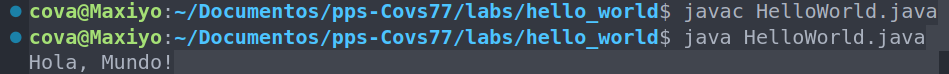


----

## Múltiples clases

### Plan
1. Crear una clase principal llamada `App` que contenga el método `main`.
2. Crear una clase llamada `Greeting` que tenga un método para devolver un mensaje de saludo.
3. Crear una clase llamada `Farewell` que tenga un método para devolver un mensaje de despedida.
4. Proporcionar instrucciones para compilar y ejecutar el código en la terminal de Linux/Windows/MacOS.


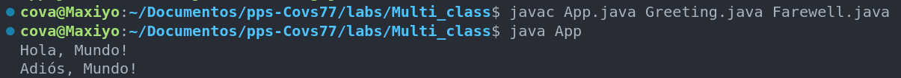

---


## Despliegue local básico

### Plan
1. Crear una estructura de directorios para organizar los archivos Java.
2. Escribir un script de shell para compilar y ejecutar los archivos automáticamente.


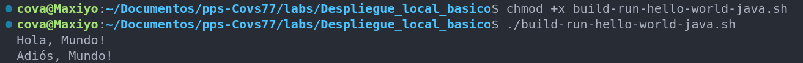

---

## Herramientas de `Build`: Maven

### Links

1. Tutorial Maven - https://www.arteco-consulting.com/articulos/tutorial-maven/

2. Maven in 5 minutes - https://maven.apache.org/guides/getting-started/maven-in-five-minutes.html


### Plan
1. Utilizar Maven como herramienta de build para gestionar el proyecto.
2. Crear un archivo `pom.xml` para definir las dependencias y configuraciones del proyecto.
3. Estructurar el proyecto según la convención de Maven (deben tener esta estructura de directorio los proyectos en Maven).
4. Proporcionar instrucciones para compilar y ejecutar el proyecto usando Maven.


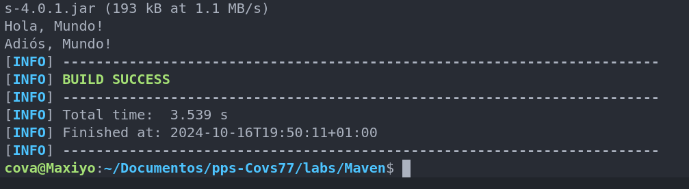


---

## Empaquetar software: JAR


### Plan
1. Actualiza el `pom.xml` para incluir el plugin de Maven JAR.
2. Usa comandos de Maven para empaquetar el proyecto en un archivo JAR.

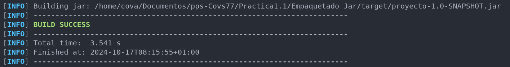

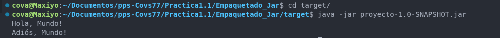

--- 
---

## Herramientas de `Build`: Dependencias

### Plan
1. Identificar las dependencias externas que necesitas para tu proyecto.
2. Agregar las dependencias al archivo `pom.xml` bajo la sección `<dependencies>`.


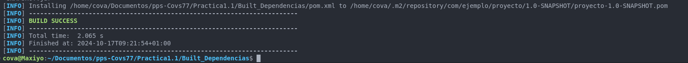


## Herramientas de `Build`: Actualizar Dependencias

### Plan
1. Identificar las dependencias específicas y sus versiones que necesitas para tu proyecto.
2. Agregar estas dependencias a la sección `<dependencies>` de tu archivo `pom.xml`.


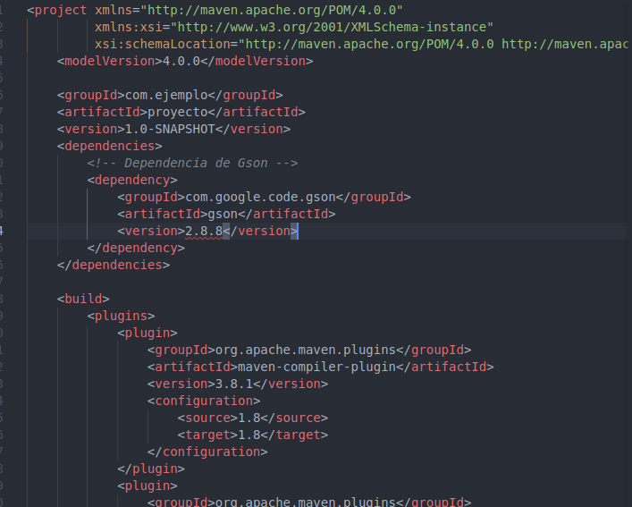


---
---
## Pruebas software: JUnit

JUnit es un marco de pruebas unitarias para el lenguaje de programación Java. Permite escribir y ejecutar pruebas repetibles para asegurar que el código funciona como se espera. A continuación, se muestra cómo integrar JUnit en tu proyecto Maven y cómo escribir pruebas unitarias para el código existente.

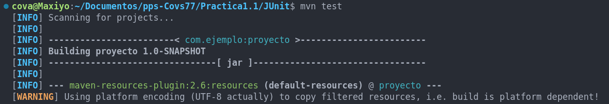
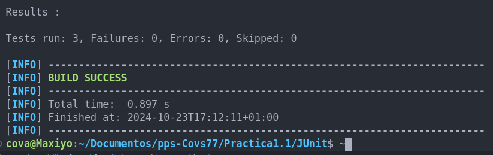

---

## Herramientas de `Build`: Integrar pruebas

Para integrar las pruebas en el proceso de build, asegúrate de que el plugin de surefire esté configurado en tu `pom.xml`. Maven Surefire Plugin es el responsable de ejecutar las pruebas unitarias.

### Ejercicios


1. Añade una nueva clase llamada `SaludoPersonalizado` que acepte un nombre y devuelva un saludo personalizado.

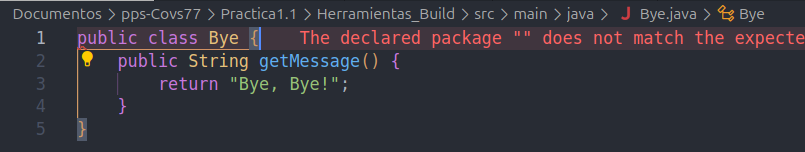

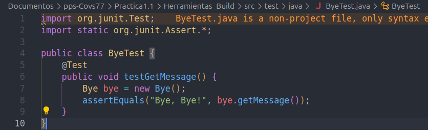

   

2. Escribe pruebas unitarias para la clase `SaludoPersonalizado`.

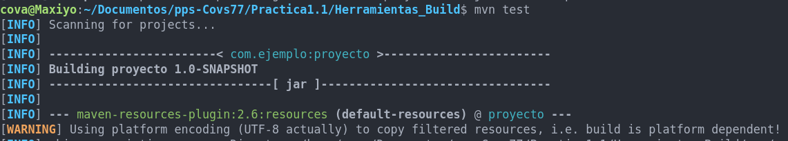

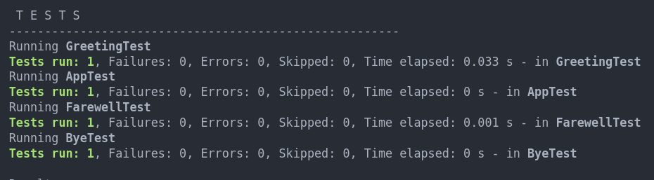


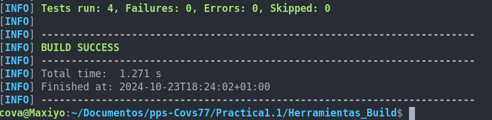
   
---

## Generar Informes de Cobertura de Código en Proyectos Java con Maven

Para generar informes de cobertura de código en proyectos Java con Maven, puedes utilizar el plugin `jacoco-maven-plugin`. Este plugin permite medir la cobertura de código de tus pruebas unitarias y generar informes detallados.

#### Pasos para Configurar y Generar Informes de Cobertura de Código

1. **Añadir el Plugin de JaCoCo a tu `pom.xml`**:
   Añade la configuración del plugin `jacoco-maven-plugin` a la sección `<build>` de tu archivo `pom.xml`.


2. **Ejecutar las Pruebas y Generar el Informe de Cobertura**:
   
   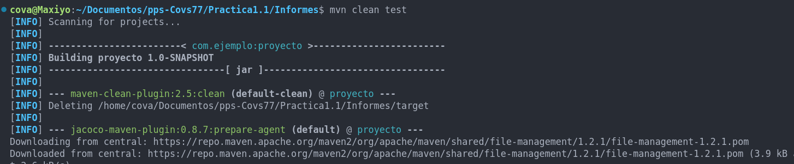

   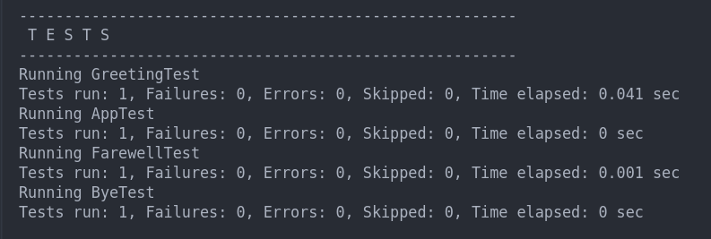

   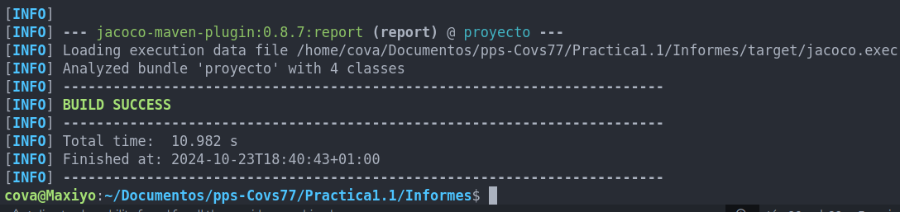


3. **Ver el Informe de Cobertura**:
   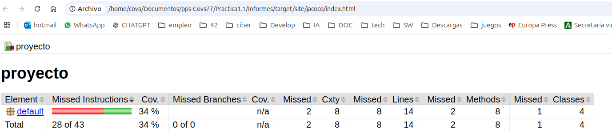


---

## Integrar Checkstyle y OWASP Dependency Check en tu Proyecto Maven


#### 1. Añadir el Plugin de Checkstyle

Checkstyle es una herramienta de análisis estático que ayuda a asegurar que el código sigue las convenciones de estilo definidas. Detecta problemas de formato y estilo en el código.

##### Ejecutar Checkstyle

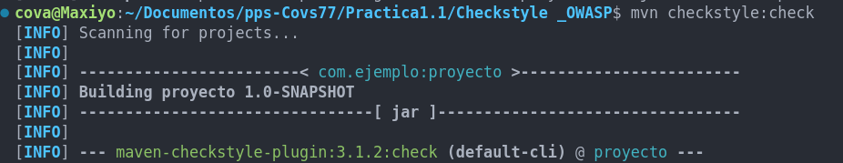
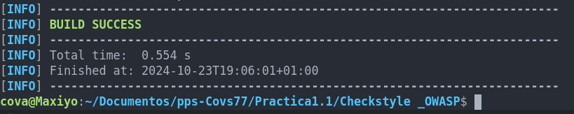


Este comando analizará el código y generará un informe de cualquier problema de estilo que encuentre.
En este momento la fase de build se detendrá al tener errores la fase de checkstyle, lo normal es que los checkstyle sean tratados como warning pero no detengan la ejecución de código para eso tenemos que hacer cierto ajustes.

Ahora mismo podríamos usar el comando  `mvn checkstyle:check` y dejaríamos de ver los errores, puesto que han pasado a tener una `severity` de `warning`. 
 
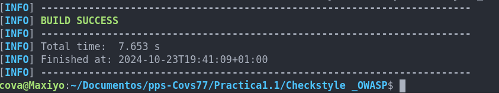

El último paso que nos quedaría es poder tener reportes generados para conocer qué ha sucedido. 
Para conseguir tener reportes, necesitamos modificar el fichero `pom.xml`, en este caso debemos 
agregar una nueva sección `reporting` diferente a `build` en el que especificamos que se quiere generar el reporte.
Finalmente nos quedaría ejecutar el comando `nvm site` para poder generar el reporte, el cual se encontará en el directorio `site`.

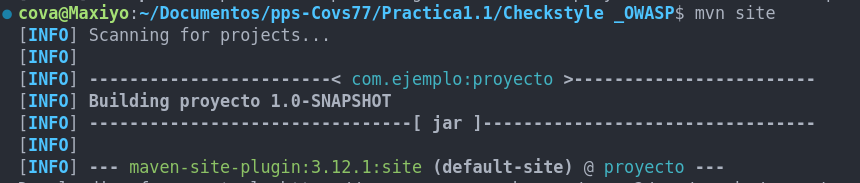

#### 2. Añadir el Plugin de OWASP Dependency Check

OWASP Dependency Check es una herramienta que analiza las dependencias de tu proyecto en busca de vulnerabilidades conocidas. Ayuda a identificar y mitigar riesgos de seguridad en las bibliotecas que utilizas.


##### Ejecutar OWASP Dependency Check
Para ejecutar OWASP Dependency Check y analizar las dependencias de tu proyecto, abre una terminal y navega al directorio raíz de tu proyecto Maven. Luego, ejecuta el siguiente comando:

```sh
mvn dependency-check:check
```

Este comando analizará las dependencias y generará un informe de cualquier vulnerabilidad conocida que encuentre.

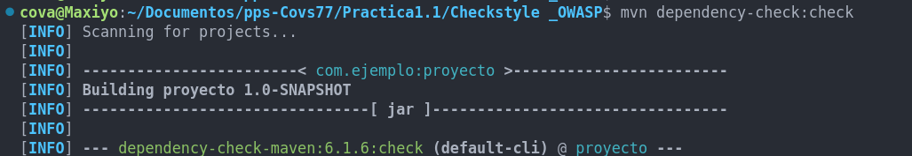
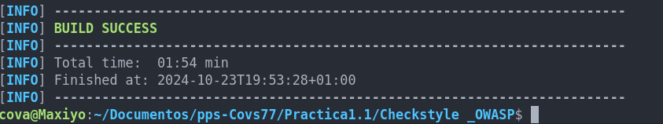

#### Resumen

Con estos pasos, puedes integrar Checkstyle y OWASP Dependency Check en tu proyecto Maven para asegurar la calidad y seguridad del código. Aquí tienes un resumen de los comandos y su propósito:

- **Checkstyle**:
  - **Comando**: `mvn checkstyle:check`
  - **Propósito**: Analizar el código en busca de problemas de estilo y formato.

- **OWASP Dependency Check**:
  - **Comando**: `mvn dependency-check:check`
  - **Propósito**: Analizar las dependencias del proyecto en busca de vulnerabilidades conocidas.


## Generar un Informe de Pruebas Unitarias en Formato XML con el Plugin Surefire de Maven

El plugin Maven Surefire es una herramienta que permite ejecutar pruebas unitarias y generar informes de los resultados. A continuación, se explica cómo configurar el plugin Surefire para generar informes de pruebas unitarias en formato XML.

#### 1. Añadir el Plugin Surefire a tu `pom.xml`

Primero, asegúrate de que el plugin Surefire esté configurado en tu archivo `pom.xml`.

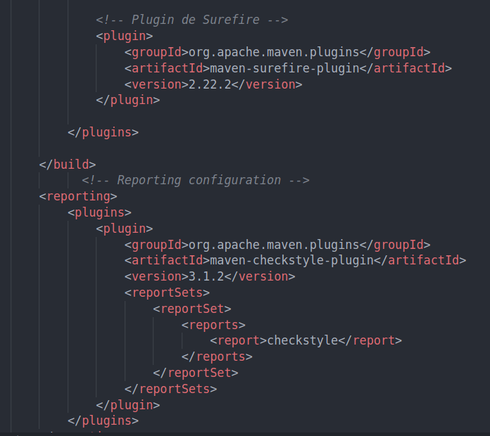


#### 2. Ejecutar las Pruebas Unitarias

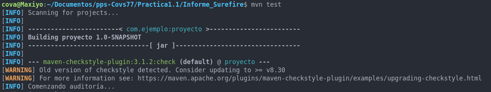
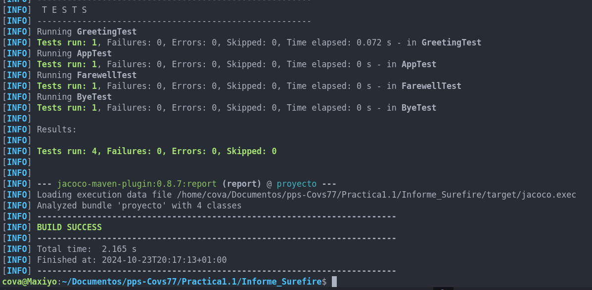

Este comando ejecutará todas las pruebas unitarias ubicadas en el directorio `src/test/java`.

#### 3. Ver el Informe de Pruebas Unitarias

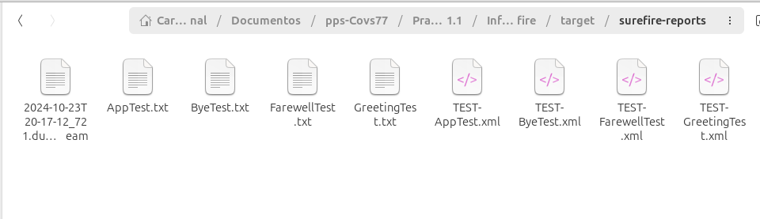


