# Laboratorio 1. Fundamentos de Programación

## Práctica 1.2. Proyecto real usando Maven

Dados los siguientes repositorios donde encontraremos programado en JAVA las siguientes aplicaciones:

## 1. Juego de Ajedrez en terminal (https://github.com/eliezergarbin/ChessSystem).

Debemos realizar las siguientes tareas para cada uno de los proyectos anteriores:

1. Adaptar la estructura de directorios para ser un proyecto en Maven.
 
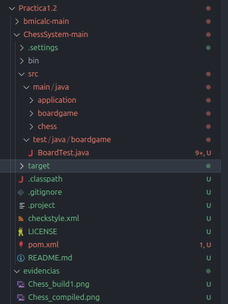

2. Crear el fichero pom.xml y mostrar que el proyecto se compila y ejecuta correctamente.
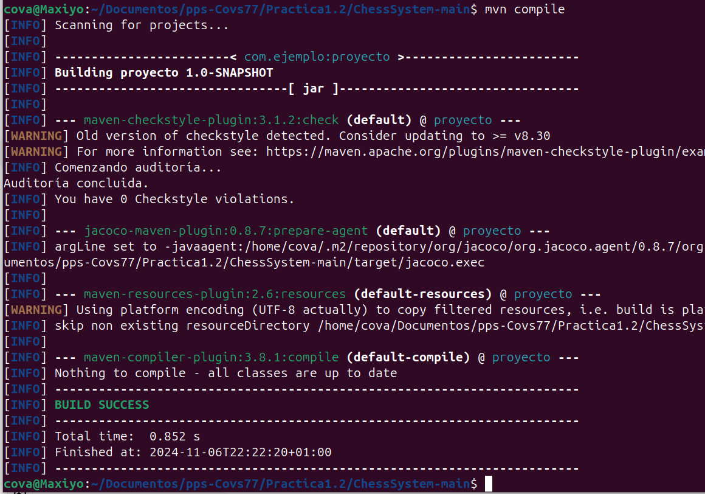

3. Genera el empaquetado en JAR usando Maven.
   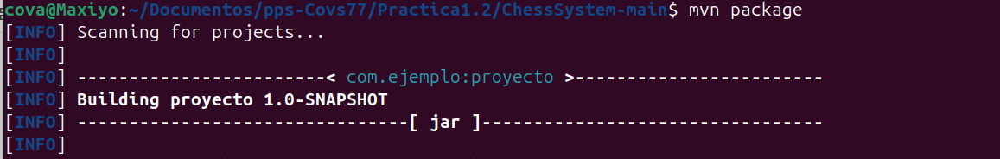
   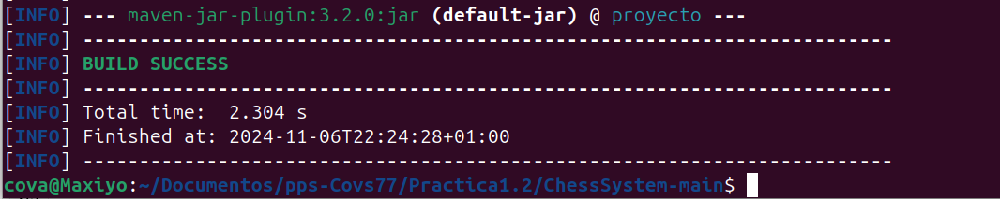

4. Incluye las dependencias de Test y ejecuta los Test de los proyectos.
  
    i. Los proyectos están desarrollados utilizando la versión de Junit 5, esta dependencia es localizada en Maven con los siguientes datos `groupId: org.junit.jupiter`, `artifactId: junit-jupiter` y `version: 5.10.0`.
   
   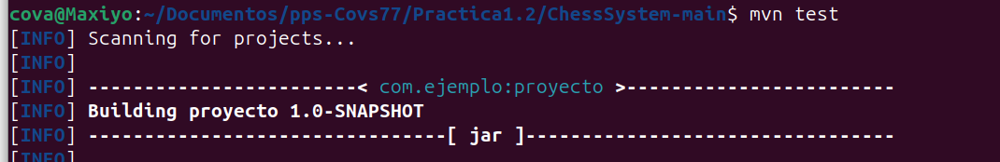

   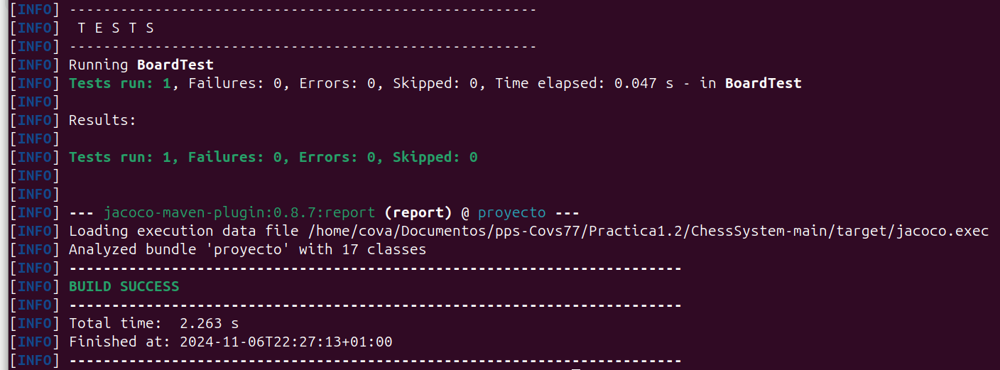

5. Incluye el plugin checkstyle e integralo en la compilación. En primer lugar muestra que el build se detiene al detectar errores de formateo. Acto seguido genera el reporte en un fichero externo (página html).

    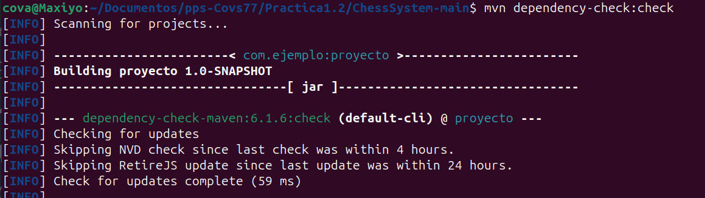

    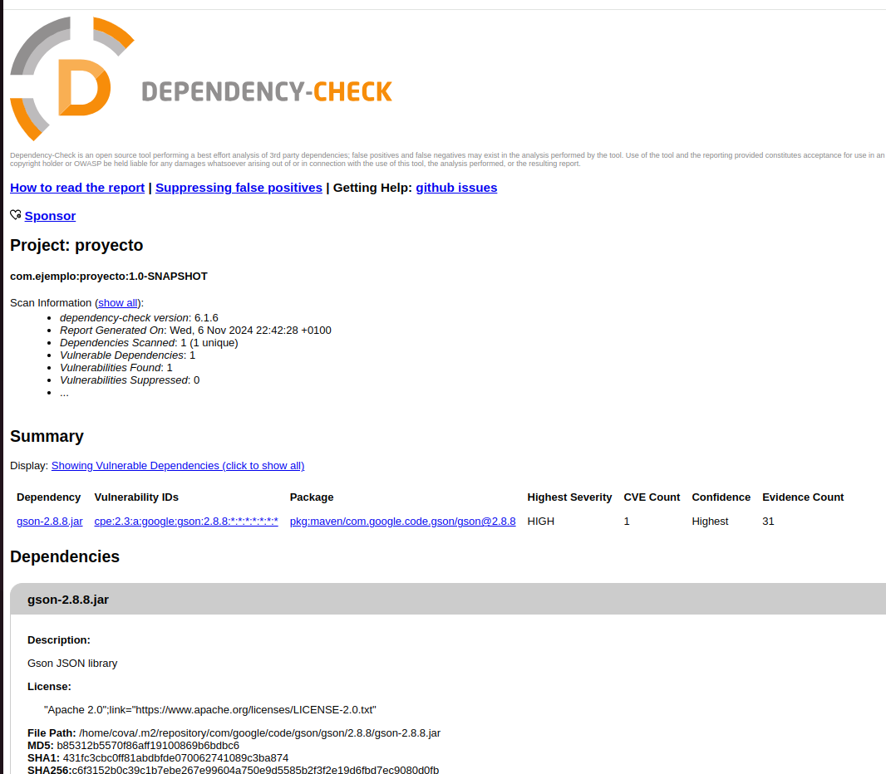

6. Incluye el plugin de OWASP Dependency check e integralo en la compilación.

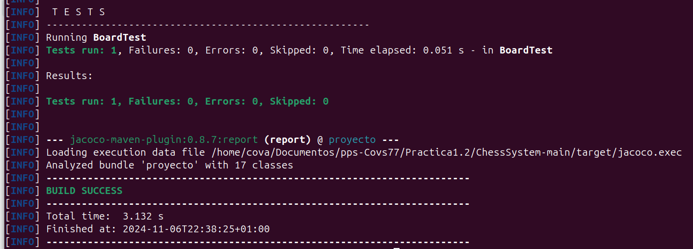

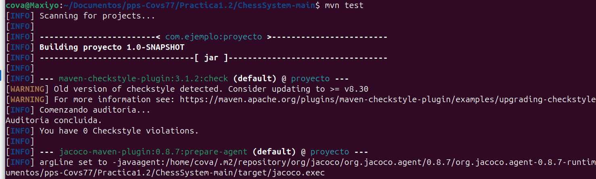

Tras añadir las dependencias con vulnerabilidades y pasar el OWASP Dependency check puedo comprobar en el archivo dependency-check-report las vulnerabilidades encontradas:

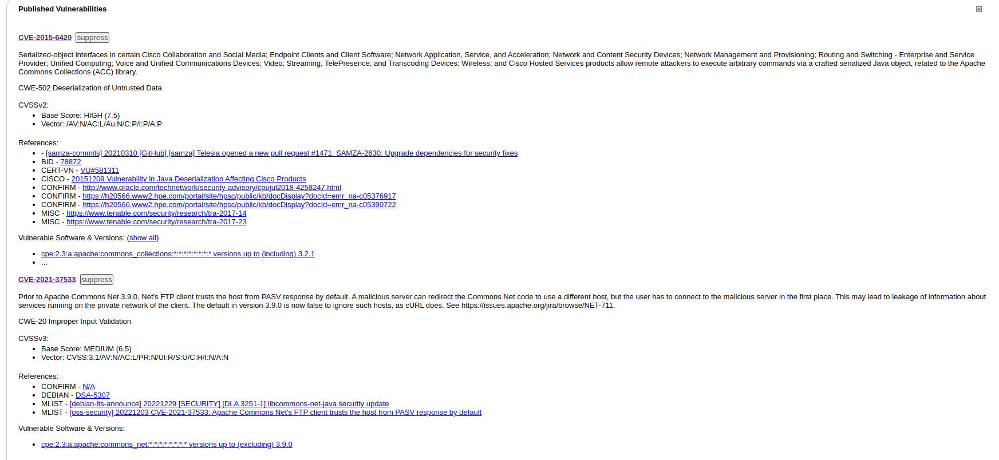

- CVE-2015-6420: Esta vulnerabilidad afecta a Cisco AnyConnect Secure Mobility Client, que es una aplicación utilizada para conexiones VPN seguras. El problema que puede generar es que un atacante remoto puede engañar a la aplicación para que ejecute comandos maliciosos en el sistema del usuario sin atutenticación previa. El impacto es que el atacante puede tomar el control del dispositivo afectado y robar datos, instalar programas o modificar archivos. La solución sería actualizar a la versión corregida de dicho sw.
    
fuente: https://nvd.nist.gov/vuln/detail/CVE-2015-6420
  
- CVE-2021-37533: Esta vulnerabilidad afecta a Teradici PCoIP, que es una tecnología usada para conexiones remotas a escritorios virtuales. Un atacante puede aprovechar esta vulnerabilidad para leer archivos en el servidor remoto sin autenticación lo que le permite robar información sensible y acceder a información importante sin permisos. La solución pasaría por actualizar a la versión parcheada del sw.

fuente: https://nvd.nist.gov/vuln/detail/CVE-2021-37533

7. Incluye el plugin de cobertura de test e integralo en la compilación.
   

## 2 Calculadora de BMI (https://github.com/claudiavegarodriguez/bmicalc/).

1. Adaptar la estructura de directorios para ser un proyecto en Maven.
   
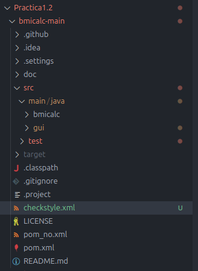

2. Crear el fichero pom.xml y mostrar que el proyecto se compila y ejecuta correctamente.

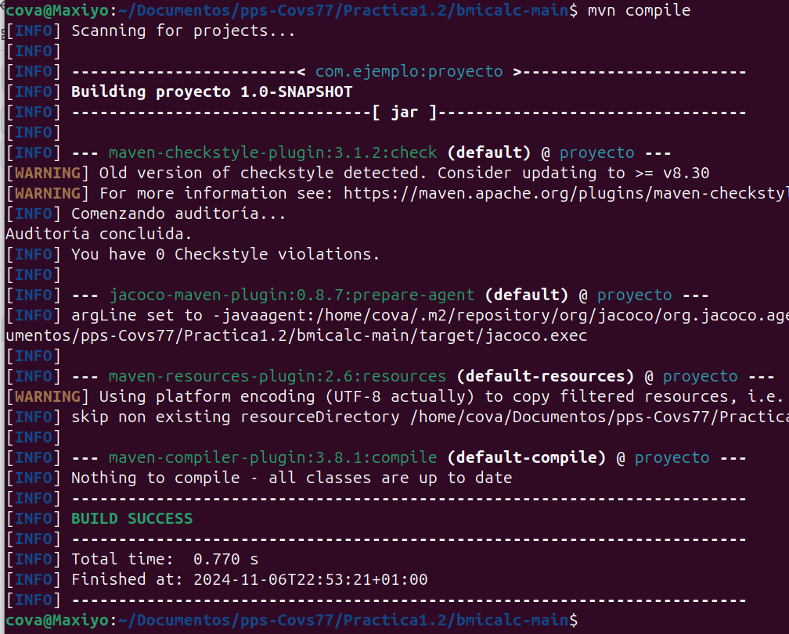

3. Genera el empaquetado en JAR usando Maven.

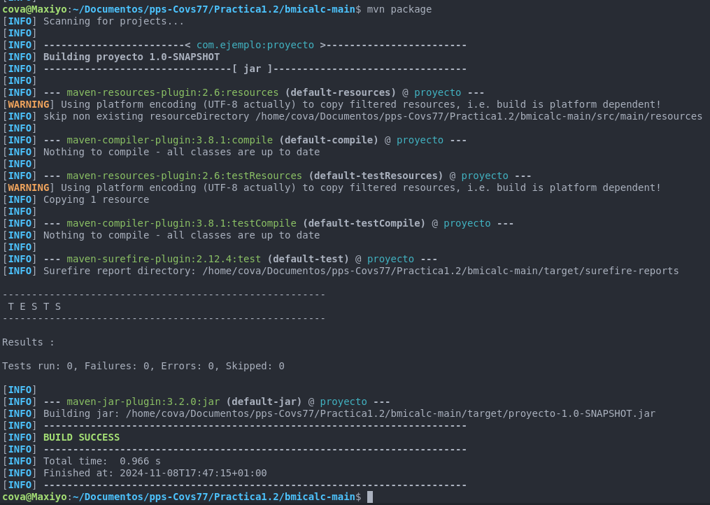

4. Incluye las dependencias de Test y ejecuta los Test de los proyectos.
   i. Los proyectos están desarrollados utilizando la versión de Junit 5, esta dependencia es localizada en Maven con los siguientes datos `groupId: org.junit.jupiter`, `artifactId: junit-jupiter` y `version: 5.10.0`.

Al incluir los test he obtenido este error:

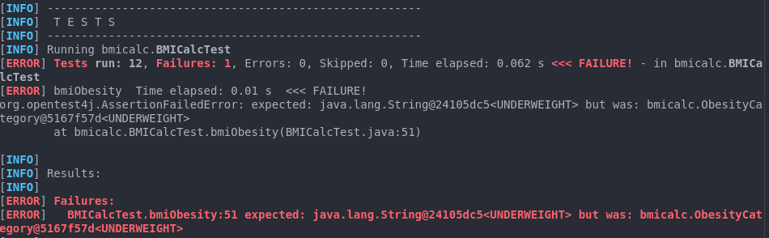

He modificado el archivo de testBMICalcTest.java(con ayuda de CHATGPT) de esta forma: 

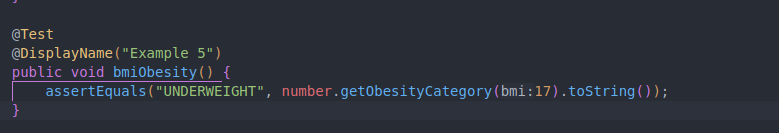

Y con dichos cambios hemos podido ejecutar los tests:

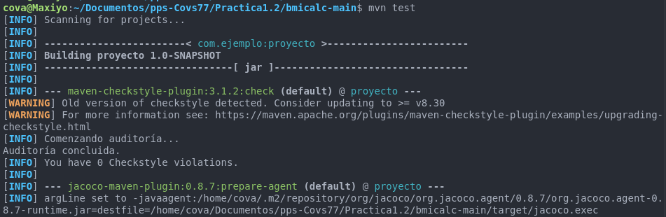

5. Incluye el plugin checkstyle e integralo en la compilación. En primer lugar muestra que el build se detiene al detectar errores de formateo. Acto seguido genera el reporte en un fichero externo (página html).

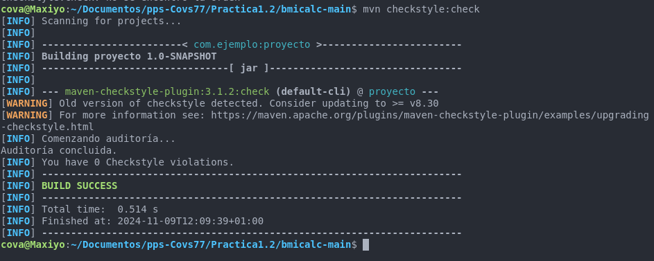

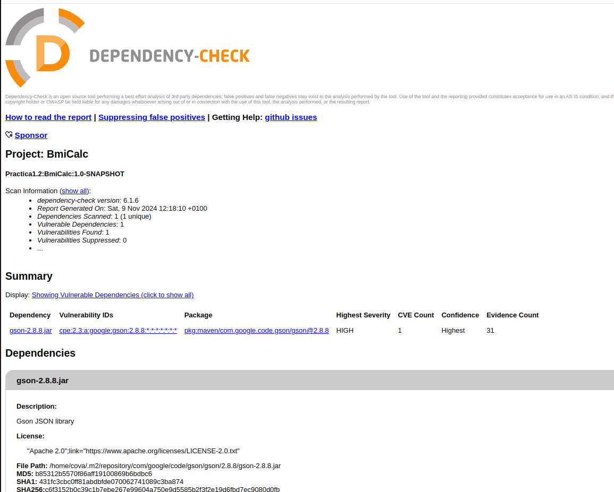

No me ha tirado ningun error porque primero he realizado el Ajedrez y me he basado en ese archivo pom.xml, donde el error de build ya estaba subsanado (no guardé captura).

6. Incluye el plugin de OWASP Dependency check e integralo en la compilación.

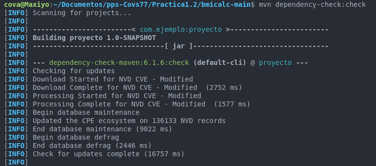

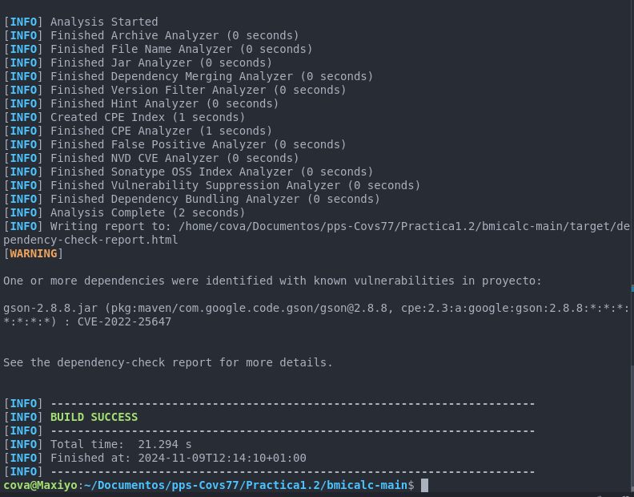

--- 
Tras añadir las dependencias con vulnerabilidades y pasar el OWASP Dependency check puedo comprobar en el archivo dependency-check-report las vulnerabilidades encontradas:

- CVE-2015-6420: Esta vulnerabilidad afecta a Cisco AnyConnect Secure Mobility Client, que es una aplicación utilizada para conexiones VPN seguras. El problema que puede generar es que un atacante remoto puede engañar a la aplicación para que ejecute comandos maliciosos en el sistema del usuario sin atutenticación previa. El impacto es que el atacante puede tomar el control del dispositivo afectado y robar datos, instalar programas o modificar archivos. La solución sería actualizar a la versión corregida de dicho sw.
    
fuente: https://nvd.nist.gov/vuln/detail/CVE-2015-6420
  
- CVE-2021-37533: Esta vulnerabilidad afecta a Teradici PCoIP, que es una tecnología usada para conexiones remotas a escritorios virtuales. Un atacante puede aprovechar esta vulnerabilidad para leer archivos en el servidor remoto sin autenticación lo que le permite robar información sensible y acceder a información importante sin permisos. La solución pasaría por actualizar a la versión parcheada del sw.

fuente: https://nvd.nist.gov/vuln/detail/CVE-2021-37533

7. Incluye el plugin de cobertura de test e integralo en la compilación.
Obtenemos el informe de cobertura: 
- pps-Covs77/Practica1.2/bmicalc-main/target/site/jacoco/index.html

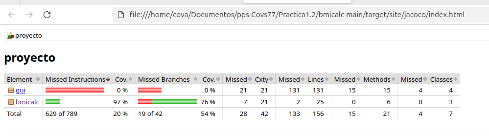

