## Práctica 1.3. JavaScript y Node.js

Durante esta práctica vamos realizar los mismos pasos que en la práctica guiada previa con JAVA pero en esta ocasión con un lenguaje interpretado con node.js


1. **Instalación y configuración de Node.js**
- Instale node.js y npm en linux (`npm --version`, `node --version`)
  
  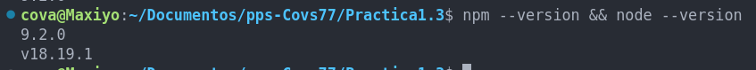
  
    
- ¿Qué es y cómo funciona Node.js?
  
  Es un entorno de ejecución que permite ejecutar una tarea sin tener que esperar a que la anterior haya acabado. Esto permite gestionar múltiples peticiones sin ralentizarlas. 
  Su funcionamiento se basa en un ***event loop*** que le permite gestionar múltiples tareas en un mismo tiempo sin necesidad de bloquear el hilo princial. Cuando inicia, el servidor Node.js empieza a escuchar peticiones, cuando llega una petición la coloca a la cola de eventos, procesa dichos eventos de forma asíncrona y no bloqueante, si una tarea tarda mucho, la delega y continúa con otras tareas, cuando una operación asíncrona acaba, su ***callback*** se ejecuta y se procesa el resultado.
  El callback es una especie de flag que avisa al hilo principal de que esa tarea delegada ha finalizado y así pueda seguir ejecutando esa petición.
  Este método es muy útil para entornos que requieren de muchas conexiones simultáneas, como aplicaciónes a tiempo real (chats, juegos online), APIs para servicios web, aplicaciones streaming (Netflix), etc.
  En cambio no es el entorno ideal para tareas que requieran de un uso intensivo de CPU como procesamiento de imágenes o algortimos complejos.

  
1. **Configurar un Proyecto Node.js**

- ¿Qué es y cómo funciona npm?

    
    Es una herramienta que te permite gestionar y compartir paquetes o librerías en ***Node.js***.  Nmp instala paquetes, si necesitas una libreria concreta, npm la descarga e instala. Gestiona dependencias, organizándolas y manteniéndolas actualizadas para que esas librerías funcionen correctamente. Y publica tus propios paquetes, compartiendo la herramiento que tú mismo hayas creado.
     
    Para instalar paquetes solo necesitas ejecutar: 

```bash
        **npm install <>nombre-del-paquete>**
```

En el archivo package.json almacena la lista de paquetes que estás usando, sus versiones y otras configuraciones del proyecto.
Una vez instalado el paquete con npm puedes usarlo en tu código:


```node
        ***const paquete = require('nombre-del-paquete');***
```

- Inicializar un proyecto Node.js con `package.json`
Iniciamos el proyecto con el comando

```bash
    npm init -y
```
Esto nos creará un archivo package.json con las consfiguraciones predeterminados.

  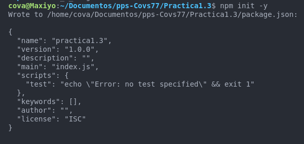


- ¿Qué información tiene el fichero `package.json`? ¿Para qué sirve cada una de las partes del fichero?


```bash

  Wrote to /home/cova/Documentos/pps-Covs77/Practica1.3/package.json:

{
  "name": "practica1.3",
  "version": "1.0.0",
  "description": "Práctica iniciación a Node.js",
  "main": "index.js",
  "scripts": {
    "test": "echo \"Error: no test specified\" && exit 1"
  },
  "keywords": [Node.js],
  "author": "Covadonga Leguina",
  "license": "ISC"

``` 


El archivo .json nos da información del normbre del proyecto, la versión inicial del mismo "1.0.0", la descripción del proyecto, el archivo index.json que es el archivo principal del proyecto. Node.js buscará este archivo cuando iniciemos la aplicación. En la parte scripts se definirán los comandos que se pueden ejecutar cuando desde la terminal ejecutemos, en este caso un script de prueba vacío.

```bash
    npm run test
```

En la sección Keywords podremos añadir palabras clave relacionadas con el proyecto para poder ayudar a identificarlo.
También podremos añadir el autor del mismo y la licencia de uso.


- ¿Cómo se instalan las dependencias? ¿Dónde se puede ver que se han instalado nuevas dependencias?
Para instalar dependencias usaremos el comando

```bah
    npm install nombre-del-paquete
```

Una vez instaladas podremos verlas en el archivo package.json en la sección <dependencies> y se guardarán en la carpeta node_modules. El arcivo package-lock.json asegura que se instalen las mismas versiones de las dependencias en el futuro.


3. **Crear una Aplicación Simple**
   - Crear un archivo `app.js` con un mensaje de "Hola, Mundo!"
  

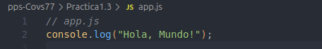


   - Proporcionar instrucciones para ejecutar el código (usando node en lugar de java/javac).
    
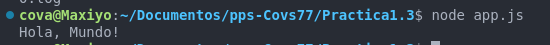

   - ¿Qué diferencias hay entre los comandos java/javac y el comando node? ¿Por qué hay dos comandos para las aplicaciones JAVA y solo uno para node?

Porque java debe ser compilado previamente antes de se ejecutado, en cambio node, al ser un lenguaje interpretado no necesita del paso previo de compilación y podemos ejecutarlo directamente.
 

4. **Múltiples Módulos**
   - Crear módulos `greeting.js` y `farewell.js`
   - Crear un archivo principal `app.js` que utilice estos módulos
   - Proporcionar instrucciones para ejecutar el código
 
 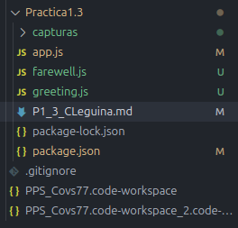

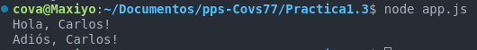

5. **Despliegue Local Básico**
   - Crear una estructura de directorios para organizar los archivos
   - Escribir un script de npm para ejecutar la aplicación

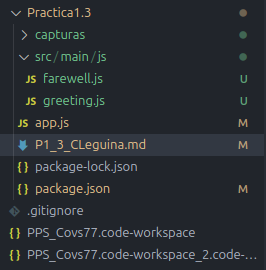

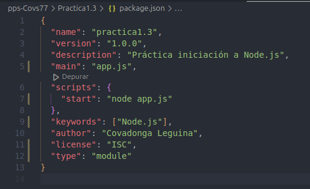

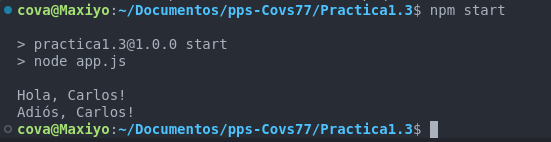

6. **Herramientas de Build: npm**
   - Utilizar npm scripts para gestionar el proyecto
   - Proporcionar instrucciones para compilar y ejecutar el proyecto

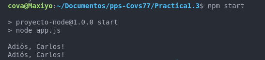

7. **Empaquetar Software: npm**
   - Crear un script de npm para empaquetar el proyecto
```json
{
  "name": "proyecto-node",
  "version": "1.0.0",
  "description": "Práctica iniciación a Node.js y npm",
  "main": "app.js",
  "scripts": 
  {
    "start": "node app.js",
    "test": "mocha",
    "coverage": "nyc mocha",
    "lint": "eslint .",
    "audit": "npm audit",
    "package": "npm pack"
  
  },
  "keywords": ["Node.js"],
  "author": "Covadonga Leguina",
  "license": "ISC",
  "type": "module"

}

```
   - Proporcionar instrucciones para ejecutar el paquete

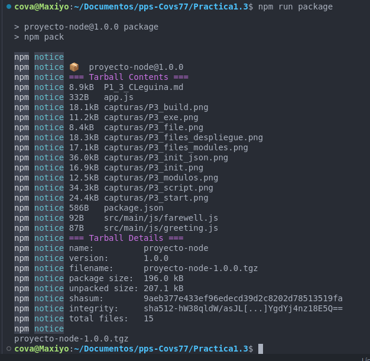


Para ejecutar el paquete deberemos usar los siguientes comandos:

``` bash
    npm install ./proyecto-node-1.0.0.tgz
    npm start
``` 

8. **Dependencias**
   - Identificar y agregar dependencias externas necesarias
  
  Añado la dependencia express:

  ```json
  "name": "proyecto-node",
  "version": "1.0.0",
  "description": "Práctica iniciación a Node.js y npm",
  "main": "app.js",
  "scripts": 
  {
    "start": "node app.js",
    "test": "mocha",
    "coverage": "nyc mocha",
    "lint": "eslint .",
    "audit": "npm audit",
    "package": "npm pack"
  
  },
  "dependencies": 
  {
    "express": "^4.17.1"
  },
  
  "keywords": ["Node.js"],
  "author": "Covadonga Leguina",
  "license": "ISC",
  "type": "module"

```

Y las instalo:


- Proporcionar ejemplos de dependencias comunes

---


9. **Pruebas de Software: Mocha y Chai**
    - Integrar Mocha y Chai para pruebas unitarias 

```json
{
  "name": "proyecto-node",
  "version": "1.0.0",
  "description": "Práctica iniciación a Node.js y npm",
  "main": "app.js",
  "scripts": 
  {
    "start": "node app.js",
    "test": "mocha",
    "coverage": "nyc mocha",
    "lint": "eslint .",
    "audit": "npm audit",
    "package": "npm pack"
  
  },
  "dependencies": 
  {
    "express": "^4.17.1"
  },
  "devDependencies": {
    "mocha": "^8.3.2",
    "chai": "^4.3.4",
    "nyc": "^15.1.0",
    "eslint": "^7.24.0"
  },
  "keywords": ["Node.js"],
  "author": "Covadonga Leguina",
  "license": "ISC",
  "type": "module"

}
```
Añado Mocha y Chai a las devDependencies y las instalo:


```bash
    npm install
```

- Escribir pruebas unitarias para el código existente
Añado FarewellTest.js y GreentingTest.js

- Proporcionar instrucciones para ejecutar las pruebas

``` json
{
  "name": "proyecto-node",
  "version": "1.0.0",
  "description": "Práctica iniciación a Node.js y npm",
  "main": "App.js",
  "scripts": 
  {
    "start": "node App.js",
    "test": "mocha",
    "coverage": "nyc mocha",
    "lint": "eslint .",
    "audit": "npm audit",
    "package": "npm pack"
  
  },
  "dependencies": 
  {
    "express": "^4.17.1"
  },
  "devDependencies": {
    "mocha": "^8.3.2",
    "chai": "^4.3.4",
    "nyc": "^15.1.0",
    "eslint": "^7.24.0"
  },
  "keywords": ["Node.js"],
  "author": "Covadonga Leguina",
  "license": "ISC",
  "type": "module"

}

```


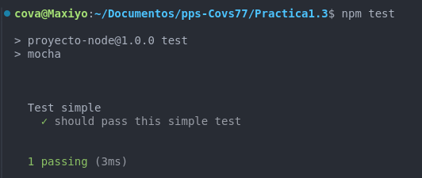


10.   **Generar Informes de Cobertura de Código: nyc**
     - Configurar nyc para generar informes de cobertura de código
     - Proporcionar instrucciones para generar y ver los informes

11.   **Análisis de Código: ESLint**
    - Configurar ESLint para análisis de estilo de código   
    - Proporcionar instrucciones para ejecutar ESLint

12.   **Análisis de Seguridad: npm audit**
    - Utilizar `npm audit` para analizar las dependencias en busca de vulnerabilidades
    - Proporcionar instrucciones para ejecutar `npm audit`

### Herramientas/Plugins Utilizados

1. **npm**: Gestor de paquetes para Node.js.
2. **Mocha**: Framework de pruebas para Node.js.
3. **Chai**: Biblioteca de aserciones para Node.js.
4. **nyc**: Herramienta para generar informes de cobertura de código.
5. **ESLint**: Herramienta de análisis estático para identificar problemas de estilo de código.
6. **npm audit**: Herramienta para analizar las dependencias en busca de vulnerabilidades.

### Ejemplo de `package.json`

```json
{
  "name": "proyecto-node",
  "version": "1.0.0",
  "description": "Proyecto Node.js equivalente a las tareas de Maven",
  "main": "app.js",
  "scripts": {
    "start": "node app.js",
    "test": "mocha",
    "coverage": "nyc mocha",
    "lint": "eslint .",
    "audit": "npm audit"
  },
  "dependencies": {
    "express": "^4.17.1"
  },
  "devDependencies": {
    "mocha": "^8.3.2",
    "chai": "^4.3.4",
    "nyc": "^15.1.0",
    "eslint": "^7.24.0"
  }
}
```

### Instrucciones para Ejecutar

1. **Inicializar el Proyecto**:
   ```sh
   npm init -y
   ```

2. **Instalar Dependencias**:
   ```sh
   npm install express
   npm install --save-dev mocha chai nyc eslint
   ```

3. **Ejecutar la Aplicación**:
   ```sh
   npm start
   ```

4. **Ejecutar Pruebas**:
   ```sh
   npm test
   ```

5. **Generar Informes de Cobertura**:
   ```sh
   npm run coverage
   ```

6. **Ejecutar ESLint**:
   ```sh
   npm run lint
   ```

7. **Ejecutar Análisis de Seguridad**:
   ```sh
   npm run audit
   ```
