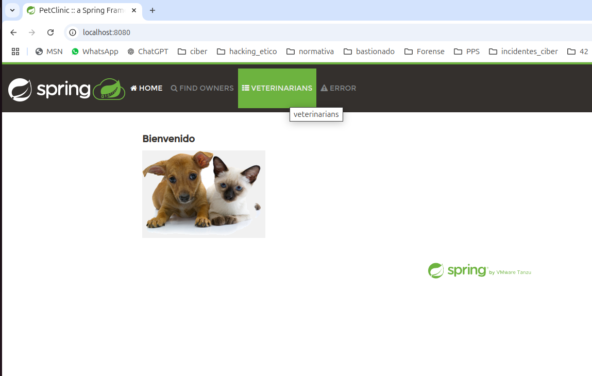

## Práctica 1.4. Proyecto real de JAVA usando SpringBoot (1.5 puntos)

En esta práctica, trabajaremos con un proyecto real de Java utilizando Spring Boot. Spring Boot es un framework que facilita la creación de aplicaciones Java basadas en Spring, proporcionando configuraciones predeterminadas para agilizar el desarrollo.

### Repositorio de Ejemplo

Para esta práctica, utilizaremos un proyecto de ejemplo disponible en GitHub. El repositorio seleccionado es un proyecto completo que demuestra las funcionalidades básicas de Spring Boot, incluyendo controladores, servicios, repositorios y pruebas unitarias.

**Nombre del Repositorio:** [spring-petclinic](https://github.com/spring-projects/spring-petclinic)

**Descripción:** El proyecto Spring PetClinic es una aplicación web que gestiona una clínica veterinaria. Este proyecto incluye ejemplos de controladores, servicios, repositorios, y pruebas unitarias, proporcionando una base sólida para entender cómo funciona una aplicación Spring Boot.

### Pasos para Configurar y Ejecutar el Proyecto

1. **Clonar el Repositorio:**
   ```sh
   git clone https://github.com/spring-projects/spring-petclinic.git
   cd spring-petclinic
   ```

2. **Importar el Proyecto en un IDE:**
   - Abre tu IDE favorito (IntelliJ IDEA, Eclipse, etc.).
   - Importa el proyecto como un proyecto Maven existente.

3. **Compilar el Proyecto:**
   ```sh
   ./mvn clean install
   ```
Aqui he usado el comando 

```bash
    ./mvnw clean install
```


4. **Ejecutar la Aplicación:**
 
```bash
./mvnw spring-boot:run
```

5. **Probar la Aplicación:**
   - Abre un navegador web y navega a `http://localhost:8080`.
   - Deberías ver la página de inicio de la aplicación PetClinic.


### Estructura del Proyecto

- **src/main/java/org/springframework/samples/petclinic**: Contiene los archivos fuente de la aplicación.
  - **PetClinicApplication.java**: Clase principal que inicia la aplicación Spring Boot.
  - **controller**: Contiene los controladores REST.
  - **service**: Contiene las clases de servicio.
  - **repository**: Contiene las interfaces de repositorio.
  - **model**: Contiene las clases de modelo.

- **src/test/java/org/springframework/samples/petclinic**: Contiene las pruebas unitarias para la aplicación.

### Tareas

1. Ejecuta el proyecto y ponlo en marcha.



2. Explica del fichero POM todos sus plugins y dependencias, ¿Qué hacen los plugins y dependencias y cómo funcionan?
   
En el apartado de **dependencias** nos encontramos estas bibliotecas, necesarias para que el proyecto, una página web, pueda funcionar:
SpringFramework: Es un cojunto de dependencias que proporcionan funcionalidades básicas para crear aplicaciones web, agregar funcionalidades de caché, monitoreo de la aplicación, integración con bases de datos relacionales, controladores web, gestión de formularios, renderización de HTML dinámico y la que más nos puede interesar es la **spring-boot-starter-test** que agrega todo lo necesario para realizar pruebas unitarias en nuestra aplicación, está marcada en el scope test, lo que significa que sólo se usará en un entorno de pruebas.

H2.database: Estas dependencias son necesarias para gestionar una base de datos en memoria usada durante el tiempo de ejecución.

javax.cache: es necesaria para implementar cachés en java.
com.github.ben-manes.caffeine: Se usa para almacenar datos en caché para Java de forma eficiente.

org.webjars.npm: Es una forma de festionar bibliotecas web dentro de un proyecto Maven, hay otra dependencia para gestionar íconos.

org.springframework.boot: Añade herramientas a los proyectos Spring Boot como la recarga automática de la aplicación o el autocompletado de las propiedadesde la configuración. En nuestro caso está marcada con el scope test para ser usada únicamente en entornos de desarrollo o pruebas. También encontramos la dependencia Testcontainer que permite ejecutar contenedores Docker en pruebas para simular entornos de producción. Otra dependencia relacionada con Docker es Docker compose que permite definir y ejecutar múltiples contendores.

org.testcontainers: Agrega soporte a Testcontainers en pruebas basadas en JUnit5. Encontramos otra que agrega un docker con una base de datos mysql durante dichas pruebas.

jakarta.xml.bind: proporciona una API para mapear objetos XML y viceversa de manera más orientada a objetos.

En cuanto a los **plugins**:

Maven Enforcer Plugin: permite aplicar reglas de validación para el proyecto como exigir una versión mínima de Java.

Spring JavaFormat Maven Plugin: Este plugin se utiliza para aplicar el formato de código Java de Spring. En la fase validate, se asegura de que el código fuente esté formateado de acuerdo con las reglas definidas por Spring.

Maven Checkstyle Plugin: Este plugin integra Checkstyle en Maven para comprobar la calidad del código.

Native Maven Plugin (GraalVM): Permite generar una imagen nativa de una aplicación Java usando GraalVM. Esto es útil para crear aplicaciones Java que puedan ejecutarse de manera más eficiente, como aplicaciones autónomas sin necesidad de la JVM completa.

Spring Boot Maven Plugin: Este plugin se usa para empaquetar y ejecutar aplicaciones Spring Boot. En este caso, se configura para generar información de construcción adicional en el archivo build-info.properties que puede ser usada por el Spring Boot Actuator para mostrar detalles de la construcción de la aplicación.

Jacoco Maven Plugin: Jacoco es una herramienta para generar informes de cobertura de pruebas en proyectos Java. Este plugin se usa para preparar el agente de cobertura (prepare-agent) y luego generar el informe de cobertura de código en la fase prepare-package.

Git Commit ID Maven Plugin: Este plugin extrae información del repositorio Git, como el ID del commit, y la pone a disposición de la aplicación. Esto es útil para mostrar información sobre la versión del código fuente que se está ejecutando, como parte de la salida del Spring Boot Actuator.

CycloneDX Maven Plugin: Este plugin genera un SBOM (Software Bill of Materials) en formato CycloneDX. Un SBOM describe los componentes de software que componen tu aplicación, lo cual es útil para la gestión de dependencias y la seguridad.


3. Incluye los plugins y dependencias que necesitamos para completar el cilo de vida del desarrollo de software.


Añado al archivo pom.xml estas dependencias:

```xml

    <!-- Dependencias de Testing JUnit-->
    <dependency>
      <groupId>org.junit.jupiter</groupId>
      <artifactId>junit-jupiter-api</artifactId>
      <version>5.7.0</version>
      <scope>test</scope>
    </dependency>

       <!-- Dependencias de Testing Mocito-->
    <dependency>
      <groupId>org.mockito</groupId>
      <artifactId>mockito-core</artifactId>
      <version>3.6.0</version>
      <scope>test</scope>
    </dependency>
```

Y estos plugins:

```xml

    <!-- Plugin para compilar el codigo fuente -->
      
      <plugin>
        <groupId>org.apache.maven.plugins</groupId>
        <artifactId>maven-compiler-plugin</artifactId>
        <version>3.8.1</version>
        <configuration>
          <source>1.8</source>
          <target>1.8</target>
        </configuration>
      </plugin>
      
      <!-- Plugin para ejecutar pruebas de integracion-->
      <plugin>
        <groupId>org.apache.maven.plugins</groupId>
        <artifactId>maven-surefire-plugin</artifactId>
        <version>3.0.0-M5</version>
        <configuration>
          <includes>
            <include>**/*Test.java</include>
          </includes>
        </configuration>
      </plugin>

      <!-- Plugin para empaquetar y ejecutar la aplicacion-->
      <plugin>
        <groupId>org.springframework.boot</groupId>
        <artifactId>spring-boot-maven-plugin</artifactId>
      </plugin>

      <!-- Plugin para generar informes de cobertura de pruebas-->
      <plugin>
        <groupId>org.jacoco</groupId>
        <artifactId>jacoco-maven-plugin</artifactId>
        <executions>
          <execution>
            <goal>prepare-agent</goal>
          </execution>
          <execution>
            <goal>report</goal>
            <phase>prepare-package</phase>
          </execution>
        </executions>
      </plugin>
      
      <!-- Plugin para la gestión de versiones y la creación de lanzamientos del proyecto-->

      <plugin>
        <groupId>org.apache.maven.plugins</groupId>
        <artifactId>maven-release-plugin</artifactId>
      </plugin>
```