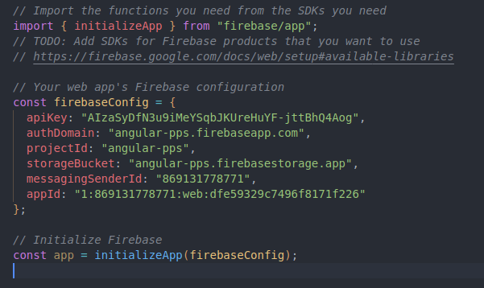
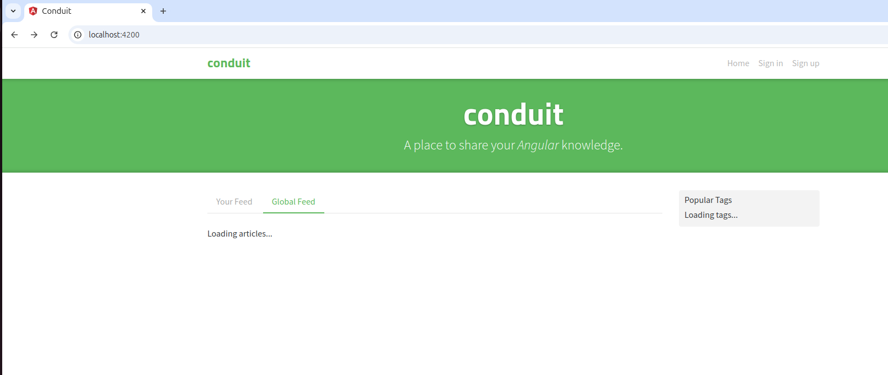
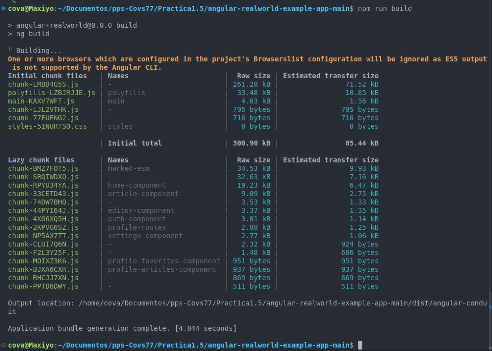
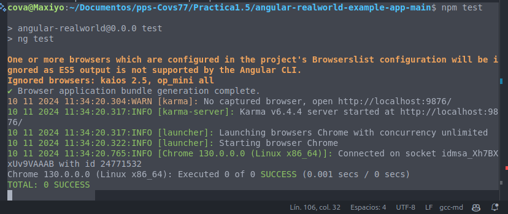
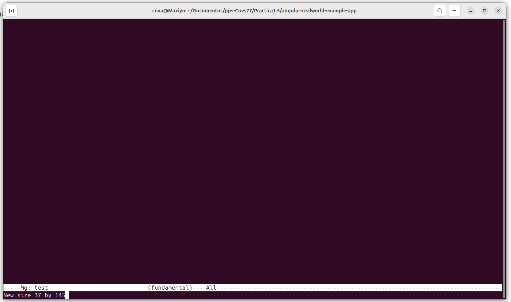
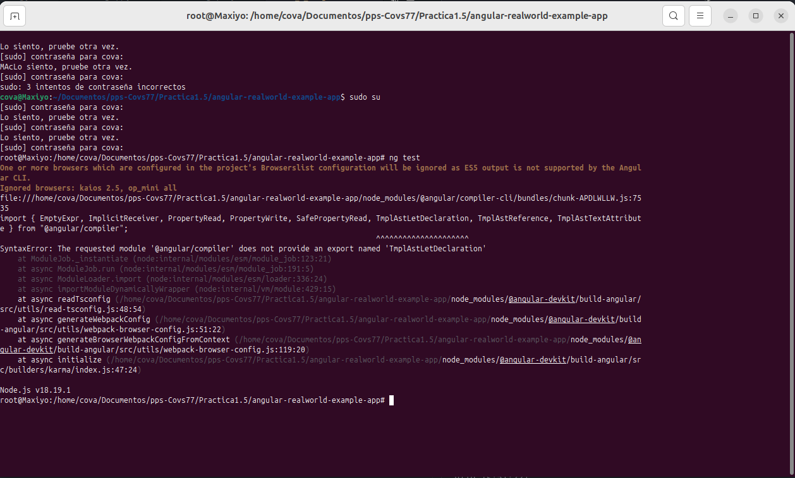

## Prática 1.5. Proyecto real de TypeScript usando Angular (Frontend) (1 punto).

En esta práctica, trabajaremos con un proyecto real de TypeScript utilizando Angular. Angular es un framework de desarrollo web que facilita la creación de aplicaciones web dinámicas y de alto rendimiento. A continuación, se detallan los pasos para clonar, configurar, ejecutar y modificar un proyecto real de Angular.

### Repositorio de Ejemplo

Para esta práctica, utilizaremos un proyecto de ejemplo disponible en GitHub. El repositorio seleccionado es un proyecto completo que demuestra las funcionalidades básicas de Angular, incluyendo controladores, servicios, repositorios y pruebas unitarias.

**Nombre del Repositorio:** [angular-realworld-example-app](https://github.com/gothinkster/angular-realworld-example-app)

**Descripción:** Esta base de código fue creada para demostrar una aplicación completamente desarrollada con Angular que interactúa con un servidor backend real, incluyendo operaciones CRUD, autenticación, enrutamiento, paginación y más. Hemos hecho grandes esfuerzos para adherirnos a la guía de estilo de Angular y las mejores prácticas.

### Paso 1: Clonar el repositorio

Primero, clona un repositorio real de GitHub que utilice Angular. Por ejemplo, puedes usar el siguiente repositorio:

```bash
git clone git@github.com:gothinkster/angular-realworld-example-app.git
cd angular-realworld-example-app
```

### Paso 2: Instalar dependencias

Instala las dependencias del proyecto utilizando npm o yarn:

```bash
npm install
# o
yarn install
```

### Paso 3: Configurar el entorno

Crea un archivo `environment.ts` en la carpeta `src/environments` y configura las variables de entorno necesarias. Puedes basarte en el archivo `environment.example.ts` si está disponible.

**OJO CORRECCIÓN**
```bash
  npm generate environments
```

** FIN CORRECCION**

```bash
cp src/environments/environment.example.ts src/environments/environment.ts
# Edita el archivo environment.ts con tus configuraciones
```
No he encontrado el archivo environment.example.ts, he creado el archivo environment.ts con las siguientes configuraciones que 
la plicacion Firebase me ha proporcionado.



### Paso 4: Ejecutar el proyecto

Inicia el servidor de desarrollo:

```bash
npm start
# o
yarn start
```

### Paso 5: Probar la aplicación

Abre tu navegador y navega a `http://localhost:4200` para ver la aplicación en funcionamiento.



### Paso 6: Modificar el proyecto

Realiza cambios en el código fuente según los requerimientos de tu práctica. 
Puedes encontrar los archivos principales en la carpeta `src/app`.

En esta parte del proceso no he modificado nada y aun así complila en el paso siguiente.

### Paso 7: Compilar el proyecto

Para compilar el proyecto para producción, ejecuta:

```bash
npm run build
# o
yarn build
```

### Paso 8: Ejecutar pruebas

Ejecuta las pruebas unitarias para asegurarte de que todo funcione correctamente:

```bash
npm test
# o
yarn test
```




Cuando lanzo las pruebas me sale esta pantalla si no soy root.



Como root consigo que empiece a lanzar las pruebas apareciéndome un montón de errores, que pensaba poder solucionar en la clase de este miércoles 13/nov.
He buscado soluciones, actualizado los archivos tsconfig.ts, package.json, tsconfig.spec.json, karma.config.js, angular.json y no consigo que ejecute los test.



### Recursos adicionales

- [Documentación oficial de Angular](https://angular.io/docs)
- [Repositorio de ejemplo en GitHub](https://github.com/gothinkster/angular-realworld-example-app)

### Tareas

1. Ejecuta el proyecto y ponlo en marcha.


2. Explica del fichero package.json todas sus dependencias, ¿Qué hacen las dependencias y cómo funcionan?

@angular/animations: Paquete de Angular que permite implementar animaciones en tu aplicación.

@angular/common: Paquete con funcionalidades comunes utilizadas en la mayoría de las aplicaciones Angular (como directivas y servicios de utilidad).

@angular/compiler: Paquete que contiene el compilador de Angular, utilizado para compilar y transformar el código Angular en código JavaScript optimizado para el navegador.

@angular/core: El núcleo del framework Angular, que incluye las funcionalidades centrales, como los componentes, directivas y servicios.

@angular/forms: Paquete que proporciona directivas y servicios para trabajar con formularios en Angular (formularios reactivos y dirigidos por plantillas).

@angular/platform-browser: Paquete necesario para ejecutar Angular en un navegador, permitiendo la interacción con la plataforma del navegador.

@angular/platform-browser-dynamic: Paquete que permite la compilación dinámica de Angular, permitiendo la inicialización de la aplicación en el navegador.

@angular/router: Paquete que proporciona las funcionalidades necesarias para gestionar la navegación y las rutas en una aplicación Angular.

@rx-angular/cdk: Un conjunto de herramientas de Angular relacionadas con RxJS (programación reactiva) para mejorar el rendimiento de las aplicaciones Angular.

@rx-angular/template: Similar al paquete anterior, pero orientado a optimizar el rendimiento de las plantillas de Angular utilizando programación reactiva.

marked: Un parser de Markdown a HTML, útil si quieres convertir contenido en Markdown en tu aplicación.

rxjs: Biblioteca para la programación reactiva con observables, ampliamente utilizada en Angular para manejar flujos de datos asíncronos.

tslib: Biblioteca que contiene funciones utilizadas por TypeScript para optimizar el tamaño del código generado.

zone.js: Biblioteca de Angular que permite gestionar las zonas de ejecución para la detección de cambios y el manejo del ciclo de vida de las aplicaciones Angular.

Dependencias de desarrollo (devDependencies)
Las dependencias de desarrollo son paquetes que se utilizan durante el desarrollo de la aplicación, pero no son necesarias para la ejecución en producción:

@angular-devkit/build-angular: Herramientas de Angular para la construcción y empaquetado de aplicaciones Angular.

@angular/cli: Herramienta de línea de comandos de Angular, utilizada para crear, desarrollar, y administrar aplicaciones Angular.

@angular/compiler-cli: Herramienta de línea de comandos para compilar aplicaciones Angular y trabajar con el compilador de Angular.

@types/jasmine: Tipos de TypeScript para Jasmine, que es un framework de pruebas utilizado para las pruebas unitarias en Angular.

@types/marked: Tipos de TypeScript para la biblioteca marked, lo que proporciona autocompletado y validación de tipos cuando usas marked.

husky: Herramienta que ayuda a configurar "hooks" de Git, como pre-commit y pre-push, para ejecutar acciones antes de hacer commits o push a un repositorio.

jasmine-core: Biblioteca principal de Jasmine, utilizada para escribir y ejecutar pruebas unitarias en Angular.

karma: Un corredor de pruebas que ejecuta las pruebas unitarias en diferentes navegadores, generalmente utilizado con Angular.

karma-chrome-launcher: Plugin de Karma que lanza pruebas en un navegador Chrome.

karma-coverage: Plugin de Karma que genera informes de cobertura de código para las pruebas ejecutadas.

karma-jasmine: Integración de Karma con Jasmine para ejecutar pruebas unitarias escritas con Jasmine.

karma-jasmine-html-reporter: Un reporte HTML que muestra los resultados de las pruebas Jasmine ejecutadas con Karma.

lint-staged: Herramienta para ejecutar linters en archivos que están a punto de ser committeados, lo que asegura que solo los archivos correctamente formateados se suban al repositorio.

prettier: Herramienta de formateo de código que asegura que el código fuente esté bien formateado y sea consistente.

typescript: El compilador TypeScript, utilizado para transformar el código TypeScript a JavaScript.

Propiedad lint-staged

Esta propiedad se utiliza para ejecutar Prettier en los archivos que se están a punto de ser añadidos al commit. Está configurado para aplicar Prettier a los archivos con extensiones .ts, .html, .css, .json, y .md.

```json

"lint-staged": {
  "*.{ts,html,css,json,md}": "prettier --write"
}
```

Este comando se ejecuta antes de hacer un commit y garantiza que los archivos estén bien formateados según las reglas de Prettier.

Propiedad engines

Esta propiedad define las versiones de Node.js que son compatibles con este proyecto. En este caso, se permite tanto la versión 18.13.0 como la 20.9.0 y sus versiones superiores compatibles:

```json

"engines": {
  "node": "^18.13.0 || ^20.9.0"
}

```

Esto asegura que el proyecto funcionará correctamente solo si se está utilizando una versión de Node.js dentro de esos rangos.

Propiedad private
La propiedad private: true en package.json asegura que el proyecto no será publicado accidentalmente en el registro de npm. Esto es útil si estás trabajando en un proyecto privado y no deseas que sea accesible públicamente.

3. Explica los npm scripts, ¿qué funcionalidades tienen?

Los scripts nos permiten ejecutar desde la terminal mediante npm run <script-name> estos comandos:

ng: Ejecuta el comando ng de Angular CLI.

start: Ejecuta el servidor de desarrollo (ng serve), abriendo automáticamente la aplicación en el navegador.

build: Construye la aplicación para producción (ng build).

test: Ejecuta las pruebas unitarias con Karma y Jasmine (ng test).

lint: Ejecuta el análisis estático de código con ng lint.

prepare: Instala husky (una herramienta para gestionar hooks de git).


4. Reflexiona qué incluirías para desarrollar el ciclo de vida en la configuración y crea un script para realizar toda la fase de build con chequeos y comprobaciones.

---
