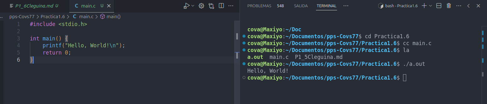
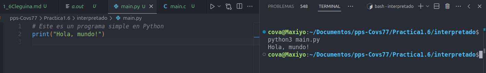
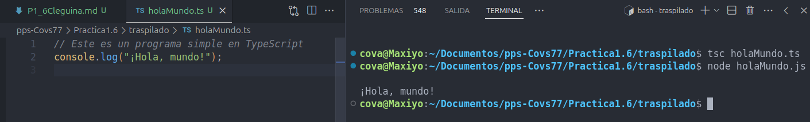

## Práctica 1.6. Compilado/Transpilado/Interpretado usando diferentes plataformas (1 punto).

En esta práctica, exploraremos el proceso de compilación, transpilación e interpretación utilizando diferentes lenguajes de programación y plataformas. El objetivo es entender las diferencias entre estos procesos y cómo se aplican en distintos lenguajes.

### Lenguajes Compilados

Los lenguajes compilados son aquellos que se traducen directamente a código máquina antes de ser ejecutados. Este proceso de compilación generalmente produce un archivo binario que puede ser ejecutado directamente por el sistema operativo.

#### Ejemplos de Lenguajes Compilados:
- **C**: Un lenguaje de programación de propósito general que es ampliamente utilizado en sistemas operativos y software de alto rendimiento.
- **C++**: Una extensión de C que incluye características de programación orientada a objetos.
- **Rust**: Un lenguaje de programación de sistemas que se centra en la seguridad y el rendimiento.
- **Go**: Un lenguaje de programación desarrollado por Google que es conocido por su simplicidad y eficiencia.
- **.NET (C#)**: Un framework desarrollado por Microsoft que soporta múltiples lenguajes de programación, siendo C# uno de los más populares.

### Lenguajes Interpretados

Los lenguajes interpretados son aquellos que se ejecutan directamente a partir del código fuente mediante un intérprete. Este proceso puede ser más lento en comparación con los lenguajes compilados, pero ofrece mayor flexibilidad y facilidad de uso.

#### Ejemplos de Lenguajes Interpretados:
- **Python**: Un lenguaje de programación de alto nivel conocido por su simplicidad y legibilidad.
- **JavaScript**: Un lenguaje de programación que se ejecuta principalmente en navegadores web y es esencial para el desarrollo web.
- **Ruby**: Un lenguaje de programación dinámico y orientado a objetos, conocido por su simplicidad y productividad.
- **PHP**: Un lenguaje de programación ampliamente utilizado para el desarrollo web del lado del servidor.
- **Perl**: Un lenguaje de programación de propósito general conocido por su capacidad de procesamiento de texto.

### Lenguajes Transpilados

Los lenguajes transpilados son aquellos que se convierten de un lenguaje de alto nivel a otro lenguaje de alto nivel antes de ser ejecutados. Este proceso es común en el desarrollo web moderno.

#### Ejemplos de Lenguajes Transpilados:
- **TypeScript**: Un superconjunto de JavaScript que se transpila a JavaScript.
- **CoffeeScript**: Un lenguaje que se transpila a JavaScript y ofrece una sintaxis más concisa.
- **Sass**: Un preprocesador CSS que se transpila a CSS.

### Ejercicio

1. **Elegir un Lenguaje Compilado**:
   - Selecciona uno de los lenguajes compilados mencionados anteriormente.
   - Escribe un programa simple en ese lenguaje.
   - Compila el programa y ejecuta el binario resultante.

   Para esta práctica he elegido hacer un programa en C que imprima "Hola, Mundo!" en pantalla.

   
   

2. **Elegir un Lenguaje Interpretado**:
   - Selecciona uno de los lenguajes interpretados mencionados anteriormente.
   - Escribe un programa simple en ese lenguaje.
   - Ejecuta el programa utilizando el intérprete correspondiente.
    
    Para esta pŕactica he elegido hacer un programa en Python que imprima "Hola, Mundo!" en pantalla.
    
    

3. **Elegir un Lenguaje Transpilado**:
   - Selecciona uno de los lenguajes transpilados mencionados anteriormente.
   - Escribe un programa simple en ese lenguaje.
   - Transpila el programa al lenguaje de destino y ejecuta el resultado.

   Para este ejercicio he elegido un programa sencillo en TypeScript que escriba *¡Hola Mundo!* por pantalla

 


### Ejemplo de Código

#### Lenguaje Compilado (C)
```c
#include <stdio.h>

int main() {
    printf("Hola, Mundo!\n");
    return 0;
}
```
Compilar y ejecutar:
```sh
gcc hello.c -o hello
./hello
```

#### Lenguaje Interpretado (Python)
```python
print("Hola, Mundo!")
```
Ejecutar:
```sh
python hello.py
```

#### Lenguaje Transpilado (TypeScript)
```typescript
let message: string = "Hola, Mundo!";
console.log(message);
```
Transpilar y ejecutar:
```sh
tsc hello.ts
node hello.js
```

Esta práctica te ayudará a comprender las diferencias entre los procesos de compilación, transpilación e interpretación, y cómo se aplican en diferentes lenguajes de programación.
