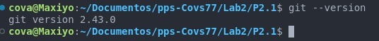
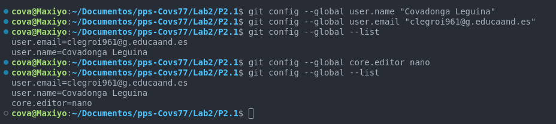
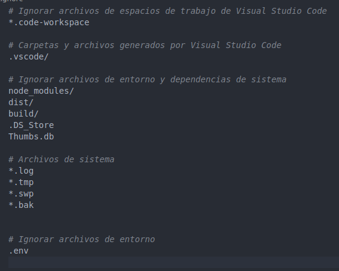

## Práctica 2.1. Configuración de GIT (0.50 puntos)

1. Realiza la práctica guiada para configurar GIT en tu entorno de trabajo.

### CONFIGURACION INICIAL DE GIT

En primer lugar, comprobamos que ya tenemos git instalado en nuestro sistema:




Establecemos el nombre de ususario y el mail, así como el editor de texto que vamos a utilizar.
Listamos la nueva configuración con el comando `git config --list` y vemos que se ha realizado correctamente.
En mi caso no configuraré el alias para el comando `git status` ya que estoy acostumbrada a usar status directamente.
Dejo lo comandos que he utilizado a continuación:

```bash
git config --global user.name "Covadonga Leguina"
git config --global user.email "clegroi961@g.educaand.es"
git config --global core.editor "nano"
git config --list

# Para configurar el alias de git status
git config --global alias.st status
# Para eliminar el alias de git status
git config --global --unset alias.st

```



También realizo la configuración incial del fichero .gitignore, donde añado los ficheros que no quiero que se guarden al repositorio.




En cuanto a las credenciales, no voy a modificar la configuración ya que lo tengo configurado con el par de llaves SSH y no necesito introducir ususario y contraseña.

Los comandos necesarios para configurar las credenciales en caso de no usar SSH son los siguientes:

```bash
# Almacena credenciales en caché durante 1 hora
git config --global credential.helper 'cache --timeout=3600'

```

