## Práctica 2.2. Trabajando con GIT básico (0.5 puntos)

Haciendo uso de algún proyecto “real”  descargado desde el repositorio GitHub (consultar con el profesor antes de tomar un repositorio, puesto que debe ser de un proyecto real de gran envergadura), demostrar que sabéis usar los comandos útiles de Git para observar el repositorio de dicho proyecto (`git log`, `git diff`, `git blame` y `git show`). 

Por cada uno de estos 4 comandos, hay que evidenciar **4 capturas** (junto a su explicación, ejemplo y todo lo que se desee aportar) de diferentes usos (opciones) del mismo comando. Junto a cada captura, hay que explicar con vuestras palabras lo que se quiere **probar**, **demostrar** o **buscar** con ese comando/opción. 


-  GIT LOG

   - **Captura 1**  
    ``` bash
        git log 
    ```

   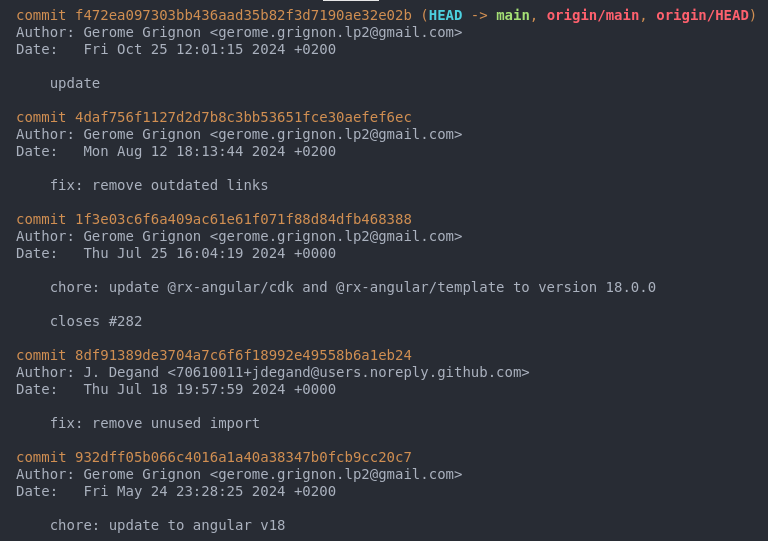

###### Con este comando vemos el registro de los últimos commits. Encontramos el hash del commit, el autor del mismo así como la fecha en que se hizo. También vermos el comentario, lo que nos facilita saber qué tipo de actualización se ha hecho y en un momento dado filtrar por si fuera necesario (fix, chore, refactor...)

   - **Captura 2**  
``` bash
git log --oneline
```


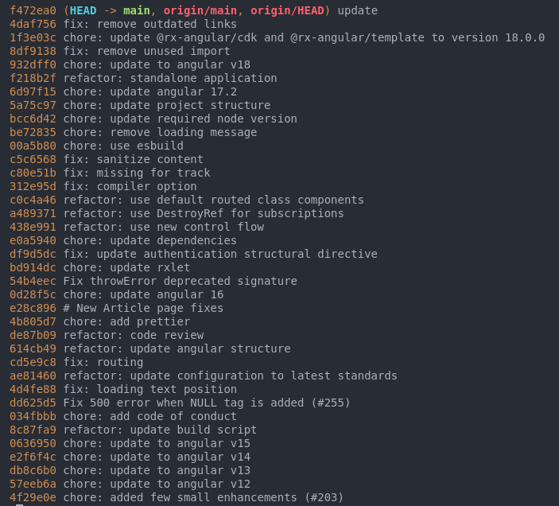
   
###### Con este comando vemos el registro de logs de forma compacta y resumida, con parte del hash del commit y el comentario del mismo. Visualmente más amable aunque no veamos la fecha de dicho commit.

- **Captura 3**  
``` bash
git log --oneline --graph --all
```
        
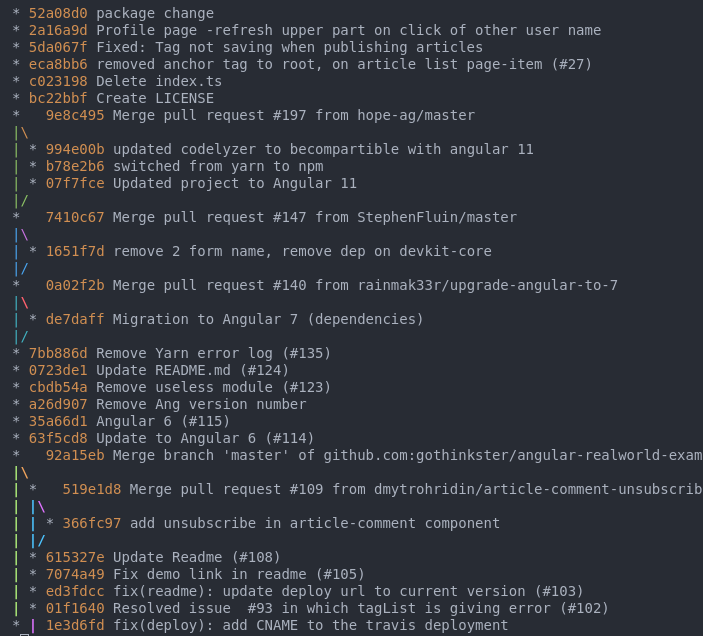
   

###### Con este comando vemos el registro de commits de forma visual --graph nos permite ver las conexiones entre commits de forma visual, permitiéndonos realizar un seguimiento del desarrolo más efectivo.

   - **Captura 4**  
``` bash
git log --pretty=format:"%h %ad | %s%d [%an]" --graph --date=short
```
    
    
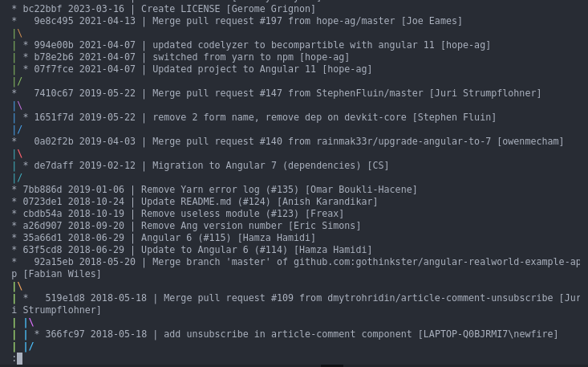

###### Estas opciones nos muestran la fecha de los commits(%ad), con el hash abreviado (%h), el creador del commit(%an), el mensaje del commit (%s) y la referencias ramas/tagas (%d). 
- GIT DIFF
    - **Captura 1**  
    ``` bash
    git diff de7daff 7bb886d 
    ```
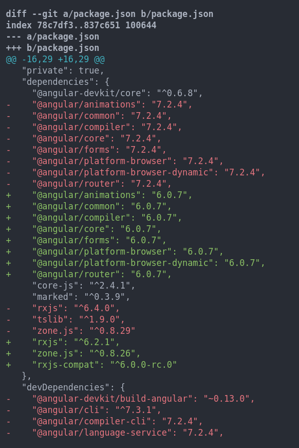
 ###### Con este comando mostramos las diferencias entre 2 commits concretos, de forma que vemos en verde las líneas nuevas y en rojo las antiguas que han sido eliminadas en el commit más reciente.

  - **Captura 2**  
     ``` bash
    git diff --stat de7daff 7bb886d 
    ```
  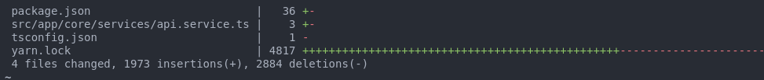
  ###### Facilita un resumen estadistico de los cambios realizados entre ambos commits, permite ver de forma fácil y rápida las líneas y los archivos que han sido modificados.

  - **Captura 3**  
```bash
  git diff --color-words de7daff 7bb886d 
```
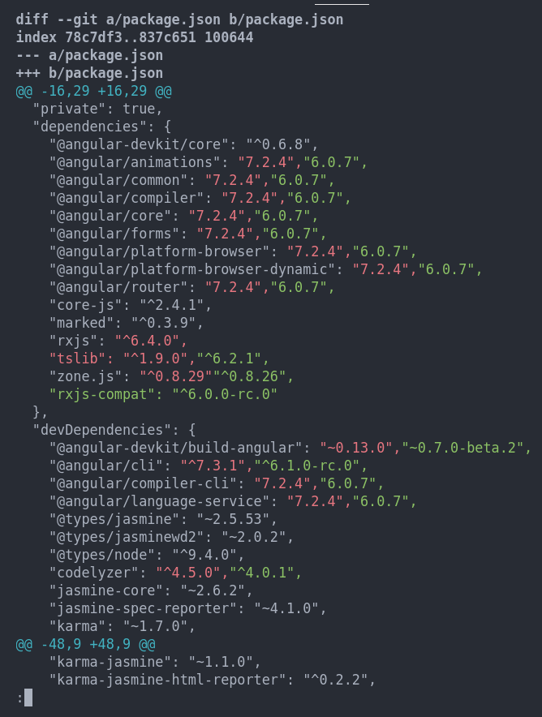
###### Ahora podemos visualizar los cambios realizados entre commits linea a línea, coloreando los cambios efectuados (en verde) sobre los que había antes del commit (en rojo). Es interesante para ver de forma clara las modificaciones realizadas.

  - **Captura 4**  
  ```bash
    git diff-tree 9e8c495 bc22bbf
  ```
  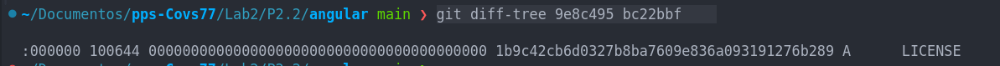
  ###### Este comando es útil para ver los cambios en el contenido de los archivos, sino también los cambios en la estructura del árbol del repositorio. Si interpretamos los datos obtenidos podemos ver que el fichero no existía en el commit anterior esto lo sabemos porque su hash (3ª columna) es 0.


- GIT SHOW
    - **Captura 1**  
```bash
git show 2a16a9d
```
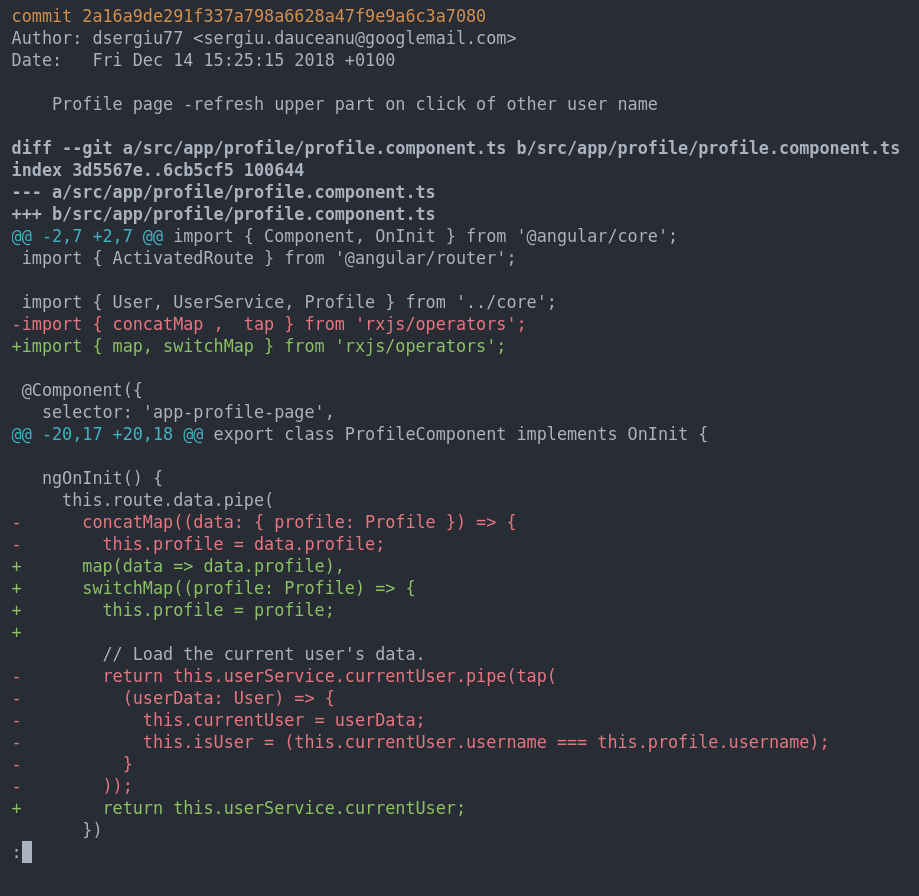
###### Vemos los detalles de un commit concreto, la información del autor, la fecha, el comentario. Así como el contenido modificado (verde) y las rojas son las líneas eliminadas.

- **Captura 2**  
```bash
    git show --oneline --stat 2a16a9d  
```
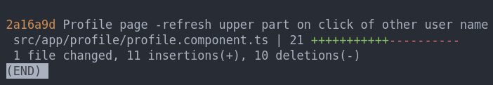
###### Obetenemos un resumen compacto de las líneas añadidas y eliminadas. Nos permite saber cuantos archivos han sido modificados

  - **Captura 3**  
```bash
    git show --pretty=format:"%h - %an, %ar : %s"932dff
```

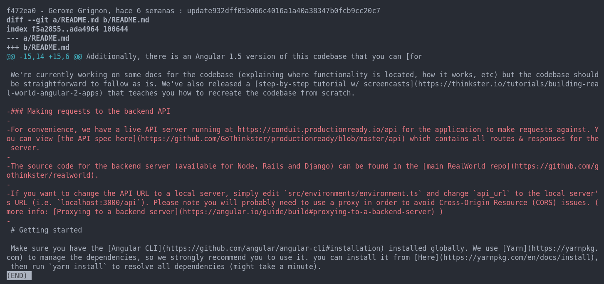
###### Con la opción pretty format podemos definir cómo ver la información, con %h,muestra el hash corto,%an devuelve el nombre del autor, %s el mensaje del commit y %ar muestra el tiempo relativo desde que se hizo el commit en la cabecera de la información devuelta. Sin duda nos permite afinar mejor la búsqueda de un cambio en el desarrollo de nuestro sw.


  - **Captura 4**  
```bash
    git show --summary 932dff  
```
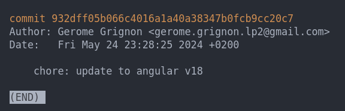
###### Muestra un pequeño resumen del commit. Su hash, el autor, la fecha de creacion y el comantario del commit. 

- GIT BLAME
  - **Captura 1**  
```bash
    git blame tsconfig.json 
```
  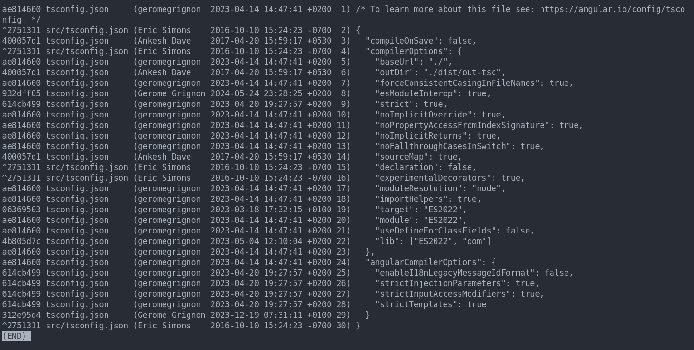
###### Muestra los distintos commits en los que dicho fichero ha sido modificado, el autor de los cambios, la fecha y el comentario así como el contenido de la línea que fue cambiada. Facilita el rastreo del historial de un archivo línea a línea.

  - **Captura 2**  
    
``` bash
git blame -L 10,20 tsconfig.json  
```
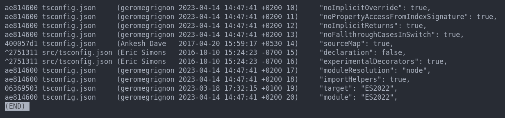
###### El flag -L nos permite chequear la infomación un rango de líneas concretas de un fichero, en este caso de las lineas 10 a 20 del archivo de configuración tsconfig.json. 

  - **Captura 3**  

``` bash
git blame -e -f tsconfig.json  
```
  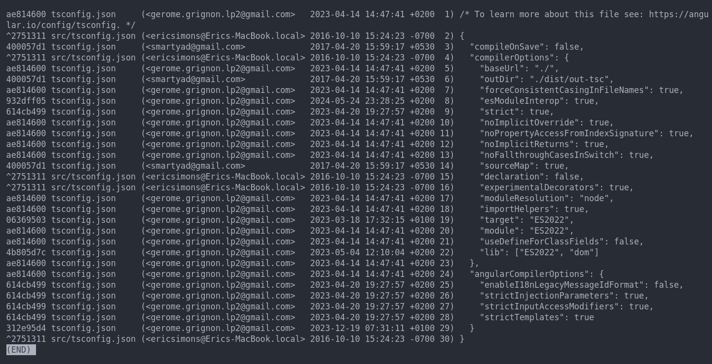
###### Ahora obtenemos los emails de quienes han formado los commits y por tanto las modificaciones en el archivo. La flag -f nos permite ver el nombre completo del archivo aunque haya sido renombrado.

  - **Captura 4**  
  ``` bash
git blame -C angular.json
```

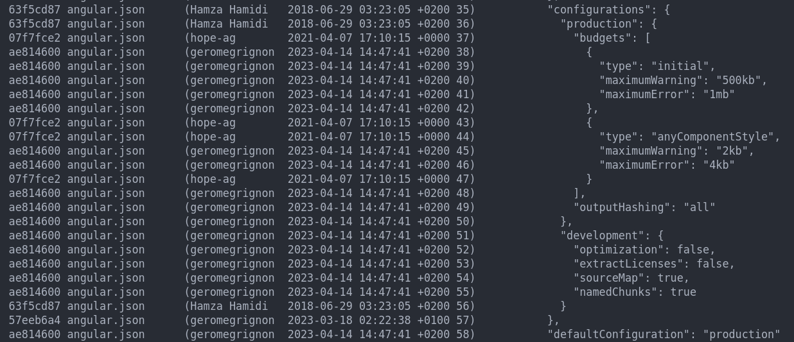

###### Devuelve las líneas que han sido copiadas desde otra parte del código incluso desde otro archivo mostrando el origen del mismo.


