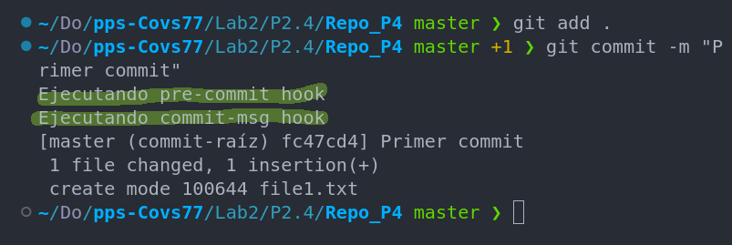
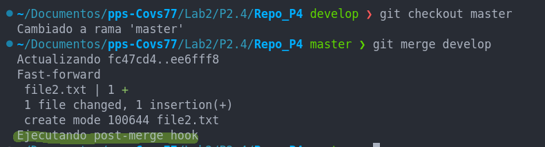
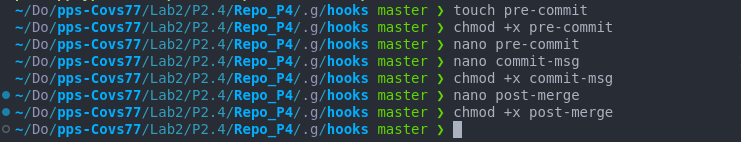
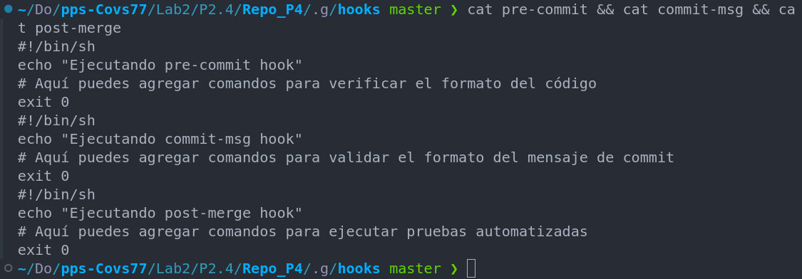

## Práctica 2.4. Configurando hooks de GIT (1 punto)

En esta práctica, aprenderás a configurar y utilizar hooks en GIT para automatizar tareas comunes en tu flujo de trabajo. Los hooks son scripts que GIT ejecuta automáticamente en ciertos puntos del ciclo de vida de los commits y otras acciones de GIT. 

#### Objetivos:
1. Configurar un hook pre-commit para verificar el formato del código antes de permitir un commit.
2. Configurar un hook commit-msg para asegurar que los mensajes de commit sigan un formato específico.
3. Configurar un hook post-merge para ejecutar pruebas automatizadas después de una fusión.

#### Instrucciones:
1. Crea un repositorio GIT nuevo o utiliza uno existente.
2. Navega al directorio `.git/hooks` dentro de tu repositorio.
3. Copia y pega los siguientes scripts en los archivos correspondientes dentro del directorio `.git/hooks`:

    - **pre-commit**:
      ```sh
      #!/bin/sh
      echo "Ejecutando pre-commit hook"
      # Aquí puedes agregar comandos para verificar el formato del código
      exit 0
      ```

    - **commit-msg**:
      ```sh
      #!/bin/sh
      echo "Ejecutando commit-msg hook"
      # Aquí puedes agregar comandos para validar el formato del mensaje de commit
      exit 0
      ```

    - **post-merge**:
      ```sh
      #!/bin/sh
      echo "Ejecutando post-merge hook"
      # Aquí puedes agregar comandos para ejecutar pruebas automatizadas
      exit 0
      ```

4. Asegúrate de que los scripts sean ejecutables:
    ```sh
    chmod +x .git/hooks/pre-commit
    chmod +x .git/hooks/commit-msg
    chmod +x .git/hooks/post-merge
    ```

5. Realiza pruebas para verificar que los hooks funcionan correctamente.

#### Entregables:
- Capturas de pantalla o registros de la terminal que muestren la ejecución de cada hook.



- Los scripts utilizados para cada hook.



- Un breve informe describiendo los pasos realizados y cualquier problema encontrado.

    Para comprobar que los hooks se lanzan correctamente he creado un nuevo repositorio 'Repo_P4', en el directorio .git/hooks, he creado y modificado los archivos pre-commit, commit-msg y post-merge. Después he creado un fichero de prueba en la rama master, lo he añadido y comiteado para verificar que los hooks se lanzaban correctamente. Después he creado la rama 'develop' he cambiado a dicha rama, he creado otro fichero de prueba lo he añadido y comiteado, en este punto he podido comprobar que de nuevo se lanzaban los hooks pre-commit y commit-msg y por último he hecho un git merge para integrar la rama 'develop' en la rama 'master', donde he podido comprobar que el hook post-merge se lanzaba correctamente también.
    Por último he renombrado el directorio .git .git_2 del repositorio de prueba Repo_P4 para no tener conflictos a la hora de añadir al repositorio de entrega este documento.