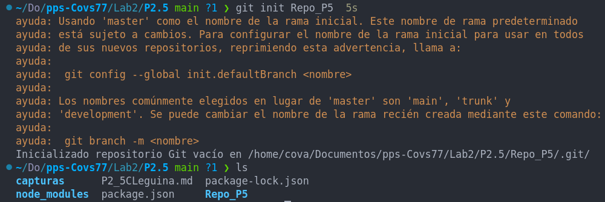
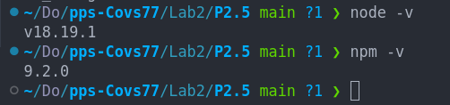
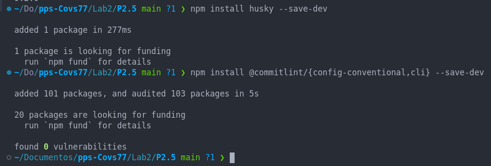
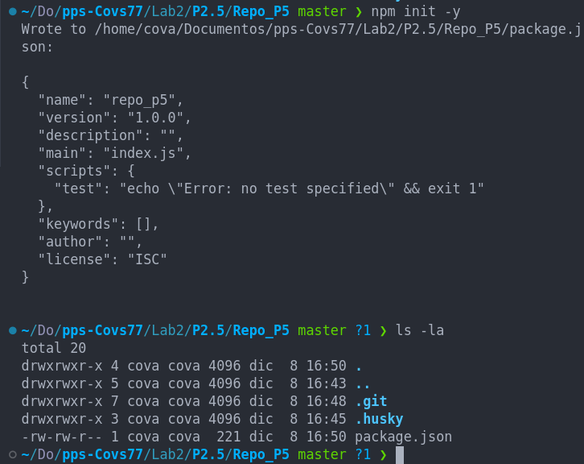
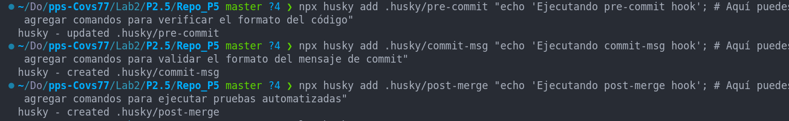
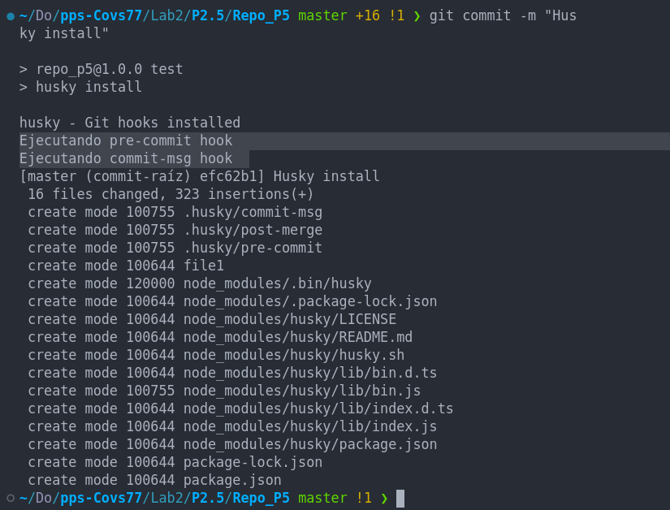
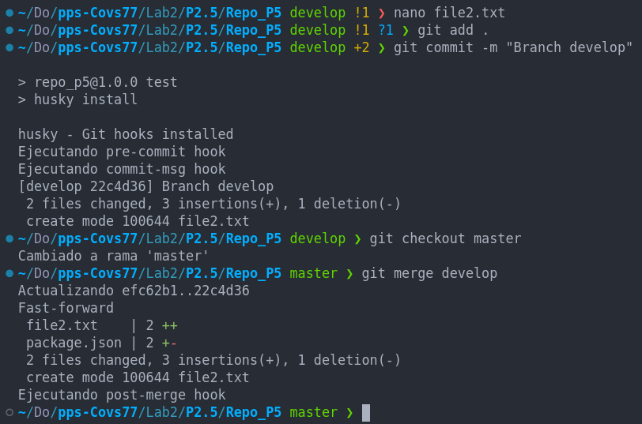
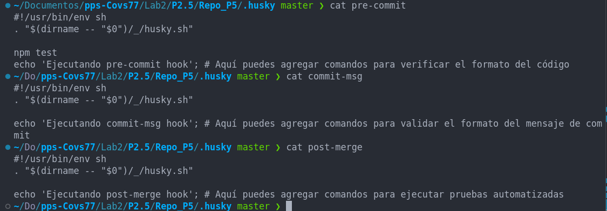

## Práctica 2.5. Configurando hooks usando Husky (1 punto)

En esta práctica, aprenderás a configurar y utilizar Husky para gestionar hooks en GIT de manera más sencilla y eficiente. Husky es una herramienta que facilita la creación y gestión de hooks en GIT, permitiendo automatizar tareas comunes en tu flujo de trabajo.

#### Objetivos:
1. Instalar Husky en un proyecto GIT.
    
2. Configurar un hook pre-commit para verificar el formato del código antes de permitir un commit.
3. Configurar un hook commit-msg para asegurar que los mensajes de commit sigan un formato específico.
4. Configurar un hook post-merge para ejecutar pruebas automatizadas después de una fusión.

#### Instrucciones:
1. Crea un repositorio GIT nuevo o utiliza uno existente.
    
2. Asegúrate de tener Node.js y npm instalados en tu sistema.
    
3. Instala Husky en tu proyecto:
    ```sh
    npm install husky --save-dev
    ```
    
4. Inicializa Husky en tu proyecto:
    ```sh
    npx husky install
    ```


5. Configura los hooks utilizando Husky:
    - **pre-commit**:
      ```sh
      npx husky add .husky/pre-commit "echo 'Ejecutando pre-commit hook'; # Aquí puedes agregar comandos para verificar el formato del código"
      ```

    - **commit-msg**:
      ```sh
      npx husky add .husky/commit-msg "echo 'Ejecutando commit-msg hook'; # Aquí puedes agregar comandos para validar el formato del mensaje de commit"
      ```

    - **post-merge**:
      ```sh
      npx husky add .husky/post-merge "echo 'Ejecutando post-merge hook'; # Aquí puedes agregar comandos para ejecutar pruebas automatizadas"
      ```


6. Realiza pruebas para verificar que los hooks funcionan correctamente.


#### Entregables:
- Capturas de pantalla o registros de la terminal que muestren la ejecución de cada hook.



- Los scripts utilizados para cada hook.

- Un breve informe describiendo los pasos realizados y cualquier problema encontrado.
    
    En primer lugar verifico que tengo node.js y npm instalados, instalo Husky.
    Después he modificado los scripts de los hooks pre-commit, commit-msg y post-merge para que muestren un mensaje por pantalla.
    He hecho un commit en la rama master para comprobar que se lanzaban lo hooks correctamente, luego he creado otra rama 'develop' a la que he añadido otro archivo para comitearlo y he verificado que el hook post-merge se lanzaba correctamente.
    
    Por último he renombrado el directorio .git .git_2 del repositorio de prueba Repo_P5 para no tener conflictos a la hora de añadir al repositorio de entrega este documento.

    

