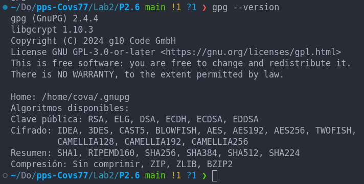
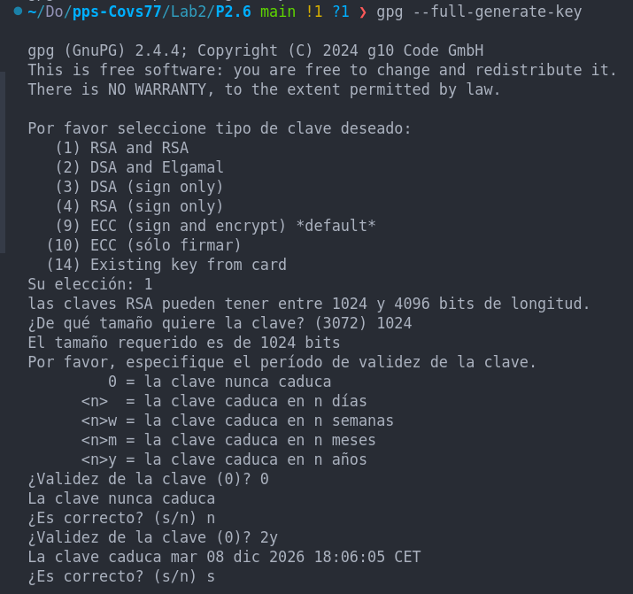
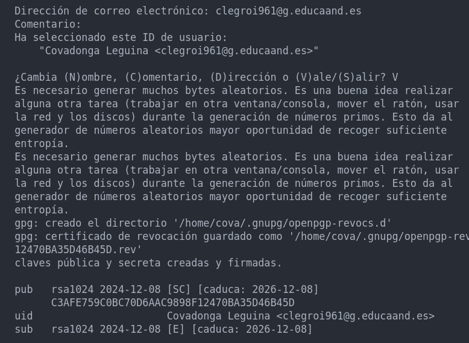
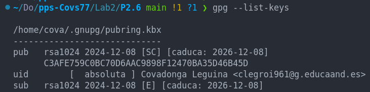
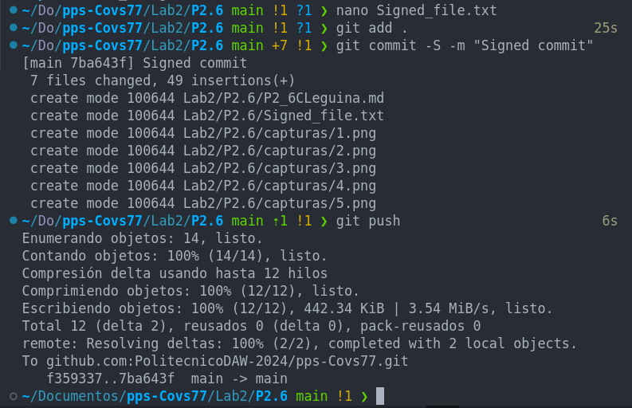
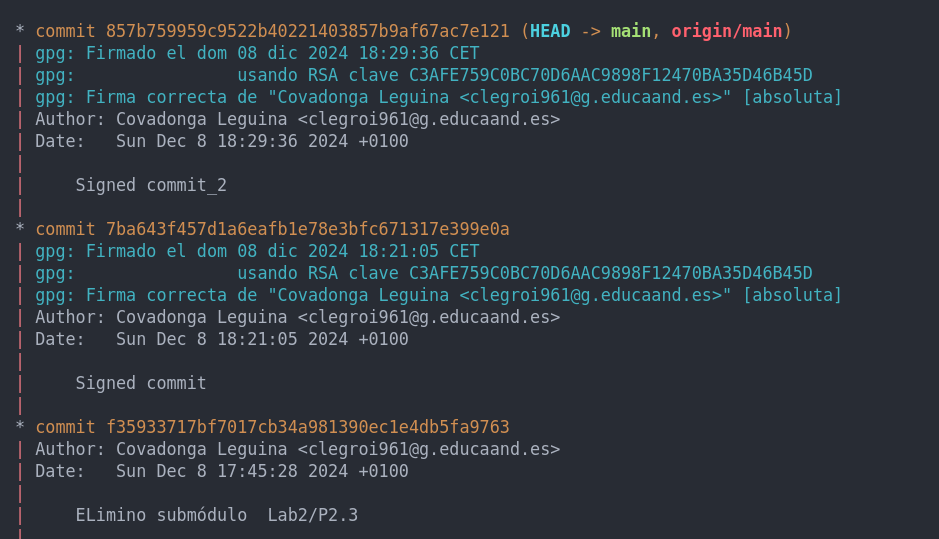
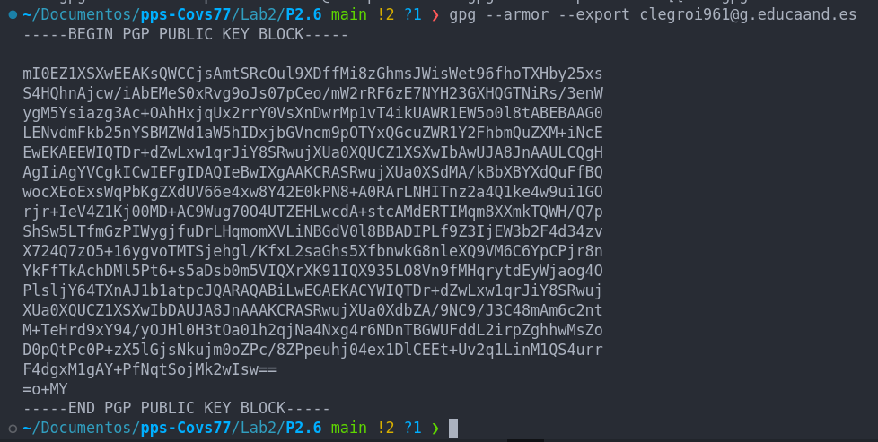
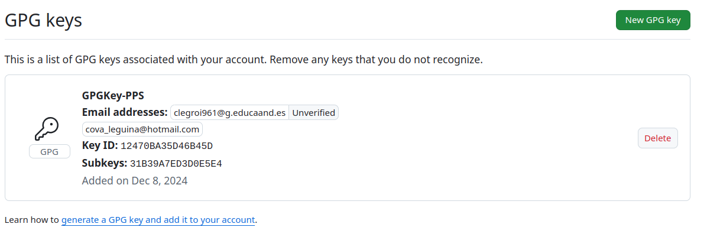
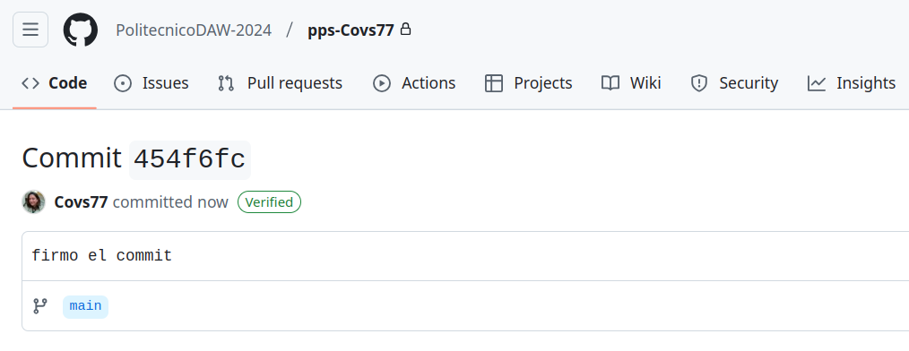

## Práctica 2.6. Firmando commits (1.5 puntos)

En esta práctica, aprenderás a firmar tus commits en GIT utilizando GPG (GNU Privacy Guard) para asegurar la autenticidad e integridad de tus cambios. Firmar tus commits añade una capa adicional de seguridad y confianza, permitiendo a otros verificar que los commits realmente provienen de ti. Además, podrás ver la verificación de tus commits firmados en plataformas como GitHub.

#### Objetivos:
1. Generar una clave GPG si no tienes una.
2. Configurar GIT para usar tu clave GPG.
3. Firmar tus commits con GPG.
4. Verificar la firma de tus commits en GitHub.

#### Instrucciones:
1. **Generar una clave GPG**:
    - Si no tienes una clave GPG, genera una nueva clave siguiendo las instrucciones de la [documentación oficial de GPG](https://gnupg.org/documentation/).
    

2. **Configurar GIT para usar tu clave GPG**:
    - Exporta tu clave pública y añádela a tu cuenta de GitHub siguiendo las instrucciones de la [documentación de GitHub](https://docs.github.com/en/authentication/managing-commit-signature-verification/adding-a-gpg-key-to-your-github-account).
    - Configura GIT para usar tu clave GPG:
      ```sh
      git config --global user.signingkey <tu_clave_gpg>
      git config --global commit.gpgSign true
      ```

3. **Firmar tus commits con GPG**:
    - Realiza un commit firmado:
      ```sh
      git commit -S -m "Tu mensaje de commit"
      ```

4. **Verificar la firma de tus commits en GitHub**:
    - Sube tus commits firmados a GitHub y verifica que aparezcan como "Verified" en la interfaz de GitHub.

#### Entregables:
- Capturas de pantalla o registros de la terminal que muestren la generación de la clave GPG y la configuración en GIT.
    ###### Verifico si tengo gpg instalado en mi equipo
    

    ###### Genero el par de claves con GPG.
    
    
    
    
    ###### Configuro Git para firmar los commits con GPG
    
    
- Capturas de pantalla de los commits firmados y verificados en GitHub.
    ###### Muestro commit firmado en GIT

    

    

    ###### Configuro GitHub para firmar los commits con GPG. Copio la clave pública y la añado a GitHub:


    
    
    


- Un breve informe describiendo los pasos realizados y cualquier problema encontrado.

    - Para realizar esta práctica he verificado que teníamos instalado gpg, lo he configurado, con mis datos personales, fecha de expiración y contraseña. Después he configurado Git para que admita las firmas añadiendo la clave pública. Después he copiado la llave pública y la he añadido a mi cuenta de GitHub. En este punto he tenido un problema ya que habia configurado la clave GPG con la cuenta de correo escolar corporativa, pero mi cuenta de GitHub está configurada con mi cuenta de correo personal. Así que he tenido que modificar la cuenta de correo tanto en la configuración de GPG como en la de Git para que GiHub pudiera aceptar los commits como verificados(no he hecho capturas de este proceso). Verás que durante el proceso aparece la cuenta de correo corporativa y ya al final mi cuenta personal, es por ese motivo.

    
        
        **Nota:** Algunos de los comandos que aparecen en la documentación que nos facilitas para la creación de claves GPG están desactualizados. Me he ayudado de ChatGPT para encontrar los comandos correctos.