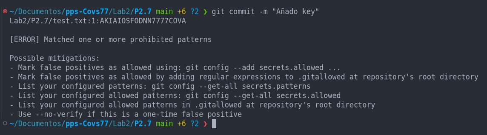

## Práctica 2.7. Securizando GIT: Git-Secrets (1.5 puntos)

En esta práctica, aprenderás a utilizar `git-secrets` para evitar que información sensible, como claves API y contraseñas, se incluya accidentalmente en tus commits de GIT. `git-secrets` es una herramienta que escanea tus commits y previene que información sensible sea añadida al repositorio.

#### Objetivos:
1. Instalar `git-secrets` en tu sistema.
2. Configurar `git-secrets` en un repositorio GIT.
3. Añadir patrones para detectar información sensible.
4. Probar `git-secrets` para asegurarte de que funciona correctamente.

#### Instrucciones:
1. **Instalar `git-secrets`**:
    - Sigue las instrucciones de instalación para tu sistema operativo desde el [repositorio oficial de git-secrets](https://github.com/awslabs/git-secrets#installing-git-secrets).
  


2. **Configurar `git-secrets` en tu repositorio**:
    - Navega al directorio de tu repositorio GIT y ejecuta:
      ```sh
      git secrets --install
      git secrets --register-aws
      ```


3. **Probar `git-secrets`**:
    - Intenta hacer un commit que contenga información sensible para verificar que `git-secrets` lo detecta y bloquea:
      ```sh
      echo "AWS_SECRET_ACCESS_KEY=example" > test.txt
      git add test.txt
      git commit -m "Añadiendo clave secreta"

      ```


4. **Verificar la configuración**:
    - Asegúrate de que `git-secrets` está correctamente configurado y funcionando en tu repositorio.


5. **Añadir patrones personalizados**:
    - Puedes añadir patrones personalizados para detectar información sensible específica de tu proyecto:
      ```sh
      git secrets --add 'tu_patron_personalizado'
      ```


  - Haz comprobaciones de que se han buscado y detectado tus patrones personalizados.

    


