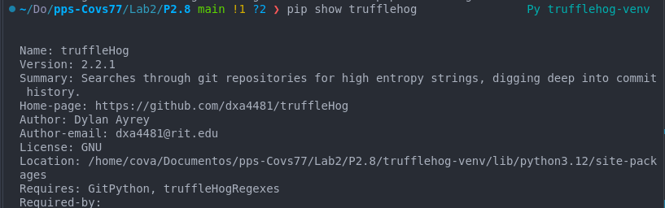
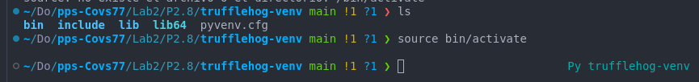
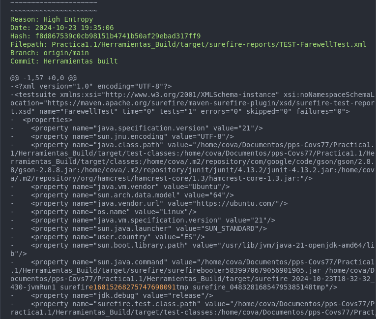
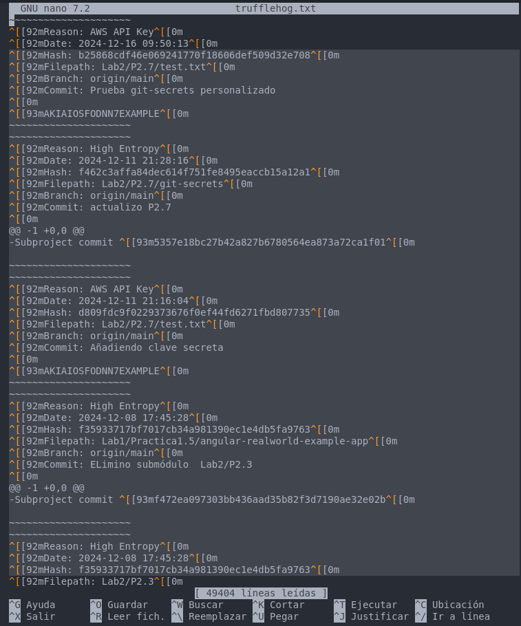

## Práctica 2.8. Securizando GIT: Trufflehog: Local (1.25 puntos)

En esta práctica, aprenderás a utilizar TruffleHog para escanear tu repositorio GIT en busca de información sensible, como claves API y contraseñas, que puedan haberse incluido accidentalmente en tus commits. TruffleHog es una herramienta que busca patrones de información sensible en el historial de commits de tu repositorio.

#### Objetivos:
1. Instalar TruffleHog en tu sistema.
2. Configurar TruffleHog para escanear un repositorio GIT local.
3. Ejecutar TruffleHog para detectar información sensible en el historial de commits.
4. Analizar los resultados del escaneo y tomar medidas para eliminar cualquier información sensible encontrada.

#### Instrucciones:
1. **Instalar TruffleHog**



Al instalar se ha creado un entorn Trufflehog en el directorio P2.8 "trufflehog-venv" para activarlo debo ejecutar el siguiente comando dentro del directorio:



```bash
    source bin/activate
```
Para desactivarlo bastará con ejecutar este comando:

```bash
    deactivate
```


2. **Configurar TruffleHog para escanear un repositorio GIT local**:
    - Navega al directorio de tu repositorio GIT.

3. **Ejecutar TruffleHog**:
    - Ejecuta TruffleHog para escanear el historial de commits de tu repositorio:
      ```sh
      trufflehog --regex --entropy=True .
      ```
4. **Analizar los resultados del escaneo**:
    - Revisa los resultados proporcionados por TruffleHog para identificar cualquier información sensible.
    - Si se encuentra información sensible, toma las medidas necesarias para eliminarla del historial de commits (por ejemplo, utilizando `git filter-branch` o `BFG Repo-Cleaner`).

Cuando ejecuto este comando aparece un muchísima informacion que no soy capaz de interpretar, como por ejemplo esto:



Quiero entender que me está mostrando los commits donde pueda haber información comprometida, como hashes. El último commit que muestra es el que he realizado de prueba en la práctica anterior donde intentamos subir una clave AWS.
Veo que me enseña información sobre la fecha y hora, el Hash del commit, el path con la ubicación de los archivos comprometidos, la rama en la que se ha realizado dicho commit...
Pero me cuesta interpretar toda esta información para tomar medidas mitigadoras al respecto.

5. **Verificar la eliminación de información sensible**:
    - Asegúrate de que la información sensible ha sido eliminada correctamente y que el repositorio está limpio.

    
    No sé cómo realizar esto por lo que comento en el punto anterior.


6. **Provoca una vulnerabilidad y localizala**
    - Haz un commit con credenciales que deben protegerse.
    - Haz un commit borrando la credencial.
    - Escanea y encuentra la vulnerabilidad.

    
    No realizado.
