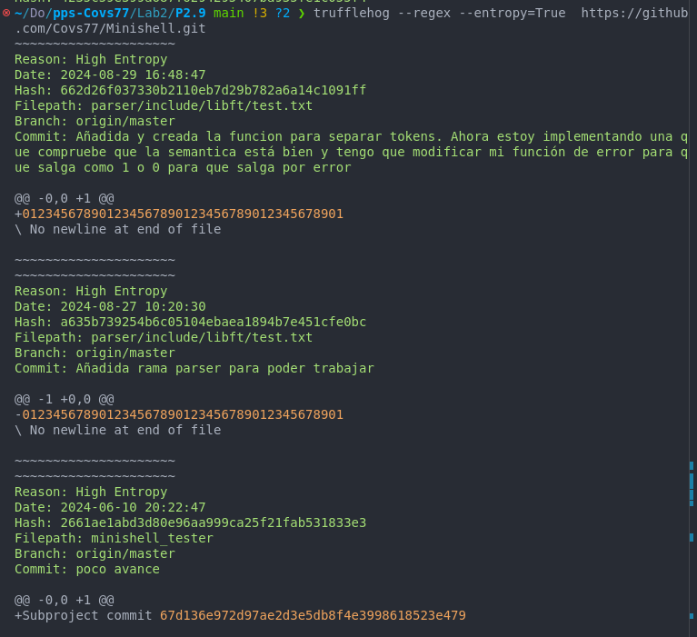

## Práctica 2.9. Securizando GIT: Trufflehog: Remoto (1.25 puntos)

En esta práctica, aprenderás a utilizar TruffleHog para escanear un repositorio GIT remoto en busca de información sensible.

#### Objetivos:
1. Configurar TruffleHog para escanear un repositorio GIT remoto.
2. Ejecutar TruffleHog para detectar información sensible en el historial de commits del repositorio remoto.
3. Analizar los resultados del escaneo y tomar medidas para eliminar cualquier información sensible encontrada.

#### Instrucciones:
1. **Configurar TruffleHog para escanear un repositorio GIT remoto**:
    - Identifica la URL del repositorio GIT remoto que deseas escanear.

```bash
    https://github.com/Covs77/Minishell.git
```

2. **Ejecutar TruffleHog**:
    - Ejecuta TruffleHog para escanear el historial de commits del repositorio remoto:
      ```sh
      trufflehog --regex --entropy=True <URL_del_repositorio_remoto>
      ```


3. **Analizar los resultados del escaneo**:
    - Revisa los resultados proporcionados por TruffleHog para identificar cualquier información sensible.
    - Si se encuentra información sensible, toma las medidas necesarias para eliminarla del historial de commits (por ejemplo, utilizando `git filter-branch` o `BFG Repo-Cleaner`).


En el reporte de TruffleHog sobre posibles claves o secretos (como contraseñas o tokens) detectados en un repositorio Git, basado en el análisis de la entropía y el uso de expresiones regulares.

**Detalles del informe:**
- Reason: High Entropy: El "High Entropy" (alta entropía) indica que TruffleHog ha detectado cadenas de texto que tienen una alta aleatoriedad, lo que podría sugerir que se trata de datos sensibles como claves API, tokens de acceso o contraseñas. Los valores de entropía más altos son típicos de secretos, ya que son más impredecibles y menos legibles.

- Date: Muestra la fecha y hora exacta del commit donde se detectó la posible clave o secreto.

- Hash: El hash del commit correspondiente donde se encuentra el posible secreto. Es una identificación única para ese commit en Git.

- Filepath: La ruta del archivo dentro del repositorio donde se encontró el posible secreto. Esto te ayuda a localizar el archivo que podría contener un dato sensible.

- Branch: La rama de Git donde se realizó el commit.

- Commit: El mensaje del commit asociado, que da información sobre lo que se estaba haciendo en ese momento en el proyecto.

- Change Diff: Las líneas cambiadas en el commit, representadas por el diff. Aquí se muestra la adición o eliminación de líneas en el archivo. Los valores con "012345678901234567890123456789012345678901" son ejemplos de cadenas con alta entropía, que podrían ser claves o secretos.


4. **Verificar la eliminación de información sensible**:
    - Asegúrate de que la información sensible ha sido eliminada correctamente y que el repositorio está limpio.

    No realizado.