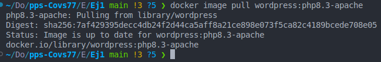

# 
<b>Covadonga Leguina Roig
## 
<b>Prueba de verificación de prácticas de Docker</b>
### Puesta en Producción Segura. CECTI 2024/2025
#### 19 de Febrero 2025
____________

### Ejercicio 1. Diferencia entre imagen y contenedor.

#### 1.1. Listado de imagenes.
No tenía ninguna descargada, así que he descargado las que vamos a necesitar en los siguientes ejercicios.

En la primera columna REPOSITORY aparece el nombre de la imagen. La columna TAG hace referencia a la versión de la imagen php8.8-apache en el caso de wordpress y 8.0 para la imagen de mysql. La siguiente columna es el ID o identificador único de cada imagen. A continuación vemos la fecha de creación de dicha imagen y por último el tamaño de la misma. en MegaBytes.

#### 1.2. Descargar imagen wordpress.

Utilizo este comando, ya la tengo descargada porque es la que he usado en el apartado anterior.

En el historial de ejecución de la imagen vemos todos los comandos y ejecuciones que se han realizado en el proceso de creación de dicha imagen. Vemos como se ha copiado un script, se han modificado los permisos, se ha establecido un volumen local en /var/www/html/. Se ha establecido apache2 para que se ejecute en segundo plano. Se ha expuesto el puerto 80... También se han establecido las variables de entorno necesarias para el servicio PHP de la imagen.

Si inspeccionamos la imagen vemos toda la configuración de la misma. 
Lo primero que encontramos es el Id,es el hash de la imagen en esta caso un sha256. El nombre que se le ha asignado "Wordpress:php8.3-apache"
La fecha de creación y la configuración del hostname, Domainname, etc.También se establecen las variables de entorno como el PATH o los directorios de configuración de los servicios apache y php del contenedor. También se incluye una clave GPG para asegurar la imagen. También se establecen los volumenes locales y los comandos de ejecución del contenedor (ENTRYPOINT).

#### 1.3 Ejecutar mysql:8.0 en modo interactivo.

He creado un Dockerfile para construir la imagen y añadir las especificaciones que se piden, variables de entorno, volumenes...En un solo comando me daba error.

No he sabido realizar todos los cambios en las variables de entorno en un solo comando. Y no me da tiempo a intentarlo de nuevo.

#### 1.4 Ejecución del contenedor en modo demonio.

Suponiendo que este es el contendor correcto, ejecutamos en modo demonio, o lo que es lo mismo, en segundo plano.

