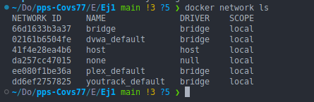
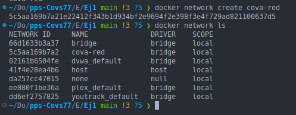
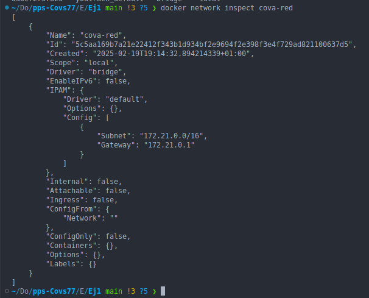
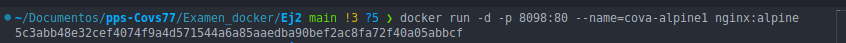
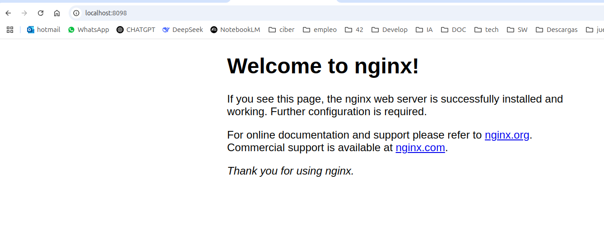
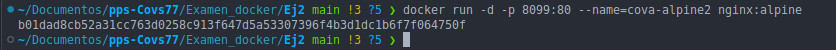
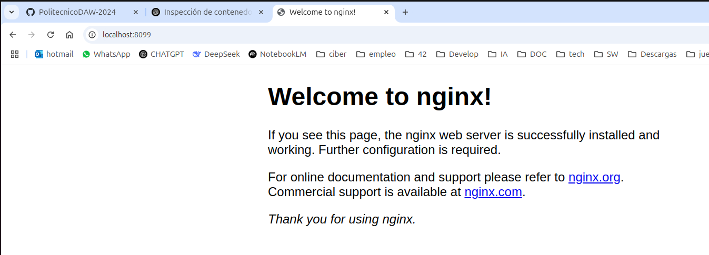
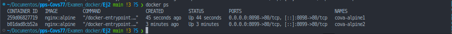
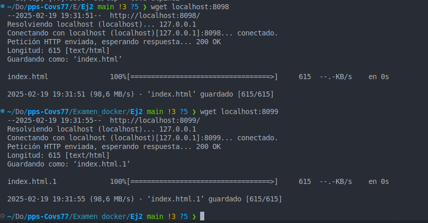

# 
<b>Covadonga Leguina Roig
## 
<b>Prueba de verificación de prácticas de Docker</b>
### Puesta en Producción Segura. CECTI 2024/2025
#### 19 de Febrero 2025
____________

### Ejercicio 2.

2.1 Redes.

Listo las redes:

Creo una red, cova-red y las vuelvo a listar:

 Vemos el nombre de la red, las IPs que tiene asignada la gateway como la subnet.

2.2 Ejecutar un contenedor exponiendo un puerto en modo demonio cova-alpine1, exponiendo el puerto 8098.

cova-alpine2, exponiendo el puerto 8099.

Verifico ambos contenedores: 

Compruebo el acceso a ambos contenedores:

