# 
<b>Covadonga Leguina Roig
## 
<b>Prueba de verificación de prácticas de Docker</b>
### Puesta en Producción Segura. CECTI 2024/2025
#### 19 de Febrero 2025
____________

### Ejercicio 3.

3.1 Usando Docker commit creamos una imagen basada en ubuntu:latest e instalaremos curl.

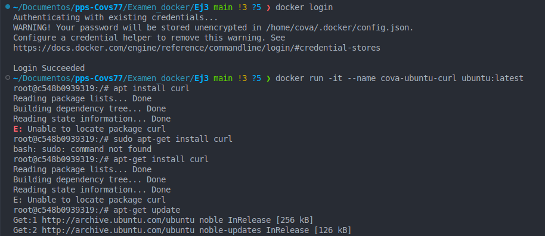

He tenido que actualizar el sistema para podere instalar curl en el contenedor.

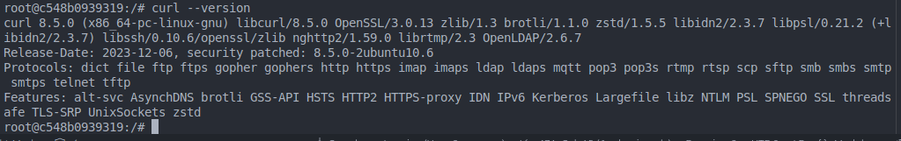

Lo comiteo:

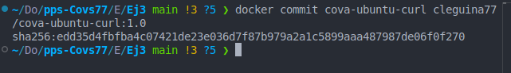

3.2. Guardo la imagen en un fichero comprimido y lo restauro desde ahi.
Lo guardo en un fichero comprimido y borro la imagen:

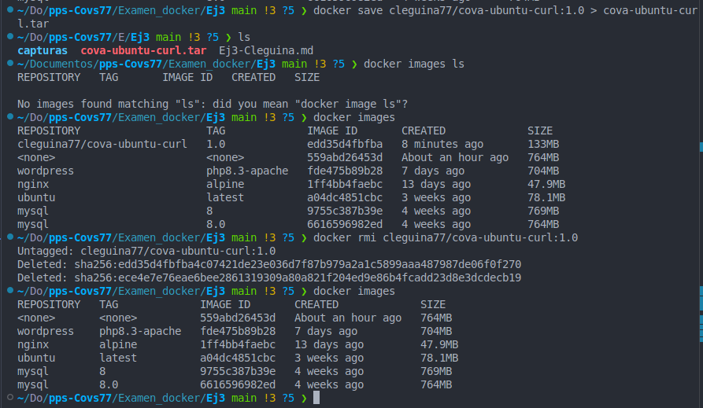

Vuelvo a cargar la imagen desde el fichero comprimido:

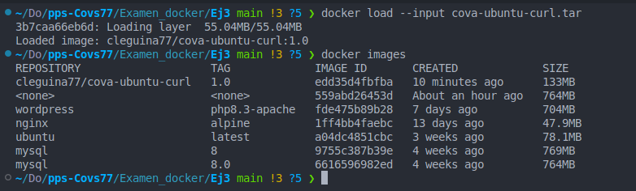

3.3 Crear un fichero de información y la subimos a Dockerhub

Creamos un fichero de información en modo interactivo, creamos una imagen personalizada y la subo a Docker Hub.

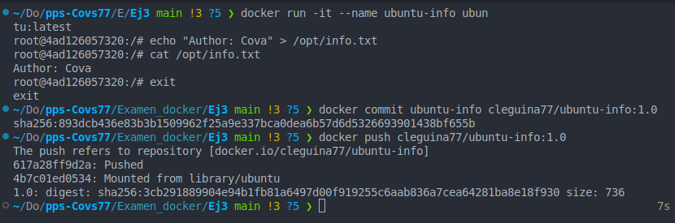
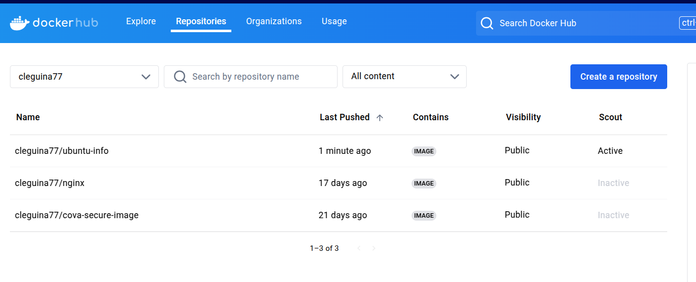

3.4 Construcción de una imagen con Dockerfile

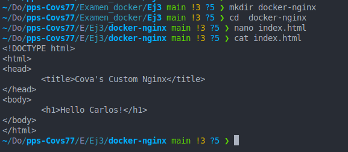
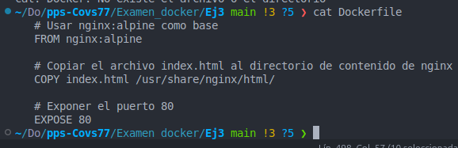
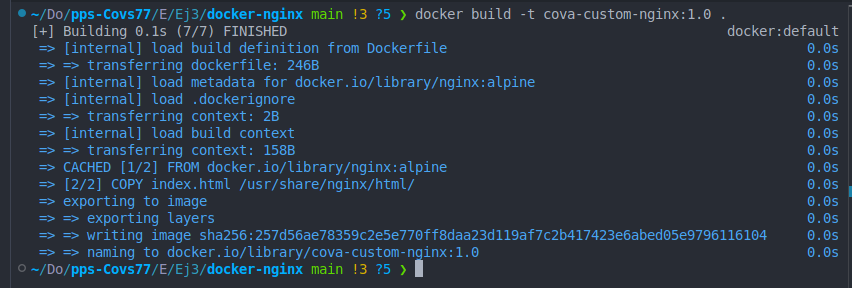

Ejecuto el contenedor:

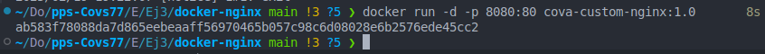
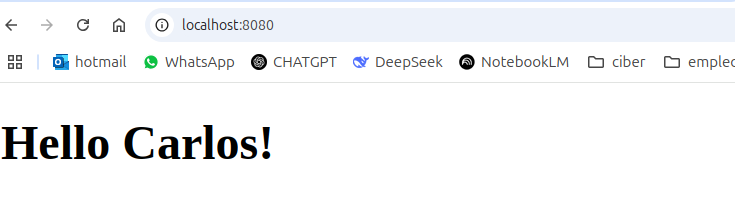