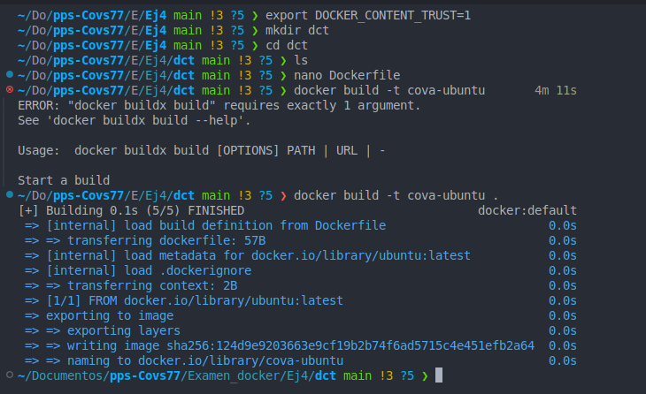
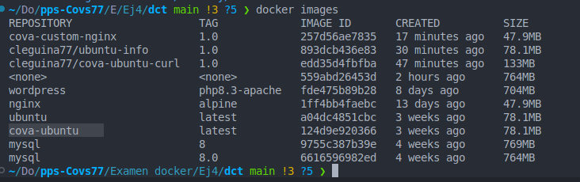
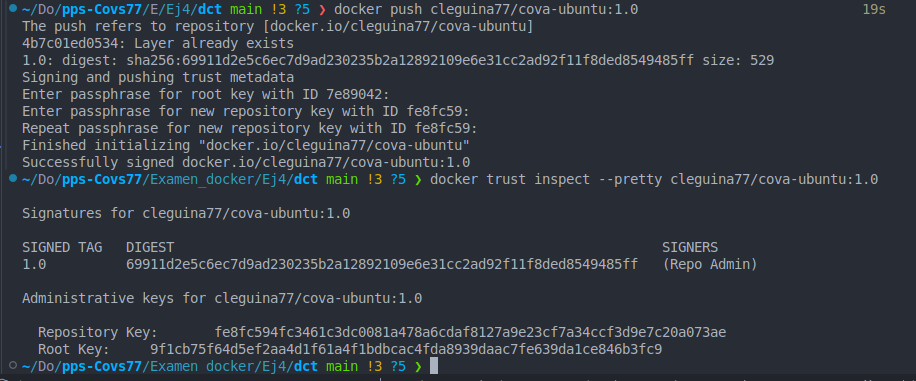
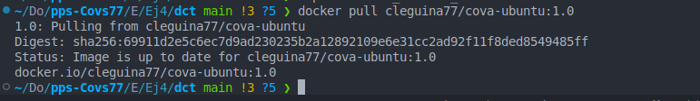
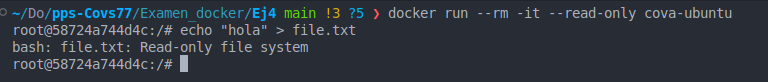
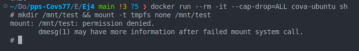
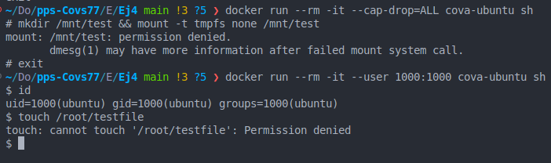
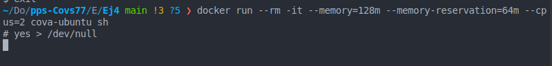

# 
<b>Covadonga Leguina Roig
## 
<b>Prueba de verificación de prácticas de Docker</b>
### Puesta en Producción Segura. CECTI 2024/2025
#### 19 de Febrero 2025
____________

### Ejercicio 4. Securización

4.1. DCT.
Creo una imagen basica de ubuntu:

4.2 Restriccion de privilegios

- Solo lectura: Esta configuración evita poder escribir en el contenedor evitando que se pueda dañar el mismo copiando archivos maliciosos.

-Limitaciones de kernel: No permitimios hacer cambios en el sistema.

- Ejecutar como no root:
Con esta configuración no permitimos realizar operaciones de root en el sistema

- Limitar uso memoria, reservar y limitar cpu:
Establecemos límites de uso de memoria para evitar ataques DoS donde se colapse el sistema y sea imposible dara servicio.
Establecemos un limite de uso de la RAM, revervamos memoria y solo permitimos que se usen 2 cpus del sistema.

Se que debería mostrarte como no consume mas resursos en el sistema pero voy a continuar o no me da tiempo a mas.