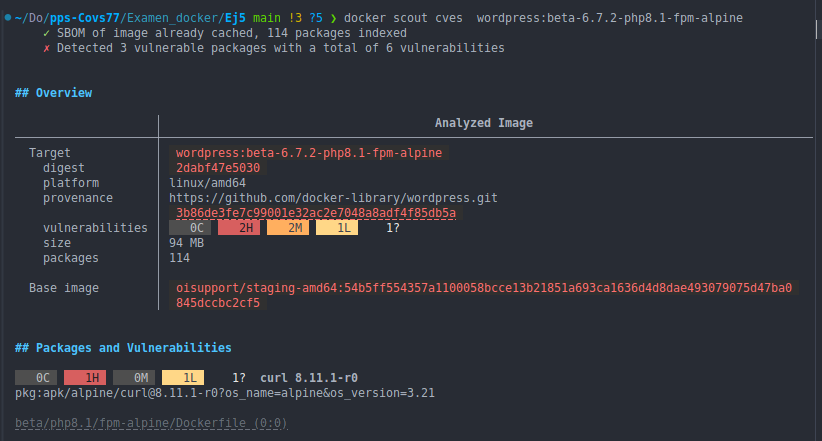
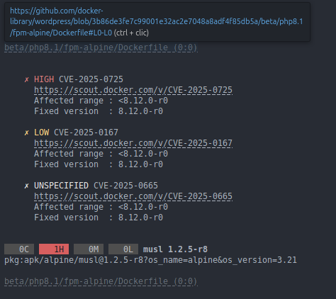
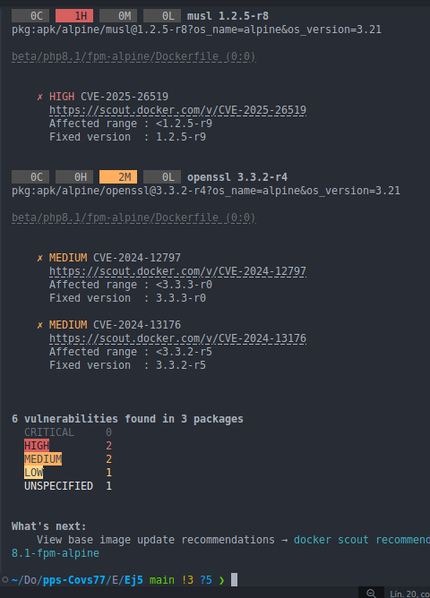
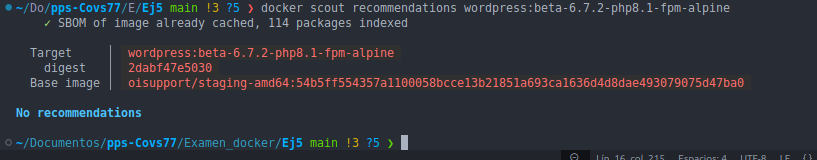
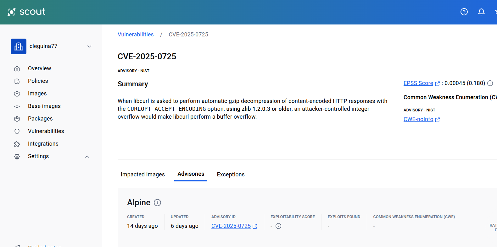
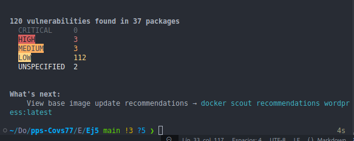

# 
<b>Covadonga Leguina Roig
## 
<b>Prueba de verificación de prácticas de Docker</b>
### Puesta en Producción Segura. CECTI 2024/2025
#### 19 de Febrero 2025
____________

### Ejercicio 5. Búsqueda de vulnerabilidades en imágenes

5.1 Analizamos la imagen de wordpress:beta-6.7.2-php8.1-fpm-alpine

Encontramos que esta imagen tiene 2 vulnerabilidades de nivel alto (high), 2 de nivel medio y 1 de bajo nivel. También existe otra que no está catalogada. Docker Scout no nos ofrece ninguna recomendación de mejora.

Por ejemplo la de nivel Alto con CVE-2025-0725 se trata de una vulnerabilidad de la libreria libcurl en la que un atacante puede provocar un desbordamiento de números enteros, lo que lleva a un desbordamiento de búfer en libcurl.

________ 

5.2 Comparación de dos imagenes:

Vamos a comparar la imagen: wordpress:beta-6.7.2-php8.1-fpm-alpine con la ultima version de wordpress:latest

He extraido la información a un documento para poderla analizar mejor. La imagen latest tiene  120 vulnerabilidades 

En el informe de la comparativa vemos como la version latest tiene vulnerabilildades en muchisimas librerias, asi como en los servicios que incluye como alpine, apache....
Sin duda la última versión no sería una buena opción para trabajar con ella ya que tiene muchas vulnerabilidades que pondrían nuestro sistema en riesgo.
Por lo que no siempre las últimas versiones serán las más seguras. 
Podemos concluir que una imagen personalizada, con los servicios mínimos que necesitemos siempre será mas segura que usar imagenes donde no sepamos que librerias o servicios tiene ya que pueden ser un problema ante ataques.

(Me gustaría poder hecho una comparativa mejor, pero me quedo sin tiempo...)
