## Práctica 3.1. Uso de contenedores (5.5 puntos)

### 1. Configuración Inicial (0.25 puntos)

1.1. Instalamos Docker:


1.2. Comprobamos la instalación y la versión:


1.3. Verificamos los permisos de mi usuario:


Ejecutamos el comando siguiente para verificar la configuración:

```bash
docker run hello-world
```

<p style="color:blue"><b>Comprobamos que se descarga y se ejecuta correctamente.</b></p>


__________________

#### 2. Primeros Pasos: Diferencia entre Imagen y Contenedor (0.25 puntos)

<p style="color:blue; text-align:justify;"><b> - Una imagen en docker es un archivo con una plantilla que define el sistema de archivos, las bibliotecas y las aplicaciones necesarias para ejecutar un contendor. Así como las configuraciones y dependencias. Son inmutables, una vez creadas no se pueden modificar. Se contruyen a traves del fichero Dokerfile y pueden ser almacenadas en el repositorio público DockerHub o en un repositorio de docker privado (de pago).
<br>- Un contenedor por su parte es la intancia en ejecución de una imagen. Son dinámicos y se pueden modificar según las necesidades que requiramos.
<br><br>Por tanto, una imagen es necesaria para crear y ejecutar un contenedor.</b></p> 

**2.1. Verifico las imagenes que tengo descargadas.**


**2.2. Descargamos una nueva imagen:**


**2.3. Comprobamos la construcción de la imagen, sus capas y cómo se ha realizado dicha construcción.**


<p style="color:blue; text-align:justify;"><b>Inspeccionamos la imagen, mostrando su configuración y metadatos (imagen incompleta). </b></p>


**2.4. Ejecutamos una imagen, entramos y renombramos el contenedor y ejecutamos una sesión interactiva de shell dentro del contenedor con el mismo comando:**


<p style="color:red ; text-align:justify;"><b>Notas: <br>* --name permite renombrar el contenedor. <br>* El flag -it permite la interacción con el contenedor a través de la terminal. <br>* El comando /bin/sh abre una sesión de shell dentro del contenedor.

**2.5. Ejecutamos la imagen en modo demonio (segundo plano) con el flag -d y le asignamos un nombre diferente:**

``` bash
   docker container run -d --name=alpine-xxxx-1 nginx:alpine 
```

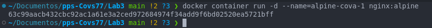

**2.6. Accedemos al contenedor ejecutado en modo demonio con el comando**
```bash
   docker container exec -it alpine-cova-1 /bin/sh  
```


**2.7. Borramos los contenedores creados anteriormente:**


**2.8. Comprobamos que no existe ningun contenedor en el sistema:**

```bash
   docker container ps -a 
```


___________________

#### 3. Primeros Pasos: Redes (0.75 puntos)
**3.1. Crear una red personalizada y listar redes existentes**

1. Listamos las redes existentes:


2. Creo una red personalizada (en bridge por defecto) y la verifico(3):

```bash
 docker network create cova_network 
```


4. Inspeccionamos la red creada:
```bash 
docker network inspect cova_network 
```


<p style="color:blue; text-align:justify;"><b>Mostramos la información detallada de la red creada, las direcciones de red subnet: 172.18.0.0/16, la gateway: 172.18.0.0.1, la configuración avanzada de la red y los contenedores conectados si los hubiera.

4. Eliminamos la red de prueba: 


------ 
#### 3.2. Configuración de un entorno multi-contenedor

1. Creamos una red personalizada:

``` bash
   docker network create multi_red 
```


2. Lanzamos un contenedor con un servidor de base de datos (redis):

```bash
   docker run -d --name db --network multi_red redis 
```

<p style="color:blue; text-align:justify;"><b> Como no la tiene, la descarga y lo ejecuta en segundo plano (flag -d), le asigna el nombre db y la conecta a la red *multi_red*

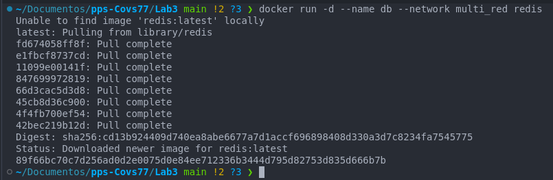

3. Lanzamos otro contenedor conectado a la misma red:


<p style="color:blue; text-align:justify;"><b> Instalamos iputils para poder hacer ping al otro contenedor db y probar la conectividad.

``` bash
   apk add --no-cache iputils 
```


5. Inspeccionamos la red con la nueva configuración:


<p style="color:blue; text-align:justify;"><b>Aqui podemos comprobar como aparecen los dos contenedores que se están ejecutando en la misma red *multi_red* y sus respectivas IPs:

<p style="color:blue; text-align:justify;"><b>**app: 172.18.0.3/16**
<p style="color:blue; text-align:justify;"><b>**db: 172.18.0.2/16**

__________

#### 3.3. Publicar un servicio al exterior
Iniciamos un contenedor nginx en modo demonio exponiendo el puerto 80 y renombrándolo como "alpine-cova":


##### 3.3.1. Comprobaciones para comprender mejor el funcionamiento de este contendor nginx:

<p style="color:blue; text-align:justify;"><b> Comprobamos la ip de nuestro equipo anfitrión, 172.18.0.1


Inspeccionamos el contenedor y verificamos la configuración del contenedor:


<p style="color:blue; text-align:justify;"><b> Comprobamos que la inet/gateway coincide: 172.17.0.1

<p style="color:blue; text-align:justify;"><b>Verificamos las conexiones de nuestro equipo anfitrión:


<p style="color:blue; text-align:justify;"><b> Accedemos al contendor que hemos lanzado previamente y comprobamos sus conexiones de red:


<p style="color:blue; text-align:justify;"><b> Probamos la conexión al servidor nginx desde el anfitrión:


<p style="color:blue; text-align:justify;"><b> Compruebo desde otro dispositivo la conexión (en este caso desde el móvil)

```bash
    http://192.168.0.109:80 
```


Detenemos el contenedor: 

```bash
clear && netstat -puta && docker container ps -all && docker container stop alpine-cova && netstat -puta && wget localhost:80
```

Para arrancarlo de nuevo: 

```bash
clear && netstat -puta && docker container start alpine-xxxx && netstat -puta && wget localhost:80
```

##### 3.3.2 Ejecutamos otro contenedor exponiendo un puerto diferente.

<p style="color:blue; text-align:justify;"><b> Ahora vamos a lanzar un contenedor nginx exponiendo el puerto 81:

```bash
 docker run -d -p 81:80 --name=alpine-cova2 nginx:alpine && netstat -puta 
```


<p style="color:blue; text-align:justify;"><b> Este comando inicia un nuevo contenedor en segundo plano (-d) con la imagen nginx:alpine, exponiendo el puerto 80 del contenedor en el puerto 81 del S.O. anfitrión.

<p style="color:blue; text-align:justify;"><b>. Comprobamos que tenemos el puerto 81 a la escucha. 
Vemos los dos contenedores creados con nginx a los que hemos expuesto los puerto 80 y 81 respectivamente:


<p style="color:blue; text-align:justify;"><b> Accedemos al contenedor alpine-cova y comprobamos su conexiones de red:


<p style="color:blue; text-align:justify;"><b> Accedemos a alpine-cova2 y verificamos sus conexiones de red:


<p style="color:blue; text-align:justify;"><b> Probamos las conexiones desde nuestro equipo anfitrión:


<p style="color:blue; text-align:justify;"><b> Tras reiniciar compruebo que los contenedores se han detenido:


<p style="color:blue; text-align:justify;"><b> Modifico el archivo /etc/rc.local del siguiente modo:


<p style="color:blue; text-align:justify;"><b> Tras reiniciar verifico que los contenedores se han lanzado de nuevo.


______


#### 3.4 Conectar un contenedor a múltiples redes

Crear dos redes personalizadas. Vamos a crear dos redes de tipo `bridge` llamadas `red1` y `red2`:
   ```bash
   docker network create red1
   docker network create red2
   ```


Creamos un contenedor `httpd`llamado `web1` y lo conectamos a `red1`:
   
```bash 
     docker run -d --name web1 --network red1 httpd    
```


   
Creamos otro contenedor `httpd` llamado `web2` y lo conectamos a `red2`:
```bash
   docker run -d --name web2 --network red2 httpd    
```


<p style="color:blue; text-align:justify;"><b> Verificamos la conectividad entre ambos contenedores.  Hacemos ping desde `web1` a `web2` usando su nombre:
     
```bash 
   docker exec web1 ping web2 
```


<p style="color:blue; text-align:justify;"><b> Efectivamente el ping falla ya que los contenedores están en redes diferentes.

Conectar el contenedor `web1` a la red `red2` para que ambos contenedores estén en las mismas redes:

   ```bash    docker network connect red2 web1 ```


Conectamos a la `red2` y comprobamos con el comando `inspect` que efectivamente el contenedor `web1` está conectado tanto a la `red1` como la `red2` para así poderse comunicar con `web2`, que está en la `red2`.

Para verificar la conectividad entre los contenedores hacemos ping entre ambos contenedores ahora que los dos están en `red2`:
Desde el contenedor `web1`, intenta hacer ping a `web2`:

   ```bash docker exec web1 ping web2 ```


<p style="color:blue; text-align:justify;"><b> Comprobamos que ahora sí están en la misma red y están conectados.

Ya no necesitamos que el contenedor `web1` esté en `red1`, asi que lo desconectamos y lo verificamos con el comando inspect:

```bash
 docker network disconnect red1 web1
 docker docker inspect -f '{{json .NetworkSettings.Networks}}' web1 | jq'
```

`web1`:


`web2`:


_______________


####  4. Persistencia de datos (0.75 puntos)


Entra en cada uno de los contenedores y cambia el fichero `index.html` para que sea diferente:

```bash
    docker container exec -it alpine-cova /bin/sh
    docker container exec -it alpine-cova2 /bin/sh
    find / -iname "index.html"
```


Copiar el fichero index.html al S.O. anfitrión

Creamos un directorio en el S.O. anfitrión para almacenar el fichero copiado y copiamos el fichero `index.html`
```bash
    mkdir /root/dockers/web
    docker container cp alpine-cova:/usr/share/nginx/html/index.html /root/dockers/web
```


Paramos y eliminamos los dos contenedores:

```bash
docker container rm -f alpine-cova
docker container rm -f alpine-cova2
```


Arrancamos un primer contenedor montando un directorio del S.O. anfitrión:

```bash
    docker container run -d -p 80:80 -v /root/dockers/web:/usr/share/nginx/html --name=alpine-cova nginx:alpine
```


Arrancamos un segundo contenedor sin montar un directorio:

```bash docker container run -d -p 81:80 --name=alpine-cova2 nginx:alpine ```


Comparar los dos contenedores: 

1. Observa la diferencia entre los dos contenedores en relación al directorio del servidor web.

<p style="color:blue; text-align:justify;"><b> Al haber vinculado el primer contenedor `alpine-cova` a un directorio local, en el contenedor no existe el fichero `index.html` y hemos podido conservar de manera local el fichero que teníamos creado para ese contenedor. Dichos archivos copiados a modo de backup deberán ser restituidos al contenedor para dejarlo como lo teníamos configurado y así no perder la información.

<p style="color:blue; text-align:justify;"><b> En `alpine-cova2`, sin directorio vinculado, hemos perdido el fichero `index.html` que habiamos creado, sustituyéndolo por el fichero base que crea nginx perdiendo por tanto las configuraciones que habiamos realizado.

2. Reflexiona sobre en qué otros servicios podrías necesitar usar montajes de volúmenes.

<p style="color:blue; text-align:justify;"><b> Es interesante crear estos directorios locales para servicios que requieran del almacenamiento de información y que no se "pierdan" al reiniciar el contenedor o incluso al eliminarlo. Algunos ejemplos  serían obviamente el realizado con diseño de páginas o aplicaciones web, bases de datos, sistemas de almacenamiento de datos, sistemas de logs o para compartir configuraciones desde el host.


___________________

#### 5. Construyendo nuestras propias imágenes (1.50 puntos)

##### 5.1  Creación de imagen desde un contenedor en ejecución

Partiremos de una imagen base de Ubuntu. Instalaremos curl en un contenedor en ejecución, personalizaremos la imagen resultante, la guardaremos como un archivo `.tar` y la cargaremos en otro sistema.

##### Descargar la imagen base

```bash docker pull ubuntu:latest ```


##### Crear y ejecutar un contenedor

Lanzamos un contenedor interactivo basado en la imagen de Ubuntu:
```bash docker run -it --name ubuntu-cova ubuntu:latest ```

##### Personalizar el contenedor

Dentro del contenedor en ejecución, instalamos curl:


Verificamos que curl está instalado:


##### Crear una nueva imagen personalizada

Salimos del contenedor (`exit`) y creamos una nueva imagen desde él:


<p style="color:blue; text-align:justify;"><b> Este comando genera una nueva imagen llamada `ubuntu-cova` con la etiqueta `1.0`.

##### Guardar la imagen en un archivo .tar

Usamos el comando `docker save` para exportar la imagen:
```bash  docker save ubuntu-curls:1.0 > ubuntu-curl.tar ```


##### Cargar la imagen en otro sistema

En un sistema diferente, usamos el archivo exportado para cargar la imagen:


Comprobamos que la imagen está disponible:

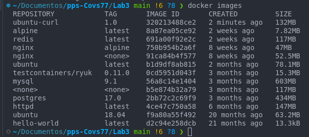

-------------------

### 5.2. Publicación de imagen en DockerHub

En este ejercicio, modificaremos un contenedor existente para incluir un archivo con información personalizada, crearemos una nueva imagen y la subiremos a DockerHub.

##### Autenticarse en DockerHub

Asegúrate de estar autenticado en DockerHub. Usa tu nombre de usuario y contraseña:

<p style="color:blue; text-align:justify;"><b> Realizo el login con los datos de GitHub y verificamos que el  login es correcto (Logueo con la cuenta de GitHub).


##### Crear, ejecutar y modificar un contenedor

<p style="color:blue; text-align:justify;"><b> Creo un contenedor interactivo a partir de la imagen de ubuntu:latest

```bash
   docker run -it --name ubuntu-info ubuntu:latest 
```

<p style="color:blue; text-align:justify;"><b>Dentro del contenedor, crea un archivo con información personalizada:

```bash
   echo "Author: Cova Leguina" > /opt/info.txt 
   cat /opt/info.txt 
```


##### Crear una imagen personalizada

Sal del contenedor (`exit`) y usa `docker commit` para guardar los cambios en una nueva imagen:
```bash
 docker commit ubuntu-info cleguina77/ubuntu-info:1.0 
```


##### Subir la imagen a DockerHub

Usa el comando `docker push` para subir la imagen a DockerHub:

```bash
   docker push usuarioDockerHub/ubuntu-info:1.0 
```


##### Verificar la imagen en DockerHub

Ve a tu cuenta en DockerHub y verifica que la imagen `ubuntu-info:1.0` esté disponible.


<p style="color:blue; text-align:justify;"><b> Otros usuarios pueden descargar esta imagen con el comando:

```bash 
   docker pull cleguiana77/ubuntu-info:1.0 
```
________

### 5.3. Construcción de una imagen usando un Dockerfile básico

Este ejercicio consiste en crear un Dockerfile que personalice una imagen `nginx:alpine`, añadiendo un archivo `index.html` para servir como página principal. Luego, construimos y ejecutamos la imagen para verificar el resultado.

- Crear un directorio de trabajo
- Crea un directorio para almacenar los archivos necesarios:

```bash  
   mkdir docker-nginx 
   cd docker-nginx 
```

- Crear el archivo index.html. Dentro del directorio, crea un archivo index.html con contenido básico:

```bash
   echo "<!DOCTYPE html>
   <html>
   <head>
       <title>Cova's Custom Nginx</title>
   </head>
   <body>
       <h1>Hello, Docker!</h1>
   </body>
   </html>" > index.html
```


- Crear el Dockerfile. En el mismo directorio, crea un archivo llamado Dockerfile y añade las siguientes instrucciones:

```dockerfile
   Copy code
   # Usar nginx:alpine como base
   FROM nginx:alpine

   # Copiar el archivo index.html al directorio de contenido de nginx
   COPY index.html /usr/share/nginx/html/

   # Exponer el puerto 80
   EXPOSE 80
```


- Construir la imagen personalizada. Usa el comando docker build para crear la imagen, asignándole un nombre y una etiqueta:

```bash
   docker build -t cova-nginx:1.0 .
```


- Ejecutar un contenedor con la imagen personalizada. Lanza un contenedor basado en la imagen recién creada:

```bash
docker run -d -p 8080:80 cova-nginx:1.0
```


- Verificar el resultado. Abre un navegador y accede a http://localhost:8080. Deberías ver la página personalizada con el mensaje Hello, Docker!.


<p style="color:blue; text-align:justify;"><b>La imagen creada puede ser reutilizada y compartida.


-------------------

### 5.4: Uso de `docker build` con un contexto remoto

Este ejercicio consiste en crear un repositorio en GitHub que contenga un Dockerfile y luego utilizarlo como contexto remoto para construir una imagen con `docker build`.

**1. Preparar el Dockerfile y otros archivos**  
   Crea un directorio local para tu proyecto y un archivo Dockerfile:  
```bash
mkdir docker-node-app
cd docker-node-app
```
Dentro del directorio, crea el archivo `Dockerfile` con este contenido:  

```dockerfile
   # Usar Node.js como base
   FROM node:16
   # Establecer el directorio de trabajo
   WORKDIR /usr/src/app
   # Copiar el archivo de dependencias
   COPY package.json .
   # Instalar las dependencias
   RUN npm install
   # Copiar el resto de los archivos al contenedor
   COPY . .
   # Exponer el puerto de la aplicación
   EXPOSE 3000
   # Comando de inicio
   CMD ["node", "app.js"]
```

**2. Añadir archivos adicionales**  
   Crea un archivo `package.json` con el siguiente contenido:  
   ```json
   {
       "name": "docker-node-app",
       "version": "1.0.0",
       "description": "A sample Node.js app",
       "main": "app.js",
       "dependencies": {
           "express": "^4.17.1"
       },
       "scripts": {
           "start": "node app.js"
       }
   }
   ```

   También crea el archivo `app.js` para una aplicación básica de Node.js:  

   ```javascript
      const express = require('express');
      const app = express();

      app.get('/', (req, res) => {
         res.send('Hello from Docker!');
      });

      const PORT = 3000;
      app.listen(PORT, () => {
         console.log(`Server running on http://localhost:${PORT}`);
      });
   ```
   
   

**3. Subir el proyecto a GitHub**  
<p style="color:blue; text-align:justify;"><b>  He querido realizar esto desde mi repositorio ya creado pero según la documentación que he leído no es posible hacerlo desde un directorio del repositorio. Así que he creado otro repositorio para poder realizar este ejercicio.
   Lo he creado desde la web, lo he clonado, he ñadido los archivos de configuración y lo he "pusheado" a GitHub.

   
   


**4. Construir la imagen desde el repositorio**  
   Usa el comando `docker build` para construir la imagen utilizando el enlace al repositorio como contexto, aquí he tenido que cambiar el repositorio de configuración de la imagen que quiero crear a público ya que sino no tenía acceso a él y me daba error. 

<p style="color:blue; text-align:justify;"><b>- Esta es la dirección del repositorio a partir del que vamos a crear la imagen: https://github.com/Covs77/Docker-node-app-proyect
   <br>- Al final listo las nuevas imagenes creadas. 

   ```bash
      docker build -t docker-node-app:1.0 https://github.com/Covs77/ Docker-node-app-proyect 
   ```

   

**5. Ejecutar un contenedor con la imagen**  
   Lanza un contenedor para verificar que la imagen funciona correctamente:  
   
   ```bash
      docker run -d -p 3000:3000 docker-node-app:1.0 
   ```

   

**6. Verificar el resultado**  
   Abre un navegador y accede a `http://localhost:3000`. Deberías ver el mensaje **Hello from Docker!**.

   

Este ejercicio demuestra cómo usar un repositorio remoto como contexto para construir una imagen Docker. Esto es útil para entornos de **integración continua** o cuando deseas compartir tu proyecto en equipo.


<p style="color:blue; text-align:justify;"><b> En este punto elimino todos los contenedores que tenía creados.  

```bash
     docker rm $(docker ps -aq) 
```

-------------------

### 5.5: Integración de variables de entorno

En este ejercicio, crearemos un Dockerfile que use variables de entorno definidas durante la construcción y las utilice dentro del contenedor para configurar su comportamiento. Veremos cómo estas variables pueden influir en los scripts o aplicaciones que se ejecutan dentro del contenedor.

**1. Crear un directorio de trabajo**  
   Crea un nuevo directorio para este ejercicio:  

```bash
   mkdir docker-env-app
   cd docker-env-app
```

**2. Crear un archivo Dockerfile**  
   Crea un archivo `Dockerfile` con el siguiente contenido:  

```dockerfile
   # Usar la imagen base de Node.js
   FROM node:16

   # Establecer un directorio de trabajo
   WORKDIR /usr/src/app

   # Definir una variable de entorno para la URL del servicio
   ARG SERVICE_URL=http://localhost

   # Establecer la variable de entorno dentro del contenedor
   ENV SERVICE_URL=$SERVICE_URL

   # Copiar y crear un archivo de prueba que use esta variable
   COPY test-env.js .

   # Instalar dependencias (vacío aquí, pero necesario para npm init)
   RUN npm init -y

   # Ejecutar el script como punto de entrada
   CMD ["node", "test-env.js"]
```

**3. Crear el archivo de prueba `test-env.js`**. Este archivo leerá la variable de entorno `SERVICE_URL` y la imprimirá en la consola:  
   
```javascript
   console.log(`Service URL is: ${process.env.SERVICE_URL}`); 
```

**4. Construir la imagen con una variable de entorno personalizada**  
   Usa el comando `docker build` para crear la imagen, definiendo el valor de la variable `SERVICE_URL`:  
   
```bash
   docker build -t env-app:1.0 --build-arg SERVICE_URL=https://api.example.com .
```

**5. Ejecutar un contenedor con la imagen**. Lanza un contenedor basado en la imagen:  

```bash
   docker run env-app:1.0 
```

**6. Observar el resultado**. El contenedor debería imprimir en la consola:  

   ```plaintext 
      Service URL is: https://api.example.com
   ```
**7. Probar con otra variable en tiempo de ejecución** . También puedes sobrescribir la variable de entorno durante la ejecución del contenedor:  

   ```bash docker run -e SERVICE_URL=https://new-api.example.com env-app:1.0 ```

   Ahora debería imprimir:  
   ```plaintext
      Service URL is: https://new-api.example.com
   ```
   


#### Explicación del resultado
<p style="color:blue; text-align:justify;"><b>Este ejercicio muestra cómo usar `ARG` y `ENV` para definir y manejar variables de entorno en Dockerfiles. Estas variables son útiles para personalizar imágenes y contenedores según las necesidades del entorno de despliegue.

__________________

### 5.6: Gestión de capas con Dockerfile

En este ejercicio optimizaremos las capas creadas durante la construcción de una imagen Docker. Usaremos múltiples instrucciones en un Dockerfile y observaremos el impacto en el número de capas y el tamaño de la imagen.


**1. Crear un directorio de trabajo**  
   Crea un nuevo directorio para este ejercicio:  
   ```bash
   mkdir docker-layers
   cd docker-layers
   ```

**2. Crear un Dockerfile con múltiples capas**  
   Escribe un Dockerfile donde cada instrucción `RUN` crea una nueva capa:  
   ```dockerfile
      FROM ubuntu:latest

      # Actualizar el sistema
      RUN apt update

      # Instalar herramientas básicas
      RUN apt install -y curl

      # Instalar Git
      RUN apt install -y git
   ```

**3. Construir la imagen**  
   Usa el comando `docker build` para crear la imagen:  

   ```bash    docker build -t multi-layer:1.0 . ```

**4. Ver las capas creadas**  
   Usa el comando `docker history` para observar las capas de la imagen:  

   ```bash docker history multi-layer:1.0 ```

   Notarás que cada `RUN` ha creado una capa separada.

   

**5. Optimizar el Dockerfile**  
   Combina las instrucciones `RUN` en una sola línea para reducir el número de capas:  

   ```dockerfile 
   FROM ubuntu:latest

      # Actualizar el sistema e instalar herramientas en una sola capa
      RUN apt update && apt install -y curl git
   ```

**6. Construir la imagen optimizada**  
   Crea una nueva imagen basada en el Dockerfile optimizado:  
   ```bash    docker build -t single-layer:1.0 . ```

**7.Comparar las capas**  
   Usa nuevamente el comando `docker history` para la nueva imagen:  

   ```bash docker history single-layer:1.0 ```

   Observa que ahora hay menos capas en comparación con la imagen anterior.
   
**8. Construir la imagen sin caché**  
   Para probar los cambios sin reutilizar capas anteriores, construye la imagen con el flag `--no-cache`:  

   ```bash    docker build --no-cache -t no-cache-layer:1.0 . ```


<p style="color:blue; text-align:justify;"><b>Este ejercicio demuestra cómo la estructura del Dockerfile afecta el número de capas en la imagen. Menos capas significan imágenes más pequeñas y rápidas de construir. Sin embargo, al combinar instrucciones, se pierde algo de flexibilidad en la reutilización de capas desde la caché.

__________________


### 5.7: Uso del archivo `.dockerignore`

`.dockerignore` nos permite excluir ciertos archivos y directorios del contexto de construcción de una imagen Docker, reduciendo su tamaño y mejorando el tiempo de construcción.

**1. Crear un directorio de trabajo**  
   Crea un directorio para este ejercicio:  
```bash
   mkdir docker-ignore
   cd docker-ignore
```

**2. Añadir archivos al proyecto**  
   Crea algunos archivos y carpetas simulando un proyecto de Node.js:  
```bash
   echo "node_modules/" > .dockerignore
   mkdir node_modules
   touch node_modules/dummy.txt
   echo "console.log('Hello, Docker!');" > app.js
   echo "{}" > package.json
```

Ahora tienes la siguiente estructura:  
```
   docker-ignore/
   ├── .dockerignore
   ├── app.js
   ├── node_modules/
   │   └── dummy.txt
   └── package.json
```

**3. Crear un archivo `.dockerignore`**  
   El archivo `.dockerignore` ya está creado con el contenido:  

```plaintext
   node_modules/
```

  Esto excluye la carpeta `node_modules` del contexto de construcción.

**4. Escribir el Dockerfile**  
   Crea un archivo `Dockerfile` con el siguiente contenido:  

```dockerfile
   FROM node:16

   WORKDIR /usr/src/app

   # Copiar el archivo package.json y app.js al contenedor
   COPY package.json .
   COPY app.js .

   # Instalar dependencias (aunque no están en el contexto)
   RUN npm install

   CMD ["node", "app.js"]
```

**5. Construir la imagen**  
   Usa el comando `docker build` para crear la imagen:  
```bash    
   docker build -t ignore-example:1.0 . 
```

**6. Verificar el contexto de construcción**  
   Usa el flag `--no-cache` para forzar una nueva construcción y observa el tamaño del contexto:  

```bash 
   docker build --no-cache -t ignore-example:1.0 . 
```


La salida indicará el tamaño del contexto de construcción. La carpeta `node_modules` no se incluirá.


**7. Ejecutar el contenedor**  
   Lanza un contenedor con la imagen recién construida:  
```bash 
   docker run --rm ignore-example:1.0 
```

Deberías ver el mensaje:  
```plaintext
   Hello, Docker!
```


<p style="color:blue; text-align:justify;"><b>El archivo .dockerignore excluye archivos innecesarios del contexto de construcción. Esto reduce el tiempo de transferencia de datos al daemon de Docker y minimiza el tamaño de la imagen, lo que es crucial en proyectos grandes con dependencias como node_modules.

________________

### 5.8: Creación de una imagen con aplicaciones preinstaladas

En este ejercicio crearemos un Dockerfile que incluye una aplicación de Python preinstalada. El contenedor ejecutará un script automáticamente al iniciarse.


**1. Crear un directorio de trabajo**  
   Crea un nuevo directorio para este ejercicio:  
   ```bash
      mkdir docker-python-app
      cd docker-python-app
   ```

**2. Escribir un script en Python**  
   Crea un archivo llamado `app.py` con el siguiente contenido:  
```python    print("Welcome to Cova Docker container!") ```

**3. Crear el Dockerfile**  
   Escribe un Dockerfile para incluir Python y configurar el script como ejecutable principal:  
   ```dockerfile
      # Usar la imagen base de Python
      FROM python:3.9

      # Establecer el directorio de trabajo en el contenedor
      WORKDIR /usr/src/app

      # Copiar el script al contenedor
      COPY app.py .

      # Establecer el comando principal
      CMD ["python", "app.py"]
   ```

**4. Construir la imagen**  
   Usa el comando `docker build` para construir la imagen:  
   ```bash 
   docker build -t python-app:1.0 . 
   ```

**5. Ejecutar un contenedor basado en la imagen**  
   Lanza un contenedor con la imagen recién construida:  
   ```bash 
   docker run --rm python-app:1.0 
   ```

**6. Observar el resultado**  
   El contenedor ejecutará automáticamente el script y mostrará:  
   ```plaintext
      Welcome to Cova Docker container!
   ```
   

**7. Probar con un script más complejo**  
   Modifica el archivo `app.py` para incluir más lógica. Por ejemplo:  
```python
   import sys
   print(f"Arguments passed: {sys.argv[1:]}")
```

   Luego, reconstruye la imagen:  
```bash
   docker build -t python-app:1.1 .
```

   Ejecuta el contenedor pasando argumentos:  
```bash
   docker run --rm python-app:1.1 arg1 arg2
```

   Verás algo como:  
```plaintext
   Arguments passed: ['arg1', 'arg2']
```

<p style="color:blue; text-align:justify;"><b> He creado una nueva imagen etiquetada como 1.1.
Para poder ejecutar el script complejo, he tenido que modificar el Dockerfile, en lugar de CMD por ENTRYPOINT para que pueda recibir argumentos. De esta forma aseguramos que el comando siempre se ejecute y podremos carmbiar los argumentos.


______________________

### 5.9 Construcción de una imagen Angular desde cero

#### 1. Crear el proyecto Angular

1. **Instalar Angular CLI (si no lo tienes ya):**
```bash
   npm install -g @angular/cli    
```

   

2. **Crear un proyecto Angular básico:**
   ```bash
      ng new angular-project
      cd angular-project
   ```
   

   Selecciona las opciones predeterminadas para el proyecto.
<br>

3. **Probar el proyecto localmente:**
<br> Verifica que el proyecto funciona correctamente:
   ```bash
      ng serve
   ```
   Accede a `http://localhost:4200` y confirma que la aplicación se carga.


#### 2. Modificar el contenido de la aplicación

1. **Cambio el mensaje de bienvenida:**
   Abre `src/app/app.component.html` y edita el contenido:

   ```html
   <h1>Welcome to Cova's Improved Angular App!</h1>
   ```


#### 3. Crear el Dockerfile con enfoque multietapa

En el directorio raíz del proyecto (`angular-project`), crea un archivo `Dockerfile` con este contenido:

```dockerfile
# Etapa 1: Construcción de la aplicación Angular
FROM node:18 AS builder

# Establecer el directorio de trabajo
WORKDIR /usr/src/app

# Copiar los archivos de configuración y dependencias
COPY package*.json ./
RUN npm install

# Copiar el resto del proyecto al contenedor
COPY . .

# Construir la aplicación para producción
RUN npm run build --prod

# Etapa 2: Servir la aplicación con nginx
FROM nginx:alpine

# Limpiar archivos predeterminados de nginx
RUN rm -rf /usr/share/nginx/html/*

# Copiar los archivos generados en la etapa 1
COPY --from=builder /usr/src/app/dist/angular-project/browser /usr/share/nginx/html

# Exponer el puerto 80
EXPOSE 80

# Comando para iniciar nginx
CMD ["nginx", "-g", "daemon off;"]
```

<p style="color:blue; text-align:justify;"><b> En el Dockerfile he modificado la versión de node a la 18, la 16 me daba error.

#### 4. Crear el archivo `.dockerignore`

Para excluir archivos innecesarios del contexto de construcción, crea un archivo `.dockerignore`:

```plaintext
node_modules/
dist/
.git/
.angular/
```

#### 5. Construir la imagen Docker


1. **Ejecutar el comando de build:**
   ```bash 
   docker build -t angular-app:1.0 . 
   ```

   Esto realizará:
   - Instalación de dependencias.
   - Construcción de la aplicación Angular.
   - Configuración del servidor `nginx` para servir la aplicación.

<br>
   <p style="color:blue; text-align:justify;"><b>He modificado el Dockerfile con las rutas correctas del archivo index.html. No copiaba el fichero y me daba un error al intentar acceder a través del puerto 8080
   
   

   

2. **Verificar la imagen creada:**
   Lista las imágenes creadas:
   ```bash
      docker images 
   ```


#### 6. Ejecutar el contenedor

1. **Lanzar el contenedor:**
   ```bash 
   docker run -d -p 8080:80 angular-app:1.0  
   ```

2. **Probar la aplicación:**
   Abre `http://localhost:8080` en tu navegador. Deberías ver el mensaje personalizado: **"Welcome to Cova's Improved Angular App!"**


#### 7. Realizar cambios y reconstruir

1. **Cambiar el mensaje nuevamente:**
   Modifica `src/app/app.component.html`:
   ```html
   <h1>Angular App Updated with Docker!</h1>
   ```

2. **Reconstruir la imagen:**
   ```bash
      docker build -t angular-app:1.1 .
   ```

3. **Reiniciar el contenedor con la nueva imagen:**
   ```bash
   docker stop <container_id>
   docker run -d -p 8080:80 angular-app:1.1
   ```


4. **Probar nuevamente:**
   Ve a `http://localhost:8080` y verifica los cambios.


<p style="color:blue; text-align:justify;"><b>En esta práctica hemos conseguido:
<br>- Una imagen Docker que automatiza todo el proceso de construcción y despliegue de una aplicación Angular.
- Uso de un servidor nginx para servir la aplicación.
<br>- Actualizaciones rápidas mediante la modificación del código y la reconstrucción de la imagen (nos vamos acercando a la puesta en producción).

### 5.10: Automatización de tareas con ENTRYPOINT

En este ejercicio crearemos un contenedor Docker que ejecute una tarea automáticamente al iniciarse. Usaremos un script que comprima archivos en un directorio y exploremos el uso de `ENTRYPOINT` para automatizarlo.

1. **Crear un directorio de trabajo**  
   ```bash 
   mkdir docker-entrypoint-task
   cd docker-entrypoint-task
   ```

2. **Crear un script de automatización**  
   Creamos un archivo `compress.sh` que comprimirá todos los archivos en un directorio dado:  
   ```bash
   #!/bin/bash
   set -e

   # Directorio de entrada
   INPUT_DIR=${1:-/data/input}

   # Directorio de salida
   OUTPUT_DIR=${2:-/data/output}

   echo "Comprimiremos los archivos de $INPUT_DIR en $OUTPUT_DIR"

   # Crear el directorio de salida si no existe
   mkdir -p "$OUTPUT_DIR"

   # Comprimir cada archivo en el directorio de entrada
   for file in "$INPUT_DIR"/*; do
       if [ -f "$file" ]; then
           filename=$(basename -- "$file")
           tar -czf "$OUTPUT_DIR/$filename.tar.gz" -C "$INPUT_DIR" "$filename"
           echo "Archivo $filename comprimido en $filename.tar.gz"
       fi
   done
   ```

Asegúrate de que el script sea ejecutable:  
   
```bash
   chmod +x compress.sh
```


1. **Crear el Dockerfile**  
   Escribe un `Dockerfile` que copie el script al contenedor y configure `ENTRYPOINT` para ejecutarlo:  
   ```dockerfile
   # Usar una imagen base de Linux ligera
   FROM alpine:latest
   # Instalar tar para la compresión
   RUN apk add --no-cache tar bash
   # Crear los directorios necesarios
   RUN mkdir -p /data/input /data/output
   # Copiar el script al contenedor
   COPY compress.sh /usr/local/bin/compress.sh
   # Hacer que el script sea el comando predeterminado
   ENTRYPOINT ["/usr/local/bin/compress.sh"]
   ```

<p style="color:blue; text-align:justify;"><b> He añadido al Dockerfile que instale bash además de la aplicación para descomprimir tar para poder ejecutar el script en el contenedor. También he tenido que cambiar la ruta donde copiar el script para comprimir. Para ello he tenido que entrar en modo interactivo para verificar si se copiaba o no y dónde para configurar bien el Dockerfile.

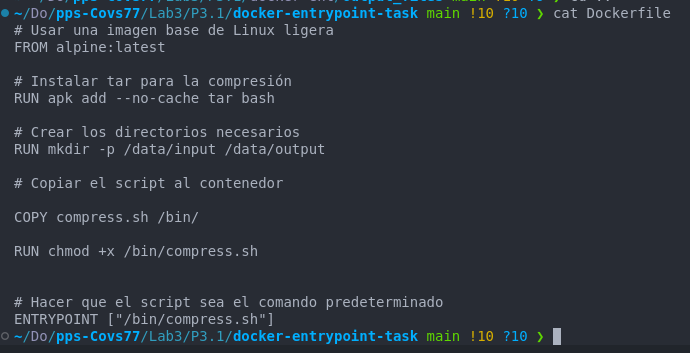

**2. Construir la imagen**  
   
   ```bash
   docker build -t compress-task:1.0 .
   ```

**3. Ejecutar el contenedor**  
   Usa el contenedor para comprimir archivos. Primero, crea un directorio local con archivos para comprimir:  
   ```bash
   mkdir -p input_files
   echo "File 1 content" > input_files/file1.txt
   echo "File 2 content" > input_files/file2.txt
   ```

Luego, lanza el contenedor, vinculando los directorios locales con los del contenedor:  
   
```bash
   docker run --rm -v $(pwd)/input_files:/data/input -v $(pwd)/output_files:/data/output compress-task:1.0
```

**4. Verificar los archivos comprimidos**  
   Lista el contenido del directorio `output_files`:  
   ```bash
   ls output_files
   ```
   Deberías ver los archivos comprimidos:  
   ```plaintext
   file1.txt.tar.gz
   file2.txt.tar.gz
   ```

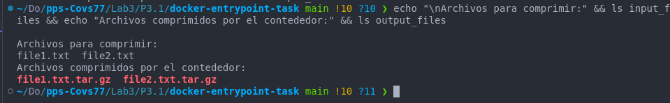


<p style="color:blue; text-align:justify;"><b>Análisis de los resultados<br>
1. Uso de ENTRYPOINT:
   El script `compress.sh` se ejecuta automáticamente al iniciar el contenedor. Puedes pasar argumentos adicionales, como los directorios de entrada y salida.
<br>2. Automatización completa:
   El contenedor está configurado para ejecutar una tarea específica, lo que lo hace útil para pipelines CI/CD o procesos batch.
<br>3. Flexibilidad:
   Puedes modificar el script o los parámetros sin reconstruir la imagen.

___________________
#### Docker-Compose (0.75 puntos)


### 6.1. Configuración básica de un contenedor web y una base de datos con Docker Compose

El objetivo es aprender a configurar un entorno básico utilizando **Docker Compose**, donde se ejecutan dos contenedores: uno con un servidor web (por ejemplo, Nginx) y otro con una base de datos (como MySQL o PostgreSQL). Se abordarán conceptos fundamentales como la definición de servicios, la gestión de redes y la exposición de puertos.

<p style="color:blue; text-align:justify;"><b>En primer lugar instalo docker-compose


1. **Crear un archivo `docker-compose.yml`**
   
   En un directorio nuevo, crea un archivo llamado `docker-compose.yml`. Este archivo definirá los servicios que se ejecutarán, incluyendo un servidor web y una base de datos. El archivo podría tener el siguiente contenido:
   
   ```yaml
   version: '3.7'
   services:
     web:
       image: nginx:latest
       container_name: web
       ports:
         - "8080:80"
       networks:
         - app_network

     db:
       image: mysql:5.7
       container_name: db
       environment:
         MYSQL_ROOT_PASSWORD: toor
       networks:
         - app_network

   networks:
     app_network:
       driver: bridge
   ```

   - **`version: '3.7'`**: Define la versión de Docker Compose que estamos utilizando.
   - **`services`**: Define los servicios (contenedores) que se ejecutarán.
     - **`web`**: Un contenedor que ejecuta Nginx.
       - **`image: nginx:latest`**: Usa la última versión de la imagen oficial de Nginx.
       - **`ports`**: Mapea el puerto 8080 del host al puerto 80 del contenedor (Nginx).
       - **`networks`**: Conecta este contenedor a la red `app_network`.
     - **`db`**: Un contenedor que ejecuta MySQL.
       - **`environment`**: Define las variables de entorno necesarias, en este caso, la contraseña del root para MySQL.
       - **`networks`**: Conecta el contenedor de base de datos a la misma red `app_network`.
   - **`networks`**: Define la red `app_network` usando el controlador `bridge` para que los contenedores se comuniquen entre sí.

<p style="color:blue; text-align:justify;"><b> Creo el fichero de configuración para docker-compose:


2. **Iniciar los servicios con Docker Compose**
   
   Con el archivo `docker-compose.yml` configurado, puedes iniciar los servicios (contenedores) ejecutando el siguiente comando en la misma carpeta donde está el archivo:
   
   ```bash
   docker-compose up -d
   ```
<p style="color:blue; text-align:justify;"><b> Inicio los servicios configurados en el archivo de configuracion .yml


3. **Verificar que los servicios están en funcionamiento**
   
   Una vez que los contenedores estén en ejecución, puedes verificar el estado de los servicios con el siguiente comando:
   
   ```bash
      docker-compose ps
   ```


4. **Acceder al servidor web**
   
   Abre tu navegador y accede a `http://localhost:8080`. Deberías ver la página predeterminada de Nginx, lo que confirma que el servicio web está funcionando correctamente.


5. **Verificar la base de datos**
   
   Para verificar que el contenedor de la base de datos está funcionando, puedes acceder al contenedor de MySQL y realizar algunas consultas. Primero, accede al contenedor:
   
   ```bash
   docker exec -it db mysql -u root -p
   ```

   Luego, ingresa la contraseña `toor` cuando se te pida. Después de ingresar a MySQL, puedes verificar que la base de datos esté en funcionamiento con un comando como:
   
   ```sql
   SHOW DATABASES;
   ```

   

6. **Detener los servicios**

   Cuando termines, puedes detener y eliminar los contenedores ejecutando:
   
```bash
   docker-compose down
```

   

___________ 

### 6.2. Gestión de volúmenes con Docker Compose

Aprender a usar volúmenes en Docker Compose para persistir datos de los contenedores. Este ejercicio se centrará en cómo gestionar los volúmenes para servicios como bases de datos, lo que garantiza que los datos persistan incluso después de que los contenedores se reinicien o se eliminen.

1. **Crear un archivo `docker-compose.yml` con volumen para la base de datos**

En este ejercicio, vamos a modificar el archivo `docker-compose.yml` que creamos en el ejercicio anterior para incluir un volumen que persista los datos de MySQL.

```yaml
   version: '3.7'
   services:
     web:
       image: nginx:latest
       container_name: web
       ports:
         - "8080:80"
       networks:
         - app_network

     db:
       image: mysql:5.7
       container_name: db
       environment:
         MYSQL_ROOT_PASSWORD: toor
       volumes:
         - db_data:/var/lib/mysql
       networks:
         - app_network

   volumes:
     db_data:
       driver: local

   networks:
     app_network:
       driver: bridge
   ```

   - **`volumes` en el servicio `db`**: El contenedor de la base de datos MySQL ahora tiene un volumen llamado `db_data`, que se montará en el directorio `/var/lib/mysql` dentro del contenedor. Este es el directorio donde MySQL almacena sus datos.
   - **`volumes` en el nivel raíz**: Definimos un volumen llamado `db_data` para Docker Compose. El volumen será gestionado automáticamente por Docker y persistirá incluso si el contenedor se reinicia o se elimina.


<p style="color:blue; text-align:justify;"><b>Ojo a las tabulaciones del fichero docker-compose.yml!!
   
1. **Iniciar los servicios con Docker Compose**

Ejecuta los servicios con el siguiente comando:

```bash
docker-compose up -d
```

1. **Verificar que el volumen ha sido creado**

Verifica que el volumen `db_data` ha sido creado y está siendo utilizado por Docker:

```bash
docker volume ls
```

Deberías ver algo como:

```plaintext
   DRIVER              VOLUME NAME
   local               db_data
```


Esto indica que Docker ha creado y está utilizando el volumen `db_data`.

2. **Acceder al contenedor y verificar la persistencia de datos**

Para verificar que los datos están siendo persistidos, accede al contenedor MySQL:

```bash
   docker exec -it db mysql -u root -p
```

Ingresa la contraseña `example`. Luego, crea una base de datos para verificar que los cambios persisten:

```sql
   CREATE DATABASE testdb;
   SHOW DATABASES;
   ```

   Sal de MySQL con `exit`.


3. **Reiniciar los contenedores y verificar la persistencia de datos**

   Detén y elimina los contenedores para probar la persistencia de los datos:

   ```bash
      docker-compose down
   ```

<p style="color:blue; text-align:justify;"><b>   Nota: Los volúmenes no se eliminan con `docker-compose down`, lo que garantiza que los datos persisten.


   Vuelve a iniciar los contenedores:

   ```bash
      docker-compose up -d
   ```
   Accede nuevamente al contenedor MySQL y verifica que la base de datos `testdb` aún existe:

   ```bash
   docker exec -it db mysql -u root -p
   SHOW DATABASES;
   ```


**Resultado esperado**: La base de datos `testdb` debería aparecer, lo que indica que los datos se han mantenido gracias al volumen.

4. **Eliminar el volumen (opcional)**

Si deseas eliminar el volumen y todos los datos persistentes, ejecuta:

```bash
   docker-compose down -v
```

<p style="color:blue; text-align:justify;"><b>Explicación: La opción `-v` elimina los volúmenes asociados a los servicios, eliminando así los datos persistentes.


### 6.3. Uso de redes personalizadas en Docker Compose
 
Aprender a configurar redes personalizadas en Docker Compose para aislar servicios y gestionar su comunicación de manera más segura y controlada.

1. **Modificar `docker-compose.yml` para incluir redes personalizadas**

   Ampliaremos el archivo `docker-compose.yml` para separar los servicios `web` y `db` en redes diferentes, manteniendo un punto de conexión específico entre ellos.

   ```yaml
   version: '3.7'
   services:
     web:
       image: nginx:latest
       container_name: web
       ports:
         - "8080:80"
       networks:
         - front_end
         - back_end

     db:
       image: mysql:5.7
       container_name: db
       environment:
         MYSQL_ROOT_PASSWORD: toor
       networks:
         - back_end

   networks:
     front_end:
       driver: bridge
     back_end:
       driver: bridge
   ```
   

<p style="color:blue; text-align:justify;"><b>Explicación: <br> - networks en web y db: Los servicios web y db están conectados a la red back_end para que puedan comunicarse entre sí. Además, el servicio web está conectado a la red front_end para manejar solicitudes externas.
   <br>- front_end: Una red aislada que conecta el servicio web al host.
   <br>- back_end: Una red privada para la comunicación entre web y db.

2. **Iniciar los servicios con Docker Compose**

   Ejecuta los servicios con el comando habitual:

   ```bash
   docker-compose up -d
   ```

   Docker Compose creará automáticamente las redes `front_end` y `back_end` y conectará los contenedores a las redes especificadas.

   

3. **Verificar las redes creadas**

   Lista las redes creadas para asegurarte de que `front_end` y `back_end` están activas:

   ```bash
   docker network ls
   ```

   Busca las redes `front_end` y `back_end` en la salida.
<br>
4. **Inspeccionar las redes**

   Inspecciona la configuración de una de las redes para ver los contenedores conectados:

   ```bash
   docker network inspect back_end
   ```

   Deberías ver que tanto `web` como `db` están conectados a `back_end`.

   
   
   
   

5. **Probar la conectividad entre contenedores**

   - Desde el contenedor `web`, verifica la conexión con `db` mediante su nombre:
     ```bash
     docker exec -it web ping db
     ```
   - Desde el contenedor `db`, intenta hacer ping a `web`:
     ```bash
     docker exec -it db ping web
     ```
   <p style="color:blue; text-align:justify;"><b>Para poder comprobar la conectividad he tenido que instalar un paquete que realice el ping, para ello he entrado en modo interactivo en el contenedor web y he podido realizar el ping.

   
   

   <p style="color:blue; text-align:justify;"><b>Resultado esperado:<br>   - El contenedor web puede comunicarse con db porque ambos están en la red back_end.
   <builder>- El contenedor db no puede comunicarse con el exterior ni con la red front_end, garantizando el aislamiento.

6. **Detener los servicios**

   Detén y elimina los servicios:

   ```bash
   docker-compose down
   ```

   Esto eliminará los contenedores y las redes asociadas.

### 6.4. Uso de variables de entorno en Docker Compose
 
Aprender a utilizar variables de entorno en Docker Compose para configurar servicios de manera dinámica y segura. Este enfoque es fundamental en entornos de producción para evitar la exposición de datos sensibles como contraseñas, claves API y configuraciones específicas.


1. **Crear un archivo `.env` para las variables de entorno**

   Crea un archivo `.env` en el mismo directorio que tu archivo `docker-compose.yml`. Este archivo almacenará las variables de entorno que utilizarán los servicios:

   ```env
   MYSQL_ROOT_PASSWORD=MYS3CR3TP4SSW0RD
   API_KEY=MY4P1K3Y 
   ```

   **Explicación:**
   - **`MYSQL_ROOT_PASSWORD`**: Contraseña del usuario `root` de MySQL.
   - **`API_KEY`**: Ejemplo de una clave API que podría usarse en otro servicio.
<br>
2. **Modificar `docker-compose.yml` para usar las variables de entorno**

   Modifica el archivo `docker-compose.yml` para integrar las variables definidas en `.env`:

   ```yaml
   version: '3.7'
   services:
     web:
       image: nginx:latest
       container_name: web
       ports:
         - "8080:80"
       environment:
         - API_KEY=${API_KEY}
       networks:
         - front_end
         - back_end

     db:
       image: mysql:5.7
       container_name: db
       environment:
         MYSQL_ROOT_PASSWORD: ${MYSQL_ROOT_PASSWORD}
       networks:
         - back_end

   networks:
     front_end:
       driver: bridge
     back_end:
       driver: bridge
   ```

   


   <p style="color:blue; text-align:justify;"><b>Explicación: <br> - environment: Usa ${VARIABLE} para acceder a las variables definidas en el archivo .env. <br>- Separación de datos sensibles**: Las contraseñas y claves no están codificadas directamente en el archivo `docker-compose.yml`.
<br>

3. **Ejecutar los servicios con Docker Compose**

   Inicia los servicios con el comando habitual:

   ```bash
   docker-compose up -d
   ```
      


   **Nota:** Docker Compose cargará automáticamente las variables definidas en el archivo `.env`.
<br>
4. **Verificar que las variables están configuradas**

   Verifica que las variables de entorno se pasaron correctamente al contenedor:

   - Inspecciona el contenedor `db` para comprobar que la contraseña se estableció correctamente:
     ```bash
     docker exec -it db printenv MYSQL_ROOT_PASSWORD
     ```
   - Inspecciona el contenedor `web` para verificar que la clave API está presente:
     ```bash
     docker exec -it web printenv API_KEY
     ```
   
<br>
5. **Actualizar las variables de entorno**

   Si necesitas cambiar los valores de las variables de entorno, edita el archivo `.env` y reinicia los servicios para aplicar los cambios:

   ```bash
   docker-compose down
   docker-compose up -d
   ```
   
   

   <p style="color:blue; text-align:justify;"><b> Verifico de nuevo la variables modificadas:

   
<br>
6. **Proteger el archivo `.env`**

   Asegúrate de que el archivo `.env` no se incluya en sistemas de control de versiones como Git. Añade la siguiente línea a tu archivo `.gitignore`:

   ```plaintext
   .env
   ```

<p style="color:blue; text-align:justify;"><b> Explicación: Esto evita que las credenciales sensibles se suban accidentalmente a un repositorio.
<br>

7. **Detener los servicios**

   Cuando termines, detén los servicios y elimina los contenedores:

   ```bash
   docker-compose down
   ```
   

___________________
#### Securización (0.75 puntos)

### 7.1. Uso de imágenes seguras y verificadas

Este ejercicio tiene como propósito:
1. Enseñar a identificar y usar imágenes seguras y verificadas desde Docker Hub.
2. Habilitar **Docker Content Trust (DCT)** para garantizar la autenticidad e integridad de las imágenes.
3. Firmar imágenes propias para reforzar la seguridad durante su distribución.


<br>

1. **Verificar imágenes seguras en Docker Hub**

   - Accede a [Docker Hub](https://hub.docker.com) y busca una imagen oficial, como `nginx` o `node`.  
   - Verifica que sea una imagen oficial mediante los indicadores de confianza, como la etiqueta **"Official Image"**.
   

2. **Habilitar Docker Content Trust (DCT)**

   - Activa Docker Content Trust en tu entorno estableciendo la variable de entorno `DOCKER_CONTENT_TRUST`:
     ```bash
     export DOCKER_CONTENT_TRUST=1
     ```
     

   - **Prueba con una imagen firmada:**  
     Descarga una imagen oficial que esté firmada:

     ```bash
     docker pull nginx
     ```
   - **Prueba con una imagen NO firmada:**
      Descarga una imagen NO firmada (busca en dockerhub).
     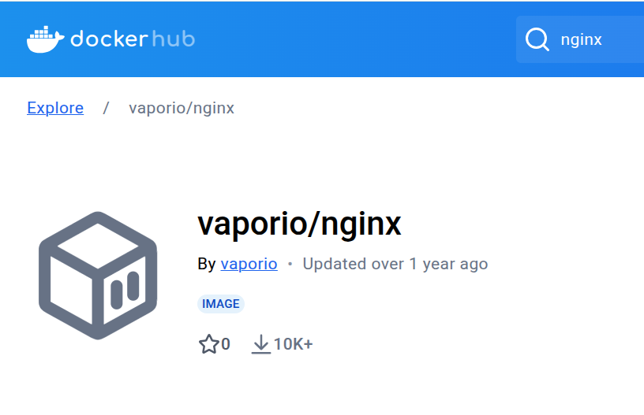
   - **Resultado esperado:** Si la imagen no está firmada, Docker rechazará la descarga. De lo contrario, la imagen será descargada con éxito (debes obtener los dos resultados).

    

   <p style="color:blue; text-align:justify;"><b>Podemos comprobar como docker ha rechazado la descarga de la imagen no firmada

3. **Firmar imágenes propias**

   - Crea una imagen básica basada en `nginx`:
     ```dockerfile
     # Dockerfile
     FROM nginx:latest
     RUN echo "Hello from a secure image!" > /usr/share/nginx/html/index.html
     ```

   - Construye la imagen:
     ```bash
     docker build -t my-secure-image:1.0 .
     ```

   - Firma la imagen al subirla a un repositorio:
     ```bash
     docker tag my-secure-image:1.0 <tu_usuario>/my-secure-image:1.0
     docker push <tu_usuario>/my-secure-image:1.0
     ```
   
   

     **Nota:** Durante este paso, se te pedirá que configures una clave de firma si es la primera vez que usas DCT.
<br>

4. **Verificar la firma de la imagen**

   - Usa el siguiente comando para verificar que la imagen está firmada correctamente:
     ```bash
     docker trust inspect --pretty <tu_usuario>/my-secure-image:1.0
     ```
   

5. **Desactivar temporalmente Docker Content Trust**

   - Si necesitas deshabilitar DCT temporalmente, usa:
     ```bash
     DOCKER_CONTENT_TRUST=0 docker pull imagen-no-firmada-del-anterior-ejercicio:latest
     ```

   
   

---

### 7.2. Restricción de privilegios en contenedores

Configurar contenedores con privilegios mínimos para mejorar la seguridad. Este ejercicio cubre:  
1. Uso del flag `--read-only` para montar el sistema de archivos del contenedor en modo solo lectura.  
2. Restricción de capacidades del kernel mediante el flag `--cap-drop`.  
3. Uso del flag `--user` para ejecutar contenedores con un usuario no root.  


1. **Preparar un contenedor básico**  
   - Crea un contenedor basado en una imagen ligera como `alpine` para realizar pruebas.  
     ```bash
     docker run --rm -it alpine sh
     ```
   - Dentro del contenedor, verifica que puedes escribir en el sistema de archivos:  
     ```bash
     touch /tmp/testfile
     ```
   - Sal del contenedor con `exit`.
   

2. **Ejecutar un contenedor con sistema de archivos de solo lectura**  
   - Usa el flag `--read-only` para montar el sistema de archivos del contenedor en modo solo lectura:  
     ```bash
     docker run --rm -it --read-only alpine sh
     ```
   - Dentro del contenedor, intenta crear un archivo en el sistema de archivos:  
     ```bash
     touch /tmp/testfile
     ```
     **Resultado esperado:** Deberías obtener un error similar a:  
     ```plaintext
     touch: /tmp/testfile: Read-only file system
     ```
   

3. **Probar la restricción de capacidades del kernel**  
   - Por defecto, los contenedores Docker tienen capacidades del kernel activadas, como `CAP_SYS_ADMIN`.  
   - Ejecuta un contenedor y prueba montar un sistema de archivos (necesita privilegios elevados):  
     ```bash
     docker run --rm -it alpine sh -c "mkdir /mnt/test && mount -t tmpfs none /mnt/test"
     ```
     **Resultado esperado:** La operación debería completarse sin errores.  
   
<p style="color:blue; text-align:justify;"><b>Para poder realizar estas operaciones en el contenedor debo acceder como root para ello añado el flag --privileged

   


   - Ahora ejecuta el contenedor con `--cap-drop=ALL` para deshabilitar todas las capacidades del kernel:  
     ```bash
     docker run --rm -it --cap-drop=ALL alpine sh
     ```
   - Intenta nuevamente montar un sistema de archivos:  
     ```bash
     mkdir /mnt/test && mount -t tmpfs none /mnt/test
     ```
     **Resultado esperado:** Deberías recibir un error similar a:  
     ```plaintext
     mount: permission denied (are you root?)
     ```
   

4. **Ejecutar contenedores con un usuario no root**  
   - Por defecto, los contenedores Docker ejecutan procesos como `root`. Usa el flag `--user` para ejecutar el contenedor como un usuario no root:  
     ```bash
     docker run --rm -it --user 1000:1000 alpine sh
     ```
   - Verifica que estás ejecutando como un usuario diferente con:  
     ```bash
     id
     ```

     **Resultado esperado:** El UID y GID deberían ser `1000`.  
   - Intenta crear un archivo en un directorio protegido como `/root`:  
     ```bash
     touch /root/testfile
     ```
     **Resultado esperado:** El sistema debería rechazar la operación debido a permisos insuficientes.

     

5. **Combinar todas las restricciones**  
   - Ejecuta un contenedor con todas las restricciones habilitadas:  
     ```bash
     docker run --rm -it --read-only --cap-drop=ALL --user 1000:1000 alpine sh
     ```
   - Verifica que:
     - El sistema de archivos es de solo lectura.
     - No puedes usar capacidades avanzadas del kernel.
     - Estás operando como un usuario no root.
     
     

   <br><p style="color:blue;"><b>Con estas intrucciones hemos añadido a la ejecución del contenedor las restricciones de solo lectura, de uso del kernel y restricciones a usuarios que no sean root, fortaleciendo la seguridad y minimizando las vulnerabilidades del contenedor.</b></p>

____ 

### 7.3. Construcción segura de imágenes

Aplicar buenas prácticas de seguridad al construir imágenes Docker para reducir riesgos y minimizar vulnerabilidades. Este ejercicio incluye:

1. Uso de imágenes base mínimas.  (BusyBox, Alpine)
2. Creación de un archivo `.dockerignore` para proteger datos sensibles.  
3. Uso de usuarios no root en la construcción de la imagen.

<br>
   
   1. **Preparar un Dockerfile básico**  
   Crea un archivo `Dockerfile` con el siguiente contenido inicial para una aplicación simple basada en Nginx:  
   
   ```dockerfile
      FROM nginx:latest
      COPY . /usr/share/nginx/html
   ```
   <br>  **Problema:** Este enfoque inicial tiene varios problemas de seguridad:
      - Usa una imagen genérica que puede incluir más herramientas de las necesarias.  
      - No asegura que los datos sensibles queden fuera de la imagen.  
      - Ejecuta procesos como root.

2. **Usar una imagen base mínima**  
   Modifica el Dockerfile para usar una imagen base más ligera, como `alpine`, que es más segura por su tamaño reducido:  
   ```dockerfile
   FROM nginx:alpine
   COPY . /usr/share/nginx/html
   ```
   
     

   <br><p style="color:blue; text-align:justify;"><b> Vemos como la imagen nginx:alpine pesa sólo 47Mb en lugar de los 192Mb de la imagen nginx:latest, lo que la convierte en más segura ya que dispone sólo de los servicios y dependencias mínimas necesarias. Esto reduce la superficie de ataque y refuerza su seguridad.
<br>

3. **Crear un archivo `.dockerignore`**  
   Para evitar incluir archivos innecesarios o sensibles en la imagen, crea un archivo `.dockerignore` con el siguiente contenido:  
   ```plaintext
   .env
   .git/
   node_modules/
   ```
   **Explicación:** Esto excluye archivos y carpetas como configuraciones locales, credenciales o dependencias del host, evitando su inclusión accidental en la imagen.
     

 <br>

4. **Usar un usuario no root en la imagen**  
   Modifica el Dockerfile para crear y usar un usuario no root durante la ejecución:  
   ```dockerfile
   FROM nginx:alpine

   # Crear un usuario no root
   RUN addgroup -S appgroup && adduser -S appuser -G appgroup

   # Cambiar al usuario no root
   USER appuser

   # Copiar los archivos de la aplicación
   COPY . /usr/share/nginx/html
   ```
   **Explicación:** Esto asegura que el contenedor no opere con privilegios elevados, minimizando los riesgos en caso de compromiso.

     

     <br><p style="color:blue; text-align:justify;"><b> En este dockerfile creamos una imagen ligera de nginx, creamos un usuario sin privilegios "user_cova" en el contenedor para evitar realizar actividades que comprometan el sistema, ejecutamos el contenedor con este usuario sin privilaegios y por último copiamos la aplicación al directorio del contenedor desde el que se servirá.
<br>

5. **Construir la imagen segura**  
   Construye la imagen con las modificaciones realizadas:  
   ```bash
      docker build -t secure-nginx:1.0 .
   ```

6. **Verificar la seguridad de la imagen**  
   - Inspecciona los metadatos de la imagen para confirmar que está usando el usuario no root:  
   ```bash
     docker inspect secure-nginx:1.0
   ```
     
     
     Busca el campo `"User"` en la salida.  
   - Ejecuta un contenedor basado en esta imagen y verifica el usuario activo:  
   
   ```bash
      docker run --rm secure-nginx:1.0 id
   ```
     **Resultado esperado:** El UID y GID deberían coincidir con el usuario `user_cova` creado en el Dockerfile.
     
     

7. **Probar la imagen segura**  
   - Inicia un contenedor con la imagen construida:  
     ```bash
     docker run -d -p 8080:80 secure-nginx:1.0
     ```
   - Abre `http://localhost:8080` en tu navegador para confirmar que el servidor Nginx funciona correctamente.


<br>

####  Optimizar el tamaño de la imagen

1. **Reducir capas en el Dockerfile**  
   Combina instrucciones para minimizar el número de capas:  
   ```dockerfile
   FROM nginx:alpine

   RUN addgroup -S appgroup && adduser -S appuser -G appgroup \
       && apk add --no-cache curl

   USER appuser
   COPY . /usr/share/nginx/html
   ```
   **Explicación:** Combinar instrucciones reduce el tamaño de la imagen y simplifica la cadena de capas.

2. **Verificar el tamaño de la imagen**  
   Compara el tamaño de la nueva imagen con otras usando:  
   ```bash
   docker images
   ```

   
   
     <br><p style="color:blue; text-align:justify;"><b> La combinación de comandos en la ejecución del dockerfile reduce las capas y por tanto su tamaño lo que minimiza la superficie de ataque, como hemos visto anteriormete, y optimiza el uso de disco en el host. Esto también agiliza la construcción de futuras imágenes ya que el cacheo de la imagen es también más eficiente y por tanto la construcción de futuras imágenes será más rápida. Por tanto: Menos capas, menos puntos de posible vulnerabilidad o errores en la imagen. 
 
 
______________

### 7.4. Configuración de límites de recursos para prevenir ataques DoS

Configurar límites de uso de memoria y CPU en los contenedores para prevenir ataques de Denegación de Servicio (DoS) o sobrecarga del sistema. Este ejercicio incluye el uso de flags como `--memory`, `--memory-reservation` y `--cpus` para gestionar recursos.

1. **Preparar un contenedor básico sin límites de recursos**  
   - Inicia un contenedor de prueba basado en la imagen `alpine`:
     ```bash
     docker run --rm -it alpine sh
     ```
   - Dentro del contenedor, genera un alto consumo de memoria:
     ```bash
     yes > /dev/null
     ```
   - Sal del contenedor con `Ctrl+C`.  
     
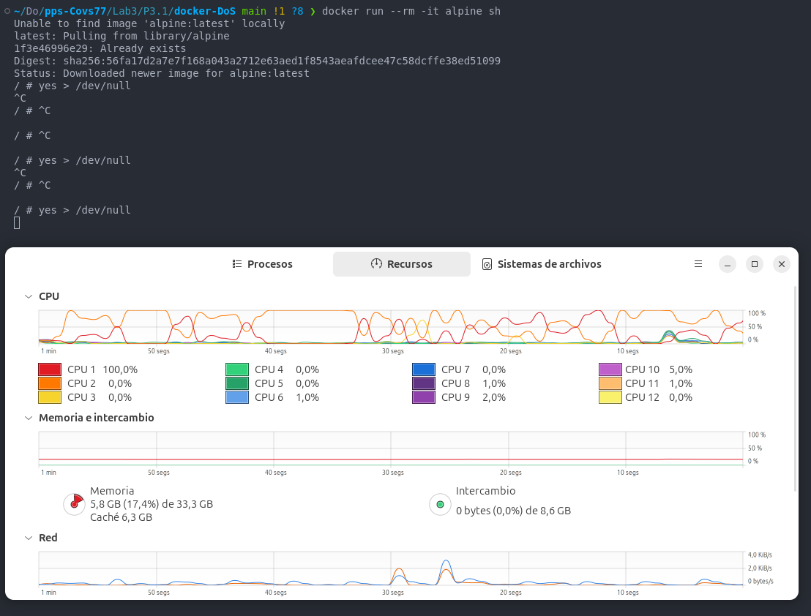
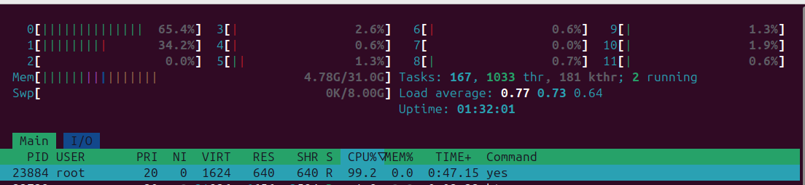
 <br><p style="color:blue; text-align:justify;"><b> Podemos comprobar como la ejecución de ese comando acapara casi el 100% de uso de la cpu de nuestro sistema lo que podría afectar a otros procesos que tengamos en ejecución.

2. **Establecer un límite de memoria con `--memory`**  
   - Inicia un contenedor con un límite estricto de memoria:
     ```bash
     docker run --rm -it --memory=64m alpine sh
     ```
   - Dentro del contenedor, verifica el límite de memoria disponible:
     ```bash
     cat /sys/fs/cgroup/memory/memory.limit_in_bytes
     ```
     **Resultado esperado:** El límite debería ser de 64 MB.
     
     

   
<br><p style="color:blue; text-align:justify;"><b> Verificamos que el limite máximo de memoria del que el contenedor puede disponer es de 64Mb, como hemos indicado al ejecutar el contenedor

   - Intenta consumir más memoria de la permitida:
     ```bash
     yes > /dev/null
     ```
     **Resultado esperado:** El contenedor debería ser detenido automáticamente por Docker debido al límite.

<br><p style="color:blue; text-align:justify;"><b> No consigo que el contenedor se detenga ya que el comando "yes > /dev/null" consume uso de CPU pero no de memoria. He intentado varios comandos en bucle pero sólo consigo que aumente el uso de cpu. Aunque más adelante comprobamos como sí que se limita el uso de memoria (docker stats)

3. **Establecer una reserva de memoria con `--memory-reservation`**  
   - Usa el flag `--memory-reservation` para garantizar una cantidad mínima de memoria:
     ```bash
     docker run --rm -it --memory=128m --memory-reservation=64m alpine sh
     ```
   - **Explicación:**  
     - `--memory-reservation=64m`: Reserva 64 MB de memoria como mínimo.
     - `--memory=128m`: Establece un límite máximo de 128 MB.
     
     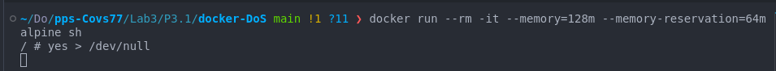
     
     <p style="color:blue; text-align:justify;"><b>  Ejecuto el comando docker stats para comprobar el consumo de recursos que está realizando el contenedor:

     

      <p style="color:blue; text-align:justify;"><b>  Vemos como la Memoria está limitada a los 128Mb que le hemos indicado.

4. **Configurar límites de CPU con `--cpus`**  
   - Inicia un contenedor con un límite de CPU:
     ```bash
     docker run --rm -it --cpus=0.5 alpine sh
     ```
   - Dentro del contenedor, genera una carga alta de CPU:
     ```bash
     yes > /dev/null
     ```
   - En otra terminal, monitorea el uso de CPU del contenedor:
     ```bash
     docker stats
     ```

          
     **Resultado esperado:** El contenedor no debería utilizar más del 50% de una CPU.

     


     <p style="color:blue; text-align:justify;"><b> Comprobamos que el consumo de CPU no supera el 50% como le hemos indicado al ejecutarlo. 
     
     
<br>

5. **Combinar límites de recursos**  
   - Inicia un contenedor con límites combinados de memoria y CPU:
     ```bash
     docker run --rm -it --memory=128m --memory-reservation=64m --cpus=1 alpine sh
     ```
   - Realiza pruebas de consumo de memoria y CPU para verificar que los límites se aplican correctamente.


<br>

6. **Aplicar límites en un archivo `docker-compose.yml`**  
   Si estás utilizando Docker Compose, configura los límites en el archivo `docker-compose.yml`:
   ```yaml
   version: '3.7'
   services:
     app:
       image: alpine
       deploy:
         resources:
           limits:
             memory: 128m
             cpus: "0.5"
           reservations:
             memory: 64m
   ```

<p style="color:blue; text-align:justify;"><b>Añado un comando para que el contendor se mantenga activo y poder realizar las comprobaciones.

   

   - Inicia los servicios con:
     ```bash
     docker-compose up -d
     ```
   - Verifica que los límites están aplicados con:
     ```bash
     docker stats
     ```

     
___________________
#### Docker scout (1 punto)

## 8. Herramientas de securización: Docker Scout

### 8.1 Análisis básico de vulnerabilidades en imágenes Docker

Utilizar **Docker Scout CLI** para realizar un análisis inicial de vulnerabilidades en una imagen Docker. El objetivo es identificar CVEs (vulnerabilidades conocidas) y categorizarlas por severidad.

1. **Instalar Docker Scout CLI (si no está instalado)**  
   Debes tener instalado en tu sistema operativo Docker Scout CLI.


2. **Seleccionar una imagen para analizar**  
   Elige una imagen pública conocida como `nginx:latest` para el análisis. Asegúrate de tenerla en tu sistema ejecutando:
   ```bash
   docker pull nginx:latest
   ```
   
   Elige otra imagen pública elegida por tí, una que te llame especialmente la atención y haz el ejercicio completo también con esta imagen.
<p style="color:blue; text-align:justify;"><b>He elegido esta imagen porque es de un autor no verificado y además muy pesada así que supongo que será más probable que tenga alguna vulnerabilidad.

   

   

3. **Ejecutar el análisis básico con Docker Scout CLI**  
   Realiza un análisis inicial para identificar vulnerabilidades en las dos imagenes seleccionadas (nginx y la tuya):
   ```bash
   docker scout cves nginx:latest
   ```
   **Explicación:**  
   - Este comando analiza la imagen y muestra las vulnerabilidades detectadas, categorizadas por severidad (crítico, alto, medio, bajo).

4. **Interpretar los resultados**  
   Examina la salida del comando, que debería ser similar a esto:
   ```plaintext
   IMAGE           HIGH   MEDIUM   LOW
   nginx:latest    5      10       20
   ```

   
   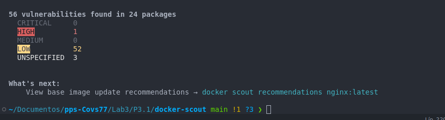

<p style="color:blue; text-align:justify;"><b>Para la imagen analizada (nginx:latest) docker scout ha encontrado una vulnerabilidad de caracter severo (high) y 52 de severidad baja (low). 


5. **Filtrar vulnerabilidades por severidad**  
   Si solo te interesan vulnerabilidades críticas o altas, puedes usar el flag `--only-severity`:
   ```bash
   docker scout cves nginx:latest --only-severity=high
   ```


6. **Obtener detalles sobre un CVE específico**  
   Usa el ID de un CVE listado en los resultados para obtener más información:
   ```bash
   docker scout cves nginx:latest --only-cve-id=CVE-2022-49043
   ```


<p style="color:blue; text-align:justify;"><b>A continuación busco más información sobre esta vulnerabilidad de código CVE-2022-49043 y de severidad <span style="color:red">alta.


<p style="color:blue; text-align:justify;"><b>Esta vulnerabilidad se encuentra en la biblioteca de software libxml2 en versiones anteriores a la 2.11.0 y es ampliamente utilizada para procesar archivos XML en diversas aplicaciones lo que implica que, al procesar ciertos archivos XML, la aplicación podría intentar acceder a áreas de memoria que ya no están disponibles para su uso lo que puede provocar comportamientos inesperados, como bloqueos de la aplicación o, en el peor de los casos, permitir que un atacante ejecute código malicioso. Para mitigar este problema, se recomienda actualizar libxml2 a la versión 2.11.0 o posterior, donde esta vulnerabilidad ha sido corregida

<p style="color:blue; text-align:justify;"><b>A continuación voy a analizar la otra imagen que he descargado de un usuario sin verificar, muy pesada.

 


<p style="color:blue; text-align:justify;"><b> En esta ocasión encontramos 4 vulnerabilidades críticas, 13 altas, 19 de nivel medio y 21 bajas. Ahora listo las vulnerabilidades de nivel alto:


<p style="color:blue; text-align:justify;"><b>Analizando los resultados, encuentro que la primera vulnerabilidad listada tiene la etiqueta <span style="background-color: red; color: white; padding: 2px 5px; border-radius: 4px;">CISA KEV</span>. Esto siginificaque se trata de una vulnerabilidad incluída en la lista KEV (Know Exploited Vulnerabilities) de la Agencia Estadounidense de ciberseguridad y Seguridad de infraestructuras (CISA) y que actualmente hay ataques en curso en el mundo real a través de esa vulnerabilidad. Lo que la convierte en <span style="background-color: red; color: white; padding: 2px 5px; border-radius: 4px;">crítica</span>
<br> Este fallo ocurre cuando el sistema procesa la variable de entorno GLIBC_TUNABLES. Si alguien con acceso local manipula esta variable de manera malintencionada y ejecuta un binario con permisos de propietario (SUID), puede forzar un desbordamiento de búfer y conseguir ejecutar código con permisos elevados, obtener acceso como administrador y controlar por tanto el sistema atacado.
<br>
<br>
Nota: me ha parecido más interesante analizar las vulnerabilidades altas para profunduzar en el significado de la etiqueta <span style="background-color: red; color: white; padding: 2px 5px; border-radius: 4px;">CISA KEV</span>. El hecho de no aparecer como crítica en la clasificación de Docker Scout puede deberse a los distintos criterios de clasificación o a la falta de actualización de las bases de dabos de seguridad. En cualquier caso dicha etiqueta debe convertir esa vulnerabilidad en prioritaria para aplicar las medidas de mitigación pertinentes.


7. **Analizar la imagen desde un registro remoto**  
   Usando una imagen propia en Docker Hub o un registro privado, analiza directamente desde el registro:
   ```bash
   docker scout cves cleguina77/cova-secure-image:1.0
   ```

<p style="color:blue; text-align:justify;"><b>He seleccionado una de las imagenes propias que tengo en DockerHub, la creamos como imagen segura podemos comprobar que tiene una vulnerabilidad alta y 52 leves


<p style="color:blue; text-align:justify;"><b>En esta imagen también encontramos una vulnerabilidad etiquetada como <span style="background-color: red; color: white; padding: 2px 5px; border-radius: 4px;">CISA KEV</span> que aunque es de baja severidad debería ser mitigada de forma prioritaria a las demás por lo comentado anteriormente.


### 8.2. Filtrar vulnerabilidades y recomendaciones en imágenes

Utilizar **Docker Scout CLI** para filtrar vulnerabilidades en imágenes Docker según su severidad y obtener recomendaciones prácticas para mitigarlas.

1. **Seleccionar una imagen para el análisis**  
   
   ```bash
   docker pull node:16
   ```

2. **Ejecutar un análisis básico con Docker Scout CLI**. Realiza un análisis inicial para listar todas las vulnerabilidades:
   ```bash
   docker scout cves node:16
   ```
   
   

3. **Filtrar por severidad específica**  
   ```bash
   docker scout cves node:16 --only-severity=high
   ```


4. **Listar recomendaciones prácticas**  
   Ejecuta el comando `recommendations` para incluir sugerencias sobre cómo mitigar las vulnerabilidades detectadas:
   ```bash
   docker scout recommendations node:16
   ```

   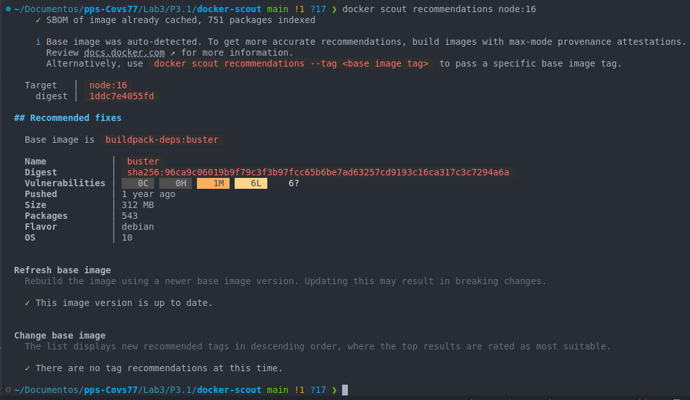

<br>
   <p style="color:blue; text-align:justify;"><b>Docker scout nos dice cuál es la imagen base desde la que se creó está imagen de node y las recomendaciones que indica parecen estar ya hechas, como serían reconstruir la imagen con una nueva versión de la imagen base y también nos indica que la imagen base que estamos usando está al actualizada.
<br>
   <p style="color:blue; text-align:justify;"><b>Repito el proceso para otra imagen no verificada.


  <p style="color:blue; text-align:justify;"><b>Para esta imagen sí que tenemos una lista de sugerencias para mitigar las vulnerabilidades detectadas. Indica la medida a tomar y los beneficios en cuanto a seguridad que ofrecen. En la columna de la derecha de esta última imagen se indican si las vulnerabilidades aumentan o se mitigan en función de la medida que tomemos. En este caso concreto parece que si actualizamos la imagen de alpine eliminariamos todas las vulnerabilidades que ahora mismo tiene además de reducir su peso ya que contiene 14 paquetes menos. Elimina 50 vulnerabilidades y no tiene ninguna y además está siendo muy utilizada ya que ha sido descargada más de 40mil veces al mes.


5. **Analizar recomendaciones en detalle**  
   Selecciona un CVE específico de la salida anterior y obtén más información sobre el impacto y las acciones sugeridas:
   ```bash
   docker scout cves node:16 --only-cve-id=CVE-2024-45492
   ```
   
   

<p style="color:blue; text-align:justify;"><b>Se nos recomienda actualizar a una versión actualizada de 3-slim que es la imagen base, es más ligera y se han eliminado paquetes innecesarios. En la columna de la derecha nos indica que las vulnerabilidades críticas has sido eliminadas, así como las de severidad alta y media, pero añade 6 vulnerabilidades de caracter leve.

6. **Comparar imágenes para evaluar mejoras**  
   Descarga una versión más reciente de la imagen y compárala con la versión actual:
   ```bash
   docker pull node:18
   docker scout compare --to node:16 node:18
   ```

   

   **Resultado esperado:**  
   La salida debería indicar si la versión más reciente ha reducido el número de vulnerabilidades.
<p style="color:blue; text-align:justify;"><b> En pantalla es imposible chequear esto, hay demasiada información. Guardo la salida en un fichero de texto para poder analizarlo al completo.(ver ejercicio siguiente)
   <br>

7. **Generar un informe para revisión posterior**  
   Redirige la salida del análisis a un archivo para su documentación:
   ```bash
   docker scout recommendations node:16 > comparativa
   ```
   
8. **Evaluar el impacto de las recomendaciones**  
   - Aplica una de las recomendaciones, como cambiar a una imagen más reciente (`node:18`) o eliminar paquetes inseguros en tu imagen personalizada.
   - Analiza nuevamente para verificar si las vulnerabilidades se han reducido:
     ```bash
     docker scout cves node:18
     ```


### 8.3: Comparar imágenes Docker para analizar mejoras de seguridad

Utilizar **Docker Scout CLI** para comparar imágenes Docker y analizar si las actualizaciones o cambios en las imágenes han mejorado o empeorado la seguridad.


1. **Seleccionar dos versiones de una imagen Docker**  
   Descarga dos versiones diferentes de una misma imagen, como `nginx:1.19` y `nginx:1.23`:
   ```bash
   docker pull nginx:1.19
   docker pull nginx:1.23
   ```

2. **Realizar análisis individuales con Docker Scout CLI**  
   Analiza cada versión por separado para identificar sus vulnerabilidades:
   ```bash
   docker scout cves nginx:1.19
   docker scout cves nginx:1.23
   ```
   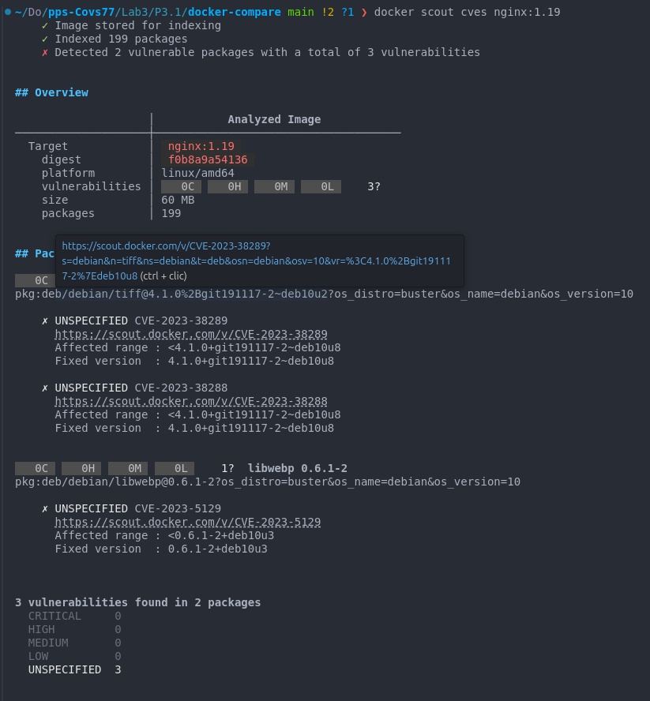
   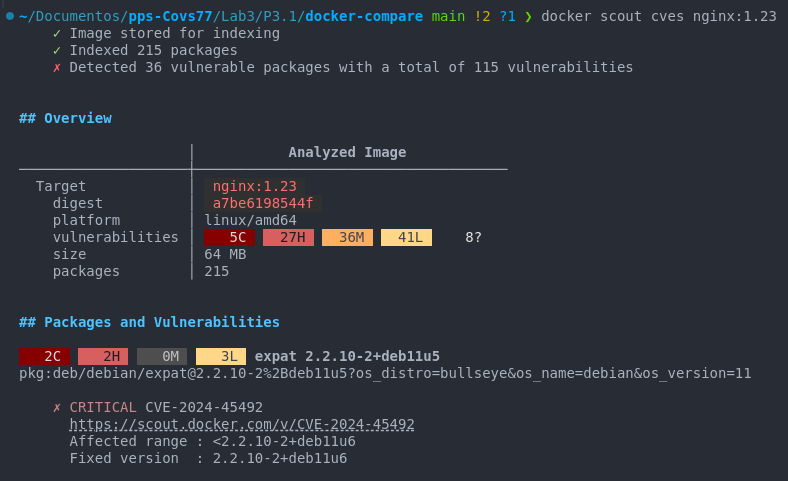

<p style="color:blue; text-align:justify;"><b> Analizándo ambas imágenes por separado vemos las vulnerabilidades de cada una.

3. **Comparar las dos versiones con Docker Scout CLI**  
   Usa el comando `docker scout compare` para analizar las diferencias en las vulnerabilidades:
   ```bash
   docker scout compare --to nginx:1.19 nginx:1.23
   ```
   

<p style="color:blue; text-align:justify;"><b> Docker Scout nos ofrece una comparativa completa de las vulnerabilidades así como de los distintos paquetes a los que afectan.

4. **Comparar imágenes personalizadas (opcional)**  
   Si tienes una imagen personalizada, compárala con la base para evaluar los riesgos adicionales.  
   - Construye una imagen personalizada:
     ```dockerfile
     FROM nginx:1.23
     RUN apt-get update && apt-get install -y curl
     ```
   - Construye y analiza la imagen:
     ```bash
     docker build -t custom-nginx:1.23 .
     docker scout compare --to nginx:1.23 custom-nginx:1.23
     ```

5. **Probar imágenes en un registro remoto**  
   Si trabajas con imágenes almacenadas en Docker Hub o un registro privado, realiza la comparación directamente desde el registro:
   ```bash
   docker scout compare --to my-repo/nginx:1.19 my-repo/nginx:1.23
   ```

<p style="color:blue; text-align:justify;"><b> Voy a realizar la compartiva de las dos imágenes remotas que tengo en mi perfil de docker hub. Se que son imágenes totalmente distintas pero es por realizar la prueba con imágenes en repositorios remotos.


6. **Documentar los resultados**  
   - Guarda los resultados de la comparación para su análisis posterior:
     ```bash
     docker scout compare --to nginx:1.19 nginx:1.23 --details > comparison-report.txt
     ```


<p style="color:blue; text-align:justify;"><b> De este modo hemos guardado en el fichero reporte_comparativa.txt toda la información que Docker Scout nos facilita sobre las imágenes que hemos comparado para facilitar su posterior análisis.

### 8.4. Generar informes detallados y visualizarlos en Docker Scout Web**

Generar un informe detallado sobre vulnerabilidades y configuraciones inseguras utilizando **Docker Scout CLI**, y explorar los resultados en la plataforma **Docker Scout Web** para analizar visualmente las capas y los paquetes de una imagen.


1. **Preparar una imagen para el análisis**  
   - Descarga una imagen pública, como `nginx:1.23`:
     ```bash
     docker pull nginx:1.23
     ```

2. **Generar un informe detallado con Docker Scout CLI**  
   - Ejecuta el comando para analizar vulnerabilidades y generar un informe:
     ```bash
     docker scout quickview nginx:1.23
     ```

3. **Guardar el informe para revisión posterior**  
   - Redirige la salida del análisis a un archivo para facilitar su revisión:
     ```bash
     docker scout quickview nginx:1.23 > scout-report.txt
     ```


<p style="color:blue"><b> 
   Contenido esperado del informe:
   <br>   - Número total de vulnerabilidades. <br>
   - Paquetes afectados y CVEs asociados. <br>
   - Recomendaciones prácticas.

4. **Explorar el informe en Docker Scout Web**  
   - Inicia sesión en la plataforma **Docker Scout Web**:  
     [https://hub.docker.com/scout](https://hub.docker.com/scout)
   - Sube el informe generado o analiza la imagen directamente desde el registro remoto.

   **Pasos para subir la imagen al registro Docker Hub:**
   - Etiqueta y sube la imagen a tu cuenta de Docker Hub:
     ```bash
     docker tag nginx:1.23 <tu_usuario>/nginx:1.23
     docker push <tu_usuario>/nginx:1.23
     ```

   - En Docker Scout Web, selecciona la imagen subida para visualizar el análisis.

   
<p style="color:blue; text-align:justify;"><b> Aunque he seguido los pasos indicados y he subido una nueva imagen para analizar al tener suscripción gratuita Docker Scout sólo permite analizar una imagen, la primera que subí. Voy a hacer las pruebas con esta imagen. Para las otras dos imagenes no me da opción siquiera a analizarlas.

5. **Explorar capas y vulnerabilidades**  
   - En Docker Scout Web, explora las capas de la imagen y las vulnerabilidades asociadas a cada capa.  
   - Identifica en qué etapa del Dockerfile se introdujeron los paquetes vulnerables.
   
   
   

<p style="color:blue; text-align:justify;"><b>  El informe nos muestra como en la etapa 4 se añaden vulnerabilidades a la imagen, en la columna de la derecha podemos ver los CVE de todas ellas.

6. **Probar análisis de imágenes personalizadas**  
   - Construye una imagen personalizada basada en `nginx:1.23`:
     ```dockerfile
     FROM nginx:1.23
     RUN apt-get update && apt-get install -y curl
     ```
   - Etiqueta y sube la imagen:
     ```bash
     docker build -t <tu_usuario>/custom-nginx:1.23 .
     docker push <tu_usuario>/custom-nginx:1.23
     ```
   - Analiza la imagen personalizada en Docker Scout Web para observar los paquetes y configuraciones adicionales.

7. **Comparar resultados entre imágenes**  
   - Usa la función de comparación en Docker Scout Web para observar diferencias de seguridad entre la imagen base `nginx:1.23` y la personalizada.

<p style="color:blue; text-align:justify;"><b> No puedo realizar esta comparativa porque la suscripción de Docker Scout que tengo no lo permite. Entiendo que igual que desde la terminal podemos realizar el análisis y la comparativa, la web también facilita este análisis de forma visual (aunque pagando).


