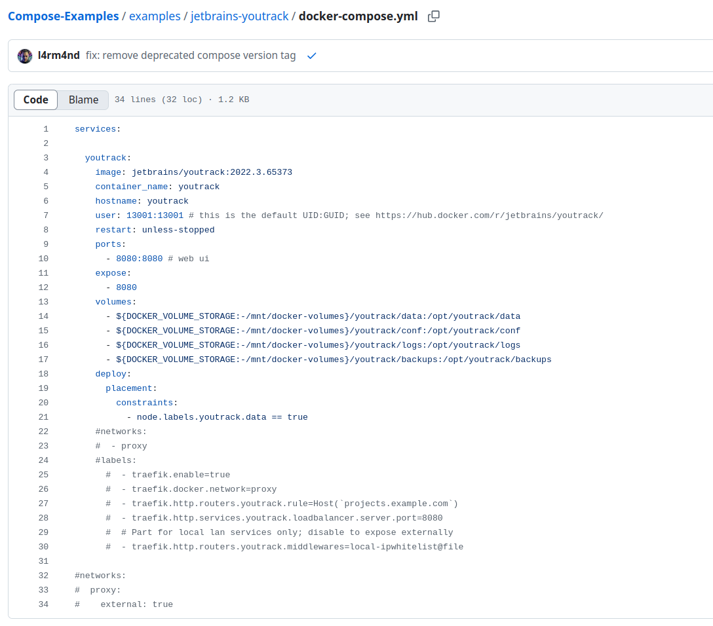
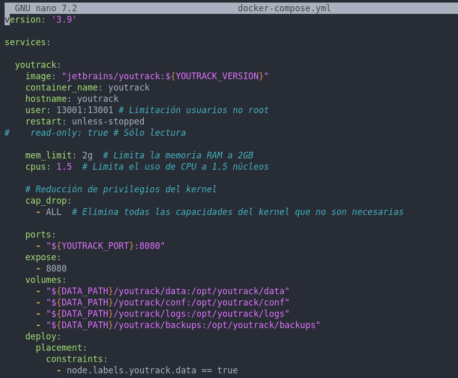

## Práctica 3.2. Estudio de diferentes docker-compose (3 puntos)

Dada la sigiuente lista de docker-compose por la comunidad:

- [https://github.com/docker/awesome-compose](https://github.com/docker/awesome-compose).

Debes seleccionar al menos 2 docker-compose de la lista anterior, siendo uno perteneciente a la categoría [https://github.com/Haxxnet/Compose-Examples?tab=readme-ov-file#software-development---project-management-devops](https://github.com/Haxxnet/Compose-Examples?tab=readme-ov-file#software-development---project-management-devops) de herramientas de desarrollo.

<p style="color:blue; text-align:justify;"><b> Voy a separar el análisis en dos partes para que sea más claro A (youtrack) y B (plex).
<p style="color:blue; text-align:justify;"><b> A. De la categoría Software Development - Project Management, DevOps, he seleccionado el proyecto jetbrains-youtrack que es una herramienta de gestión de proyectos.




1. Explicar detalladamente qué hace el docker-compose.

<p style="color:blue; text-align:justify;"><b>
    <br> En primer lugar se define un servicio  llamado "youtrack", que usa la imagen específica : jetbrains/youtrack:2022.3.65373. Se asigna el nombre al contenedor "youtrack" y dentro del contenedor, la máquina (hostname) será también "youtrack".
    <br> A continuación se especifica el usuario y grupo bajo el cual se ejecutará YouTrack en el contenedor. Esto es importante para establecer los permisos correctos en los volúmenes necesarios.

```yml
    restart: unless-stopped
```
<p style="color:blue; text-align:justify;"><b> <br>  Establece las políticas de reinicio del contenedor, en este caso se reinicia automáticamente, a menos que el usuario lo detenga manualmente.
<br> 

```yaml
    ports:
      - 8080:8080
    expose:
      - 8080
```

<p style="color:blue; text-align:justify;"><b> <br>
Mapea el puerto 8080 del contenedor al host, permitiendo el acceso vía http://localhost:8080.
expose: 8080 indica que el contenedor escucha en ese puerto, pero sin exponerlo directamente al exterior (más útil en redes internas de Docker).
<p style="color:blue; text-align:justify;"><b> 
Para establecer la persistencia de datos se establecen los volúmenes montados en los directorios del host.

```yaml
    volumes:
      - ${DOCKER_VOLUME_STORAGE:-/mnt/docker-volumes}/youtrack/data:/opt/youtrack/data
      - ${DOCKER_VOLUME_STORAGE:-/mnt/docker-volumes}/youtrack/conf:/opt/youtrack/conf
      - ${DOCKER_VOLUME_STORAGE:-/mnt/docker-volumes}/youtrack/logs:/opt/youtrack/logs
      - ${DOCKER_VOLUME_STORAGE:-/mnt/docker-volumes}/youtrack/backups:/opt/youtrack/backups
``` 
<p style="color:blue; text-align:justify;"><b> <br>
${DOCKER_VOLUME_STORAGE:-/mnt/docker-volumes} permite definir una variable de entorno para la ruta de almacenamiento.
<br>
Si no está definida, usará /mnt/docker-volumes por defecto.
<br>- YouTrack almacena datos en /opt/youtrack/data
<br>- Configuraciones en /opt/youtrack/conf
<br>- Registros (logs) en /opt/youtrack/logs
<br>- Copias de seguridad en /opt/youtrack/backups

```yaml
    deploy:
      placement:
        constraints:
          - node.labels.youtrack.data == true
``` 
<p style="color:blue; text-align:justify;"><b> <br>
Es la configuración para Docker Swarm (herramienta de orquestación de contenedores simila a Kubernetes), asegurando que el contenedor se ejecute solo en nodos con la etiqueta youtrack.data == true.
<br>Al final encontramos una configuración de red para usar Traefik como Proxy inversor pero como está comentado no se habilitará.
<br><br><br> Por tanto se ejecuta YouTrack en un contenedor con la imagen jetbrains/youtrack:2022.3.65373. Usa el puerto 8080 para la interfaz web.
<br>Almacena datos en volúmenes persistentes. Define reglas de despliegue para Docker Swarm. Incluye una configuración opcional de Traefik que no se está usando y podría conectarse a una red proxy externa.

_______ 

<br>
<p style="color:blue; text-align:justify;"><b> 
B. El otro proyecto seleccionado es para una configuración básica para usar Plex, que es una plataforma de entretenimiento y gestión de contenido multimedia.


<p style="color:blue; text-align:justify;"><b> 
Este docker-compose.yml configura un contenedor para Plex, un servidor multimedia que permite organizar y transmitir contenido a múltiples dispositivos.
<br>Se define un servicio llamado plex donde se va usar la imagen "plexinc/pms-docker" y el contenedor se llamará "plex".
<br> Se declaran unas variables de entorno para establecer la zona horaria y se configura una clave para vincular el servidor con una cuenta de Plex.tv
<br>A continuación se definen los volúmenes que se montan desde el host para la configuración, para los ficheros temporales de transcodificación y para los archivos multimedia.
<br>Se establece la política de reinicio para que se reinicie automáticamente si se detiene inesperadamente y por último se definen los puertos del contenedor, así como el puerto que se va a exponer.

_______________________


2. Adaptar el docker-compose con las variables de entorno (si fueran necesarias), volumenes, y redes de nuestra puesta en producción. 

<p style="color:blue; text-align:justify;"><b>
A. Proyecto YouTrack.  Creo un fichero con las variables de entorno personalizadas .env he puesto la última versión de Youtrack. Esto facilita la personalización y actualización del contenedor.


<p style="color:blue; text-align:justify;"><b> Y modifico el fichero de configuración a las nuevas variables de entorno:


<p style="color:blue; text-align:justify;"><b> Por útlimo verifico que la configuración es correcta levantando el despliegue:


<p style="color:blue; text-align:justify;"><b> Verifico a través del navegador por el puerto expuesto:


_______________


<p style="color:blue; text-align:justify;"><b> 
B. Para el proyecto Plex. Creo el fichero con las variables de entorno .env:


<p style="color:blue; text-align:justify;"><b> Adapto el docker-compose a esta nueva configuración:


<p style="color:blue; text-align:justify;"><b>Verifico el despliegue.


_________


 3. Realizar la securización de las imagenes/docker-compose
<p style="color:blue; text-align:justify;"><b>Para securizar las imágenes vamos a limitar el uso a usuarios "no root" también crearemos la imagen como sólo lectura y vamos a limitar el uso del kernel. También realizaremos la configuración necesaria para evitar ataques DoS.
Para ello limitamos el uso tanto de cpus como de memoria. También establecemos que no se puedan escalar privilegios.
<p style="color:blue; text-align:justify;"><b> A. Proyecto Youtrack
<br>Securizamos la imagen del proyecto estableciendo limites de uso de la RAM como de los CPUs. Limitamos la ejecución a usuarios no root y establecemos el contendor como sólo lectura.


<p style="color:blue; text-align:justify;"><b> Al intentar levantar el servicio, nos salta un error. No podemos establecer el contenedor como sólo lectura.


<p style="color:blue; text-align:justify;"><b> Modifico el docker-compose y verifico que puedo acceder al contenedor con una configuración más segura.




_______


<p style="color:blue; text-align:justify;"><b>B. Proyecto Plex.
<br>Añado la siguiente configuración para limitar la ejecución a usuarios "no root" UID/GID: 1000, habilito que sea de sólo lectura aunque para este proyecto en concreto igual esto puede provocar un mal funcionamiento del servicio ya que se necesita escribir datos en el sistema. También realiza copias de seguridad y registra logs por lo que al establecer el contenedor como sólo lectura estas tareas no se podrán ejecutar correctamente
<br>OJO: Verificar si el servicio a securizar soporta la posibilidad de solo lectura.


<p style="color:blue; text-align:justify;"><b>Verifico el despliegue:


<p style="color:blue; text-align:justify;"><b>Con esta configuración no puedo levantar el servicio ya que debo poder modificar ficheros en el contenedor.
<br>Por ello no puedo establecer las directivas de solo lectura y no ejecutarse como root.


<p style="color:blue; text-align:justify;"><b> Modificio el docker-compose.


<p style="color:blue; text-align:justify;"><b>Y compruebo que el servicio está disponible de nuevo.


___________

4. Realizar un análisis de vulnerabilidades y reflexionar la seguridad.

<p style="color:blue; text-align:justify;"><b> A. Analizamos la imagen creada para Youtrack:


<p style="color:blue; text-align:justify;"><b> Mostramos las vulnerabilidades encontradas. Se nos sugiere actulizar la imagen base de debian utilizada, lo que reduciría las vulnerabilidades, eliminando las crítcias, altas y medias quedando 23 vulnerabilidades leves. Si analizamos las recomendaciones de docker scout...


<p style="color:blue; text-align:justify;"><b>Obtenemos un informe con las posibles mejoras que podríamos obtener si reconstruimos la imagen de nuestro proyecto con una versión más actualizada de la base. Dicho informe lo guardamos en un documento para analizar de forma pormenorizada los cambios sugeridos.
<br>
<p style="color:blue; text-align:justify;"><b>B. Si analizamos la imagen creada para el proyecto Plex:


<p style="color:blue; text-align:justify;"><b>Obtenemos un reporte con las vulnerabilidades, en este caso no encontramos ninguna vulnerabilidad crítica aunque sí vemos una vulnerabilidad etiquetada como <span style="color:red;">CISA KEV </span>.
<br> Como vimos anteriormente se trata de una vulnerabilidad en activo, es decir que se están registrando ataques hoy en día a través de esa vulnerabilidad por tanto es importante solucionarla lo antes posible o nuestro proyecto seguirá expuesto a un ataque.


<p style="color:blue; text-align:justify;"><b>Buscamos más información sobre esta vulnerabilidad....


<p style="color:blue; text-align:justify;"><b>Esta vulnerabilidad permite al atacante realizar operaciones en un directorio restringido sin que se limite el acceso debido al uso de rutas absolutas. 
Esto se consigue cuando se descomprimen ficheros que usando ".." y "/" permite al atacante escapar del directorio autorizado creando un "agujero" por el que los atacantes pueden acceder a información comprometida del sistema.
<br><br>Por tanto es necesario realizar las mejoras sugeridas, donde conseguiriamos una imagen con estas vulnerabilidades. Como en el caso anterior lo guardamos en un documento de texto para poder analizarlo con detenimiento y establecer las mejoras para nuestro proyecto.


 5. Intentar solucionar una de las vulnerabilidades. 
 
 <p style="color:blue; text-align:justify;"><b>Para ambas imagenes chequedas se nos sugiere reconstruir los proyectos con imagenes base actualizadas. Luego es importante hacer seguimiento de las nuevas versiones disponibles para mejorar la seguridad de los proyectos, manteniendo al día las imagenes base utilizadas.
 <br><br>En el caso expuesto del proyecto etiquetado como B. Plex deberíamos prestar especial atención a la vulnerabilidad etiquetada como <span style="color:red;">CISA KEV </span>.
 <br>Para ello además de actualizar las imagenes base deberíamos restringir la ejecución a usuarios sin permisos de root para evitar que se pueda acceder a información sensible de nuestro sistema. 
 Como hemos visto en la etapa de securización de la imagen si hacemos esto el servicio no funciona correctamente y no estaría disponible por lo que habría que establecer directivas concisas para permitir el acceso al contenedor de forma más controlada.
