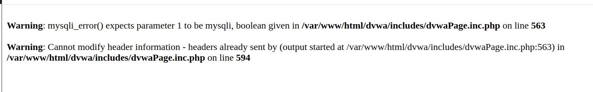
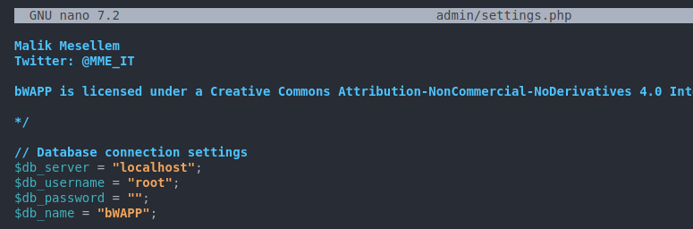
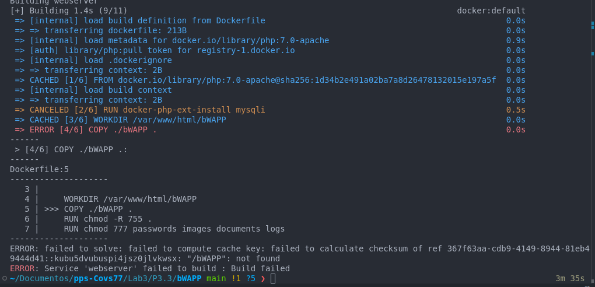
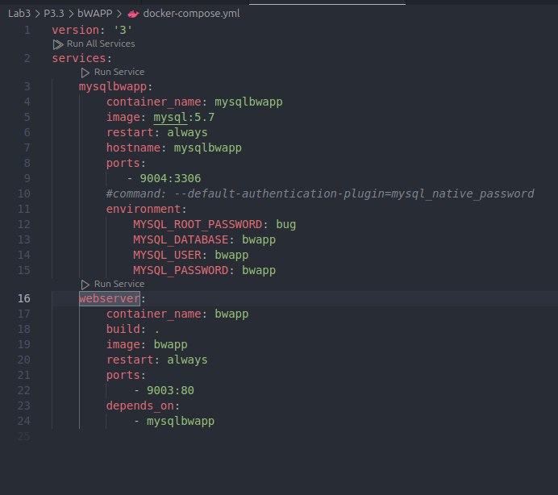
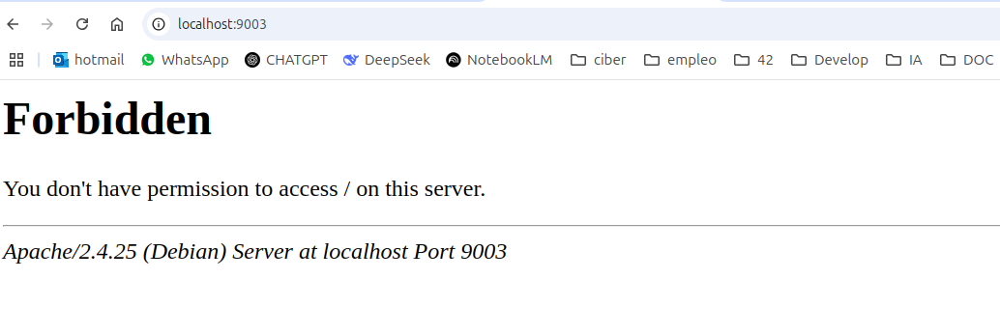
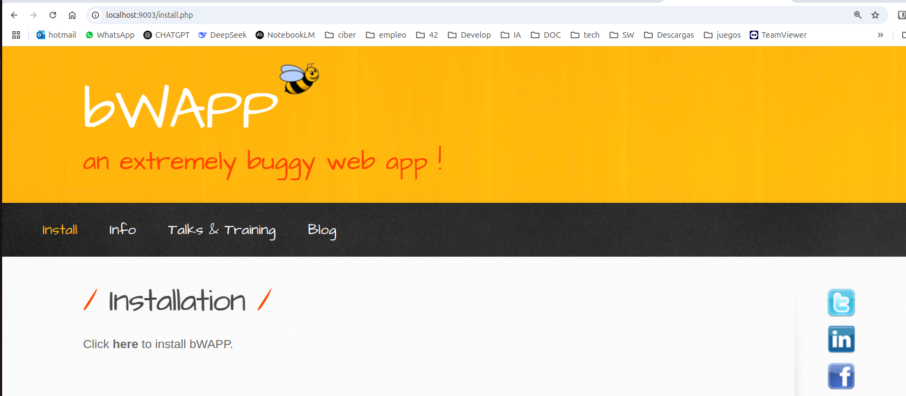
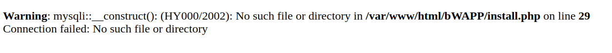
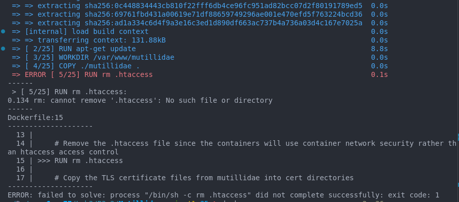
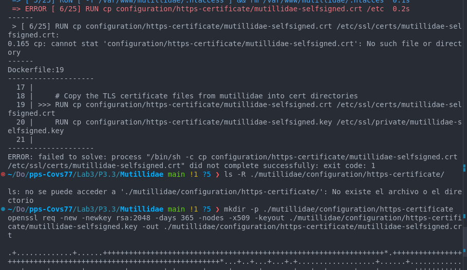
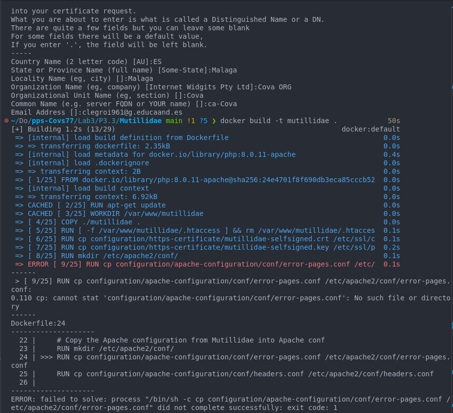

## Práctica 3.3. Despliegue de software vulnerable (1.5 puntos)
En esta práctica vamos a desplegar contenedores vulnerables para su estudio.

### 1. DVWA  

<p style="color:blue; text-align:justify;"><b>
Vamos a crear la imagen de DVWA, una aplicación vulnerable que contine una base de datos y un servidor web. Para ello contamos con el docker-compose necesario.<br>
Cuando levantamos la aplicación encontramos un problema en el servidor web, no tiene internet y no podemos actualizarlo ni instalar las dependencias necesarias, ni por supuesto exponer ningún puerto, esto es debido a la version de Apache con la que se genera la imagen, para solucionarlo debemos modificar algunos ficheros en la imagen base que estamos utilizando en el Dockerfile del Apache.


```bash
    RUN sed -i s/deb.debian.org/archive.debian.org/g /etc/apt/sources.list
    RUN sed -i 's|security.debian.org|archive.debian.org|g' /etc/apt/sources.list 
    RUN sed -i '/stretch-updates/d' /etc/apt/sources.list
```
Esta solución la hemos encontrado en esta web: 
https://serverfault.com/questions/1074688/security-debian-org-does-not-have-a-release-file-on-with-debian-docker-images

Con estos cambios conseguimos crear la imagen de apache, la de php tambíen se crea pero al ejecutar la aplicación, nos da el siguiente error.



### <p style="color:red; text-align:justify;"><b> Dejo el proceso aquí.

_________


### 2. bWAPP 
<p style="color:blue; text-align:justify;"><b>BWAPP es una aplicación web con problemas de seguridad, persenta más de 100 vulnerabilidades y cubre todos los riesgos contemplados en el OWASP Top 10. Al igual que la aplicación anterior está desarrollada en PHP y utiliza una base de datos Mysql.
Vamos a crear la imagen docker siguiendo las instrucciones facilitadas:

Instrucciones:
Installation steps


No! I will not explain how to install Apache/IIS, PHP and MySQL :)

*/ Extract the 'zip' file.

	example on Linux:

		unzip bWAPP.zip

*/ Move the directory 'bWAPP' (and the entire content) to the root of your web server.

*/ Give full permission to the directories 'passwords', 'images', 'documents' and 'logs'. 
   This step is optional but it will give you so much fun when exploiting bWAPP with tools like sqlmap and Metasploit.

	example on Linux:

		chmod 777 passwords/
		chmod 777 images/
		chmod 777 documents/
            chmod 777 logs/
		
<p style="color:blue; text-align:justify;"><b>El directorio logs no existe, asi que elimino esa línea.
        
        

*/ Edit the file 'admin/settings.php' with your own database connection settings.

	example:

		$db_server = "localhost"; 	// your database server (IP/name), here 'localhost'
		$db_username = "root";		// your MySQL user, here 'root'
		$db_password = "";		// your MySQL password, here 'blank'



<p style="color:blue; text-align:justify;"><b>Creo la imagen con el docker-compose facilitado. Nos sale este error. 




<p style="color:blue; text-align:justify;"><b>Modifico el Docker-compose:



<p style="color:blue; text-align:justify;"><b>Ahora sí se crean las imagenes pero no tengo acceso :



<p style="color:blue; text-align:justify;"><b>Parece ser que la ruta no está bien especificada en el Dockerfile, tras modificarla consigo tener acceso pero no conecta a internet, asi que realizo las mismas modificaciones en el caso anterior de DVWA:

```bash
FROM php:7.0-apache
RUN docker-php-ext-install mysqli

WORKDIR /var/www/html/bWAPP
COPY ./bWAPPv2.2/bWAPP .
RUN chmod -R 755 .
RUN chmod 777 passwords images documents 
RUN sed -i s/deb.debian.org/archive.debian.org/g /etc/apt/sources.list
RUN sed -i 's|security.debian.org|archive.debian.org|g' /etc/apt/sources.list 
RUN sed -i '/stretch-updates/d' /etc/apt/sources.list

EXPOSE 80

```
<p style="color:blue; text-align:justify;"><b>Tras todas estas modificaciones, consigo acceder a la aplicación a traves de http://localhost:9003/bWAPP/install.php

*/ Browse to the file 'install.php' in the directory 'bWAPP'.

	example: http://localhost/install.php



<p style="color:blue; text-align:justify;"><b>Procedemos a instalar la aplicación y me da un error, porque no encuentra los ficheros. Posiblemente porque las rutas no son las correctas:

*/ Click on 'here' (Click 'here' to install bWAPP).

	The database 'bWAPP' will be created and populated.




*/ Go to the login page. If you browse the bWAPP root directory you will be redirected.

	example: http://localhost/bWAPP/
	example: http://localhost/bWAPP/login.php

<p style="color:blue; text-align:justify;"><b>Parece que  el problema está en que no accede a la intalación, he intentado encontrar la solución pero no lo he logrado... 
<p style="color:red; text-align:justify;"><b>No he sabido/podido avanzar más de este paso.


*/ Login with the default credentials, or make a new user.

	default credentials: bee/bug

*/ You are ready to explore and exploit the bee!


This project is part of the ITSEC GAMES project. ITSEC GAMES are a fun approach to IT security education. 
IT security, ethical hacking, training and fun... all mixed together.
You can find more about the ITSEC GAMES and bWAPP projects on our blog.

We offer a 2-day comprehensive web security course 'Attacking & Defending Web Apps with bWAPP'.
This course can be scheduled on demand, at your location!
More info: http://goo.gl/ASuPa1 (pdf)

Enjoy!

Cheers

Malik Mesellem
Twitter: @MME_IT

_________________________

### 3.OWASP Mutillidae II
OWASP Mutillidae II es una aplicación web vulnerable que presenta más de 40 vulnerabilidades y ejercicios para practicar pentesting web.
Descargo el repositorio: https://github.com/webpwnized/mutillidae-docker

<p style="color:red; text-align:justify;"><b>Intento crear la imagen  con docker build pero tengo una serie de errores que no sé solucionar, con los ficheros de configuración del proyecto, falla el certificado, las paáginas de error...He intentado solucionar algunos, aunque creo que estoy dando palos de ciego.



