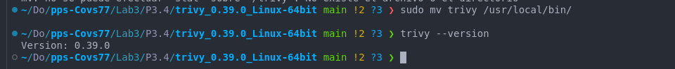
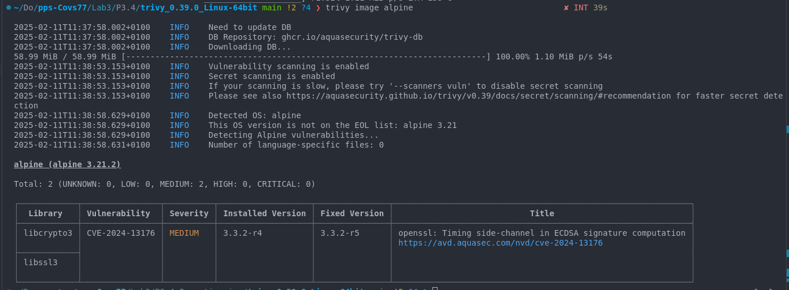
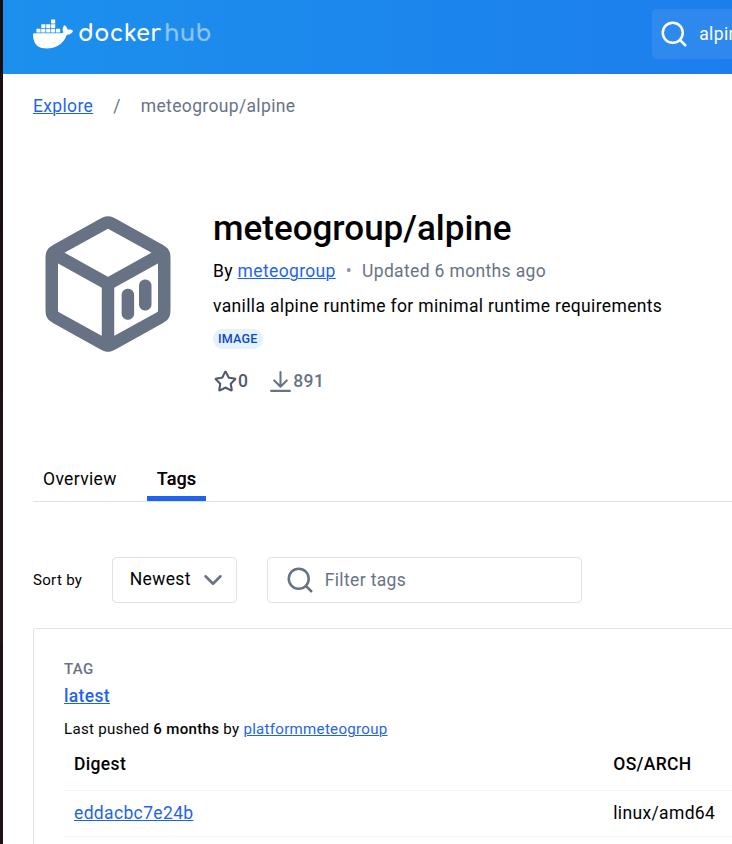
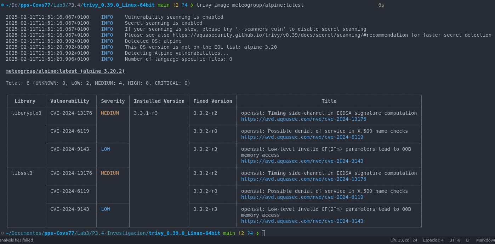
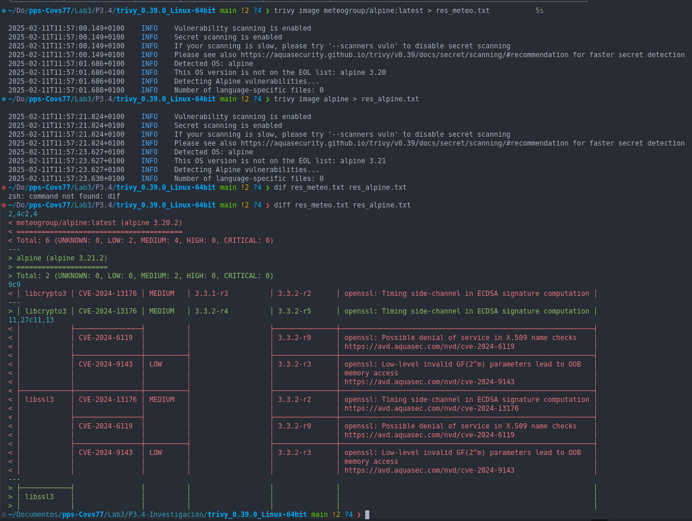

# Investigación

## Investigación 3.4. Uso de la herramienta Trivy.

<b>
1. Instala/Configura Trivy.
<p style="color:blue; text-align:justify;"><b>Para instalarlo, descargo el fichero comprimido:

https://github.com/aquasecurity/trivy/releases/download/v0.39.0/trivy_0.39.0_Linux-64bit.tar.gz




2. Realiza algunas comparaciones de seguridad de las imagenes usando Trivy.

<p style="color:blue; text-align:justify;"><b>Escaneo la imagen remota de alpine:



<p style="color:blue; text-align:justify;"><b>Nos ofrece un informe con las vulnerabilidades que tiene esta imagen sin necesidad de descargarla.

<p style="color:blue; text-align:justify;"><b>Selecciono al azar una imagen no confibale de dockerhub y la escaneo



```bash
    meteogroup/alpine:latest
```


<p style="color:blue; text-align:justify;"><b>En este informe se muestran un total de 6 vulnerabilidades. 2 de nivel bajo y de nivel 4 medio. Se indican las dependencias vulnerables y los CVE de dichas vulnerabilidades. También se indican las versiones reparadas a las que deberiamos actualizar para mitigar dichas vulnerabilidades.

<p style="color:blue; text-align:justify;"><b>A continuación comparo dos imágenes, para ello las escaneo por separado y luego hago una comparación de los mismos, en rojo vemos las vulnerabilidades de la imagen eligida al azar (meteogroup/alpine) y en verde, el resultado de alpine:latest.



<p style="color:blue; text-align:justify;"><b>Esta herramienta nos permite analizar visualmente las imagenes docker sin necesidad de tenerlas descargarlas en nuestro equipo.

_______________

### <p style="color:green; text-align:justify;"><b>Manual para mi:

Trivy es una herramienta de escaneo de vulnerabilidades para imágenes Docker, archivos de sistema y repositorios de Git. Es fácil de usar y puede identificar vulnerabilidades conocidas en el software y las dependencias de tus contenedores.

1. Instalación de Trivy
En Linux, descargar el archivo comprimido de Trivy:

```bash
    wget https://github.com/aquasecurity/trivy/releases/download/v0.39.0/trivy_0.39.0_Linux-64bit.tar.gz
```
Descomprimir el archivo:

```bash
    tar -xzvf trivy_0.39.0_Linux-64bit.tar.gz
```

Mover el binario a una carpeta del sistema:

```bash
    sudo mv trivy /usr/local/bin/
```
Verificar la instalación:

```bash
    trivy --version
```

2. Uso básico de Trivy
Escanear una imagen Docker:
    Para escanear una imagen Docker en busca de vulnerabilidades, utiliza el siguiente comando:

```bash
    trivy image nombre_imagen
```

Por ejemplo:

```bash
    trivy image nginx:latest
```

Salida:
Trivy mostrará una lista de vulnerabilidades encontradas, clasificadas por gravedad (Critical, High, Medium, Low). Para cada vulnerabilidad, se mostrará la información sobre la descripción, la versión afectada y una referencia a la CVE (si está disponible).

3. Opciones útiles
Escanear una imagen con formato JSON:
Si prefieres obtener la salida en formato JSON, puedes usar la opción --format:

```bash
    trivy image --format json nombre_imagen > resultado.json
```

Esto genera un archivo resultado.json que puedes usar para análisis posteriores.

Escanear con una política personalizada:
Si deseas escanear con configuraciones personalizadas (como omitir ciertos tipos de vulnerabilidades), puedes usar el archivo de configuración de políticas de Trivy. Para más detalles, revisa la documentación oficial de Trivy.

4. Comparar imágenes
Puedes comparar vulnerabilidades de dos imágenes Docker utilizando Trivy de la siguiente manera:

Escanear las imágenes:

```bash
    trivy image imagen1 > resultado_imagen1.txt
    trivy image imagen2 > resultado_imagen2.txt
```
Comparar los resultados con diff:

```bash
    diff resultado_imagen1.txt resultado_imagen2.txt
```

5. Escaneo de dependencias en un contenedor
Si estás trabajando con un contenedor y deseas escanear las dependencias instaladas dentro del mismo, primero obtén el ID o nombre del contenedor y luego utiliza el siguiente comando:

```bash
    trivy fs --vuln-type os /ruta/al/contenedor
```

Esto escaneará las dependencias del contenedor especificado.

6. Actualizar Trivy
Es importante mantener Trivy actualizado para obtener las últimas definiciones de vulnerabilidades:

```bash
    trivy --update
```

7. Conclusión
Trivy es una herramienta potente y fácil de usar para detectar vulnerabilidades en imágenes Docker. Puedes integrarlo fácilmente en tu flujo de trabajo de CI/CD o utilizarlo manualmente para verificar tus contenedores antes de desplegarlos.