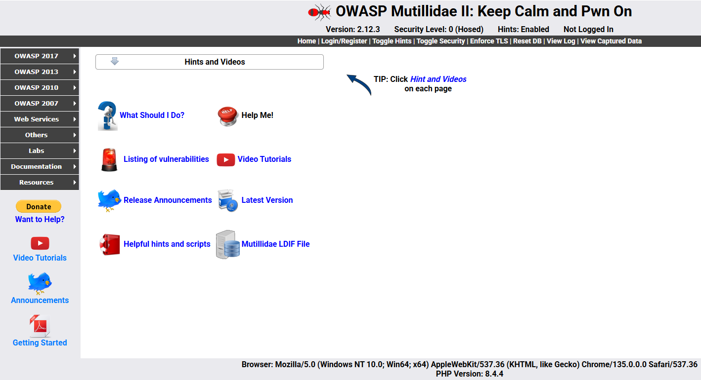
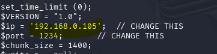
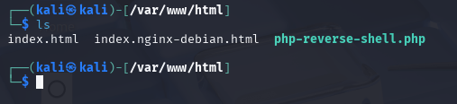
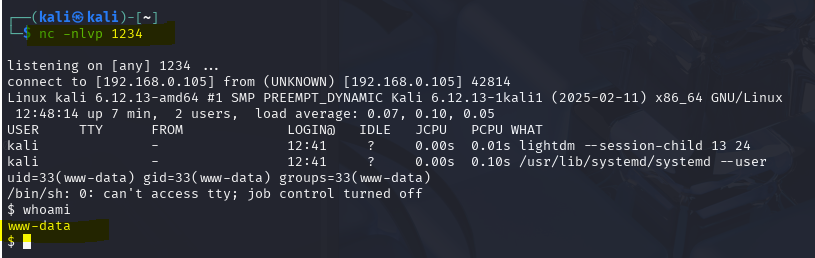
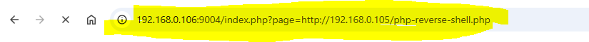

# Laboratorio 5. Vulnerabilidades Web
## Covadonga Leguina Roig

## PRÁCTICA 5.0

*RFI PoC*

 ◼ Vamos a probar a incluir una reverse shell en Mutillidae II.
 
 - Descargamos el repositorio desde GitHub: https://github.com/pentestmonkey/php-reverse-shell 
 - Importante cambiar la extensión de la shell de .php a .txt → si es un .php la shell se estaría interpretando para nuestra máquina y no para el servidor web.
 - Modificamos IP y puerto dentro del código de la shell para que se conecte con nuestra máquina Kali Linux.
 - Levantamos un servidor web en Kali Linux con el comando service  apache2 start y copiamos la shell a /var/www/html.
 - Dejamos Netcat a la escucha en el puerto 1234 con el comando nc-nlvp 1234.
 - Realizamos la inclusión remota de la shell en Mutillidae II.
 - Tenemos acceso al servidor desde Kali Linux bajo el usuario www data!

En este ejercicio vamos a demostrar que el servidor Mutillidae II es vulnerable a la inclusión de ficheros remotos o RFI. 
Para ello necesitamos una máquina atacante Kali y la Mutillidae II, que será la víctima.

Desde la Kali atacante y descargo el fichero malicioso <b>php-reverse-shell.php</b> indicado en el enlace de Github: https://github.com/pentestmonkey/php-reverse-shell
   
Levantamos la máquina vulnerable Mutillidae II con docker-compose <b>192.168.0.106:9004</b>

En la Kali editamos el fichero malicioso con la IP atacante y el puerto que vamos a poner en escucha. Para ello cambiamos la extensión a .txt y modificamos como se muestra en la imagen y volvemos a cambiar el fichero como .php.

Copiamos el fichero al directorio raíz de Apache /var/www/html para que sea accesible desde la víctima:

Configuro Netcat en modo servidor escuchando por el puerto 1234 para conexiones entrantes. Comprobamos como tras ejecutar el comando indicado, se abre una shell inversa en el atacante dándonos acceso a la víctima:

Comando ejecutado en la víctima:

De este modo hemos demostrado como explotar la vulnerabilidad de inclusión de archivos remotos (RFI) en la máquina vulnerable Mutillidae II para ejecutar una reverse shell desde nuestra máquina Kali atacante consiguiendo acceso no autorizado al servidor. Esto demuestra riesgo de un RFI sin una correcta sanitización de entradas. Para evitar esto deberíamos validar las entradas de usuario no permitiendo parámetros como ?file=  o ?page=, clave para evitar la inyección de código malicioso.

<b>Datos de las máquinas utilizadas: </b> 
IP Anfitrión: 192.168.0.106 
Mutillidae II en el puerto 9004 
IP Kali atacante: 192.168.0.105 