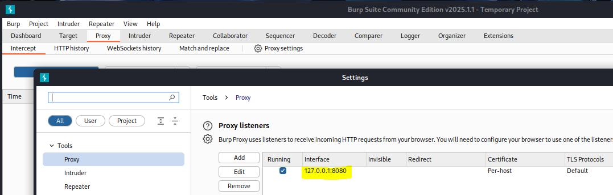
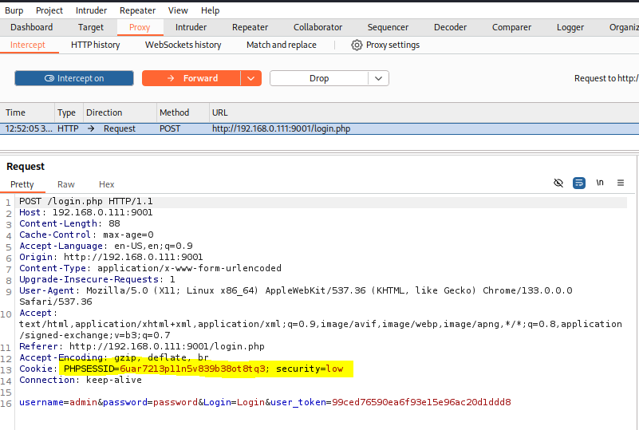
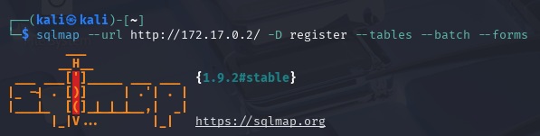
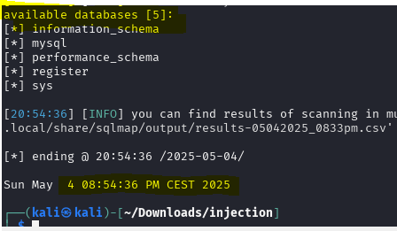

# Laboratorio 5. Vulnerabilidades Web 
## Covadonga Leguina Roig
## PRÁCTICA 5.1. SQL Injection (3 puntos)
### PRÁCTICA 5.1.1 SQLMap Práctico (1 puntos)

Para realizar esta práctica voy a necesitar la plataforma vulnerable <b>DVWA</b> que he levantado con docker en el puerto 9001 de mi anfitrión (192.168.0.111) y una <b>Kali</b>, corriendo en VirtualBox, que ya tiene instaladas las herramientas que voy a necesitar: BurpSuite y SQLMap. 
  - <b>BurpSuite</b> nos permite interceptar el tráfico entre el servidor vulnerable y un cliente que quiera autenticarse y así capturar la información de sesión del usuario que hace login como las cookies más importantes para poder realizar la inyección SQL.   
  - <b>SQLMap</b> nos permite inyectar código SQL para enumerar información de la base de datos vulnerable.
  
Credenciales de DVWA:  <b>Ususario: admin   Contraseña: password </b> 

a) Instalación y Configuración de DVWA
- Instalar DVWA: Puedes instalar DVWA en una máquina virtual o en un entorno de contenedores (por ejemplo, Docker).
- Sigue la documentación oficial para clonarla, configurar la base de datos MySQL y habilitar la aplicación.
- Accede a DVWA mediante el navegador usando la URL configurada: http://192.168.0.111:9001.
- Sigue el asistente de instalación para establecer las credenciales de base de datos y los parámetros iniciales.
- Una vez configurado, accede como usuario administrador.

b) Configuración del Proxy con `Burp Suite`

- Ejecución de Burp Suite: En Kali Linux, abre `Burp Suite` con los parámetros por defecto.
- Localiza en la interfaz la sección donde se indica en qué puerto se encuentra el proxy (usualmente el puerto 8080, pero puede ser otro).
- Configura el navegador para que utilice como proxy la dirección `127.0.0.1` y el puerto indicado (por ejemplo, 8080).

c) Captura de Tráfico:

- Activa la interceptación en la pestaña "Proxy" de `Burp Suite`.
- Accede a DVWA e inicia sesión.
- Captura una petición que se realice hacia DVWA (por ejemplo, la petición HTTP que se envía tras pulsar el botón de inicio de sesión).
- Verifica en la cabecera HTTP de la petición la presencia de las cookies importantes: `PHPSESSID` y security.

d) Extracción de Cookies y Token de Sesión
- Cookies Importantes: Una vez capturada la petición, identifica en la cabecera la cookie PHPSESSID y el parámetro security.

<b> Cookie: PHPSESSID=6uar7213p11n5v839b38ot8tq3; security=low </b>  
 
- Interpretación de Datos: Estos datos son fundamentales para que SQLMap pueda ejecutar la inyección desde una sesión autenticada, replicando el comportamiento del navegador. 
<b>NOTA: </b>EL valor de la cookie varía porque haga varias conexiones diferentes.

En la información extraída vemos el método usado para realizar la petición, así como la ruta y la versión del protocolo usado. También podemos saber desde qué navegador se ha realizado dicha petición de autenticación así como el sistema operativo. En este caso se trata de Chrome 133 en Linux 64 bits. Lo más interesante es la información de la cookie donde podemos ver el identificador del usuario y la seguridad del sistema receptor de la petición. 
Por último vemos la petición realizada en texto plano donde podemos ver el nombre de usuario, la contraseña y el token de usuario. 
En resumen, se ha realizado una una petición de autenticación HTTP para un usuario del que tenemos su identificador en un sistema con nivel bajo de seguridad.
  
<b>Nota:</b> He levantado la máquina vulnerable directamente en la Kali virtualizada porque me saltaba el antivirus de mi anfitrión y no me dejaba realizar las enumeraciones correctamente. Así que cambia la IP y la información de inicio de sesión.

e) Ejecución del Ataque con SQLMap

Con la información obtenida (cookies y parámetros de sesión), procederemos a ejecutar SQLMap en diversas fases. A continuación se describen los pasos y comandos utilizados:

  1. Enumeración de Bases de Datos: Debes Listar las bases de datos, entre las cuales se debería encontrar la base de datos dvwa.

Una vez obtenida la información de inicio de sesión vamos con la fase de enumeración con SQLMap. Primero necesitamos saber los nombre de las bases de datos de la máquina atacada, para ello indicamos la url y la cookie obtenida con BurpSuite. 
- El flag <b>-u </b>indica que vamos a usar una URL como objetivo donde realizar la inyección SQL. 
- El flag <b>--cookie</b> permite usar la cookie para identificarse en la aplicación ya que la web requiere un login. 
- El flag <b>--dbs</b> indicamos que nos enumere las bases de datos del servidor que estamos atacando.
  
Obtenemos que hay dos bases de datos: <b>dvwa</b> e <b>information_schema</b>

  2. Enumeración de Tablas de la Base de Datos: Con la base de datos identificada, ahora debemos listar las tablas de la misma. Verás una lista de tablas, identificándose la tabla `users` entre otras.
  

Una vez encontrado el nombre de la base de datos que nos interesa <b>dvwa </b>buscamos las tablas que contiene, que son <b>users</b> y <b>guestbook </b>  
- El flag <b>-D</b> nos permite especificar la base de datos de la que queremos enumerar la información. 
- El flag <b>--tables</b> nos enumerara las tablas de dicha bd.

  
  

  3. Enumeración de Columnas de una Tabla Específica: Una vez localizada la tabla `users`, extraemos las columnas disponibles, entre las cuales se deberían identificar campos como `user` y `password`.

Con la información de las tablas enumeramos las distintas columnas obteniendo <b>user</b> y <b>password</b> que son las que nos interesan.  
- El flag <b>-T</b> especifica la tabla a examinar. 
- El flag <b>--columns</b> estamos indicando lo que quiere que nos enumere, en este caso las columnas de la tabla users concretamente.

  
  4. Volcado de Datos de la Tabla Objetivo: Finalmente, extrae los datos específicos (usuarios y contraseñas) de la tabla `users`: obteniendo la información de los usuarios y contraseñas (estas últimas estarán cifradas).

Ya hemos conseguido saber el nombre de la base de datos que queremos examinar, las tablas y las columnas, sólo nos falta enumerar la información que nos interesa, en esta caso de las columnas <b>users y password</b> obteniendo como resultado las contraseñas cifradas de todos los usuarios de la base de datos. 
- El flag <b>-C</b> indica las columnas que queremos enumerar.

f) Refinamiento de SQLMap 
  1. Modificación de Flags en SQLMap: Ejecución de comandos con los flags --level y --risk diferentes para observar cómo varía la cantidad y profundidad de la información extraída. Explica para qué sirven estos flags.

  

Estos flags nos permiten personalizar la búsqueda de información durante la fase de enumeración. 
El flag <b>--risk</b> añade payloads más agresivos al proceso de enumeración. Se puede establecer el nivel de riesgo entre 1 y 3, el nivel 3 es el menos sigiloso y por tanto más detectable pudiendo incluso destruir la base de datos o modificarla, si es ese nuestro objetivo. Si no indicamos nada se ejecutan los payloads de riesgo 1, más seguros, no provocan interrupciones pero enumeran menos información.  
En nuestro caso concreto no hemos obtenido más información añadiendo los flags ya que con las peticiones que hemos realizado con el nivel de riesgo y el level por defecto hemos podido enumerar toda la información de la base de datos que buscábamos y aunque he realizado las búsquedas con mayor nivel de riesgo no he conseguido mejorar los resultados (No he hecho capturas). 
El flag <b>--level</b> define la profundidad de los test, estos van desde el nivel 1 al 5. El nivel 1 es que se realiza por defecto analizando los parámetros más obvios. Los niveles 2-3 testean parámetros en cookies y los niveles 4-5 prueba combinaciones complejas adicionales.
 
En este caso como no he detectado cambios en los resultados modificando estos flags.

  2. Simulación de Errores: Intenta modificar valores de cookies o parámetros URL para simular errores. Documenta qué tipo de mensajes de error son retornados y cómo se podrían interpretar para mejorar la seguridad. 

En este primer ejemplo he modificado el valor de la cookie, como no lo detecta en la columna "password" la misma herramienta nos permite usar un diccionario para obtener la contraseña por fuerza bruta.

Si modifico la URL obtengo un error ya que no encuentra la página,

Estos errores nos indican que aunque la página web no existe porque así lo he indicado a conciencia, intenta hacer el ataque por tanto no verifica las entradas. Para solucionar esto deberíamos sanitizar las peticiones que se puedan realizar al servidor para evitar insertar código malicioso verificando que los valores introducidos sean válidos. El servidor puede usar la técnica <b>prepared statements</b> que separa los datos de la consulta evitando la manipulación de la estructura de la consulta y por tanto la inyección de código. También deberíamos limitar la información que entra o sale del sistema estableciendo Políticas de seguridad del contenido <b>CSP</b>.

---
---
---

### PRÁCTICA 5.1.2 SQLMap Teórico (1 punto)

A continuación se proponen diversas preguntas que combinan aspectos teóricos y prácticos, con un énfasis especial en la parte práctica del ejercicio:

1. ¿Qué es una inyección SQL ciega y en qué se diferencia de una inyección SQL clásica?

En las inyecciones SQL ciegas no vemos un resultado de forma directa pero sí obtenemos respuesta de la petición, por ejemplo si lo solicitado es verdadero o falso lo que nos puede dar mucha información de la Base de datos atacada. La Inyección SQL Clásica permite al atacante ver el resultado directamente, obtener información de forma directa. 
La inyección SQL ciega es más difícil de realizar ya que primero deberemos recopilar información de la base de datos a atacar para así poder hacer consultas que nos permitan acceder a la información contenida.

2. Explica el propósito de utilizar `Burp Suite` en este ejercicio. ¿Qué información crítica se obtiene mediante este proxy?

BurpSuite nos permite capturar y modificar el trafico http/https del intento de autenticación en el servidor. En este caso lo hemos usado para conseguir las cookies de sesión así como el nivel de seguridad del servidor para la autenticación.

3. ¿Por qué es indispensable disponer de una sesión activa al atacar una aplicación como DVWA?

El sistema debe reconocer el token de sesión para poder identificar y mantener al usuario dentro de la aplicación, de este modo podemos realizar las consultas a la base de datos.

4. Describe el rol del token de sesión y de la cookie PHPSESSID en el contexto del ataque. ¿Cómo afectan estas a la autenticación y a la ejecución de la inyección?

El token de sesión nos permite autenticarnos en el sistema. La cookie nos permite mantenernos conectados al sistema. Por tanto esta información es clave para que el sistema nos considere un usuario legítimo y así poder extraer la información que queramos inyectando código SQL.

5. Detalla los pasos para configurar el proxy en el navegador y explica cómo se intercepta el tráfico de DVWA.

Para configurar el Proxy del navegador primero vamos BurpSuite y verificamos donde está corriendo

Luego, en el navegador establecemos dichos valores en la configuración del Proxy.

Con esta configuración forzamos que todo el tráfico del navegador pase por el Proxy de BurpSuite que lo interceptará. 

6. Describe el proceso de captura de una petición mediante Burp Suite. ¿Qué elementos de la cabecera HTTP son fundamentales para la ejecución del ataque con SQLMap?

Con la configuración del proxy realizada sólo tendremos que activar la interceptación en BurpSuite y a continuación en el navegador nos logueamos quedando registrada la información de login en BurpSuite. Para realizar el ataque con SQLMap usamos la Cookie obtenida y el nivel de seguridad <em>security </em>.

7.  ¿Qué significa el flag --dbs y cuál es el objetivo de listar las bases de datos del servidor?
 

 El flag <b>--dbs</b> indica a la herramienta que enumere las bases de datos del sistema examinado cuyo objetivo es obtener el nombre para poder realizar más inyecciones que nos den más información de dicha base de datos.

9. Explica la diferencia entre los flags -D, -T y --columns en SQLMap y cómo se relacionan en el flujo de extracción de información.
 

- El flag <b>-D</b> nos permite especificar la base de datos de la que queremos enumerar la información. 
- Con el flag <b>-T</b> indicamos qué tabla concreta queremos examinar. Para ello antes deberemos haber averiguado el nombre de la base de datos atacada. 
- El flag <b>--columns</b> nos permite indicar que queremos extraer la información de las columnas de la tabla especificada, de la base de datos concreta. Por tanto para usar esta flag debemos haber averiguado previamente la información de la base de datos y de las tablas. 
Si no especificamos la base de datos o las tablas cuando solicitamos información concreta nos sacará la de toda la estructura de datos.

11. ¿Qué hace la flag --dump y cómo se relaciona con el objetivo final del ejercicio (obtener usuarios y contraseñas)?

El flag <b>--dump</b> permite extraer los registros almacenados en los campos indicados, en nuestro caso concreto lo usamos para conseguir la información de las columnas <em>user y password</em> de la tabla <em>users</em> de la base de datos <em>dvwa</em>.

---
---
---

### PRÁCTICA 5.1.3. SQLMap Avanzado (1 punto)
Desarrolla una mini guía de opciones avanzadas de uso de SQLMap, es importante que razones qué estás haciendo y por qué.
Documéntate de fuentes externas: Blogs, VideoTutoriales, IAs, pero es imprescindibles que generes tu propia base de datos de referencias, es decir, de dónde has extraído la información (y comprueba la veracidad).

Debes realizar una demo práctica de opciones avanzadas, para ello aparte de la mini guía, puedes grabar un pequeño vídeo o capturas de pantalla mostrando las opciones avanzadas y sus usos.

Para realizar esta guía de uso de SQLMap vamos a usar una máquina vulnerable <em> Injection </em>, facilitada en la web dockerlabs. La descargamos y la levantamos con docker.

Una vez levantada procedemos a atacarla como hemos hecho anteriormente, primero examinamos las bases de datos, luego las tablas que contiene, después las columnas y por último obtenemos la información de los registros de usuarios relevantes y comprobamos que efectivamente es un usuario válido ya que nos permite loguearnos.  
Añadimos las flags <b>--batch</b> para que el proceso se ejecute de forma automática y <b>--forms </b> para que busque en los formularios de la base de datos.

  
  

Vemos cómo hemos encontrado la base de datos <em>register</em> con la tabla <em>users</em> y las columnas <em>passwd y usersename</em> de las que podemos extraer la información de dichos registros y por tanto los información de login del usuario <em>dylan</em>. Aunque hemos conseguido alcanzar nuestro objetivo lo hemos hecho de una forma <em>ruidosa</em> y por tanto fácilmente detectable por el sistema atacado así que vamos a ver una serie de opciones que hacen que el ataque sea mucho más sigiloso y por tanto más difícil de detectar.
  
<b>--flush-session:</b> Borra los registros previos que SQLMap haya podido generar y las respuestas del servidor, de esta forma un sistema de detección de intrusiones no podrá detectar patrones similares durante el ataque.
<b>  --threads:</b> Establecemos el número de hilos en ejecución, menos hilos, más sutil. Si este valor es muy bajo ralentizará mucho el análisis de la víctima. Así que hay que valorar el nivel de sigilosidad vs velocidad en la obtención de resultados de nuestro ataque.
<b>  --random-agent:</b> SQLMap generará un user-agent aleatorio para cads petición lo que dificultará determinar el origen del ataque (MacOS, Linux, Windows...)
<b>  --delay:</b> Añade un retraso entre cada solicitud minimizando la frecuencia de las peticiones.
<b>  --time-sec:</b> Establece un tiempo de espera en caso de que el servidor devuelva respuestas lentas, es decir como mucho esperamos los segundos que determinemos si tarda más descartamos la respuesta.
<b>  --save-url:</b> Ponemos la url de la máquina que vamos a atacar para verificar que no altermaos la url tras el ataque
<b>  --safe-freq:</b> Cuando haga las peticiones que establezcamos hará una petición a la url segura para verificar de nuevo que la web sigue funcionando correctamente y que nuestro ataque no la ha modificado o ha sufrido alguna alteración.
<b>  --level:</b> Nivel de los payloads usados. Rango 1-3 menos nivel más sigiloso y menos información obtenida. Mayor nivel, más ruido y obtención de más información.
<b>  --risk: </b>Nivel de riesgo del ataque. 1-5 a mayor riesgo más ruido genera y más rápido va, a menos riesgo más sigiloso y lento y por tanto más difícil de detectar.

sqlmap -url http://172.17.0.2/ --dbs --batch --forms --flush-session --threads=2 --random-agent --delay=5 --time-sec=5 --safe-url http://172.17.0.2/  --safe-freq=20 --level=2 --risk=2

Mientras que el primer ataque sin flags para hacerlo menos detectable ha sido muy rápido de apenas unos segundos, este ataque con todas las opciones para hacerlo más sigiloso nos ha llevado más de 21 minutos pero eso sí, prácticamente indetectable.
   
<b>Fuentes:</b>

[Dockerlabs](https://dockerlabs.es/)

[Wiki SQLMap](https://github.com/sqlmapproject/sqlmap/wiki/usage)

[Youtube: El Pingüino de Mario](https://www.youtube.com/watch?v=A9Li1DKEzlE)
  IA: Microsoft Copilot

