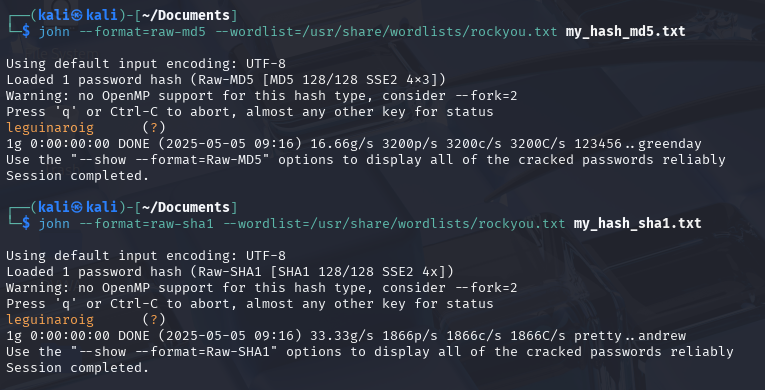
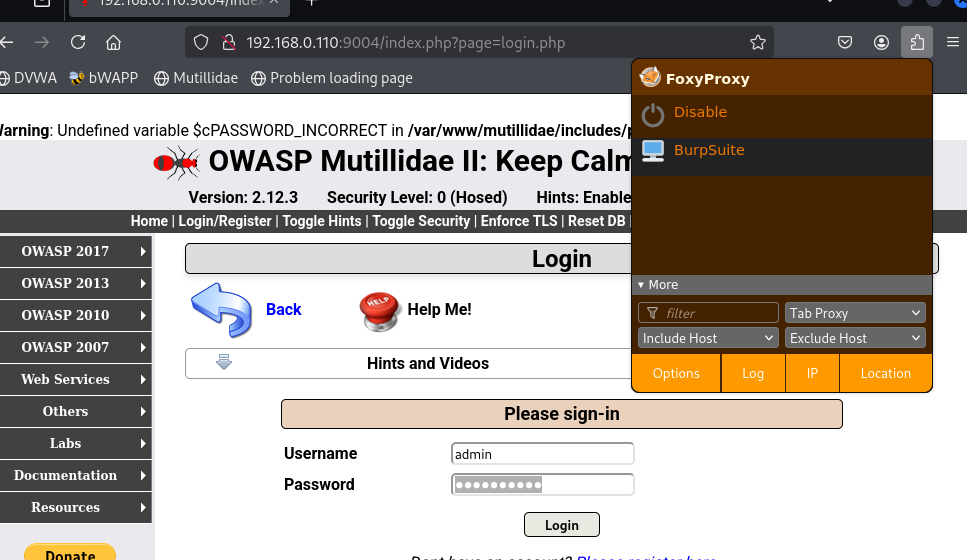
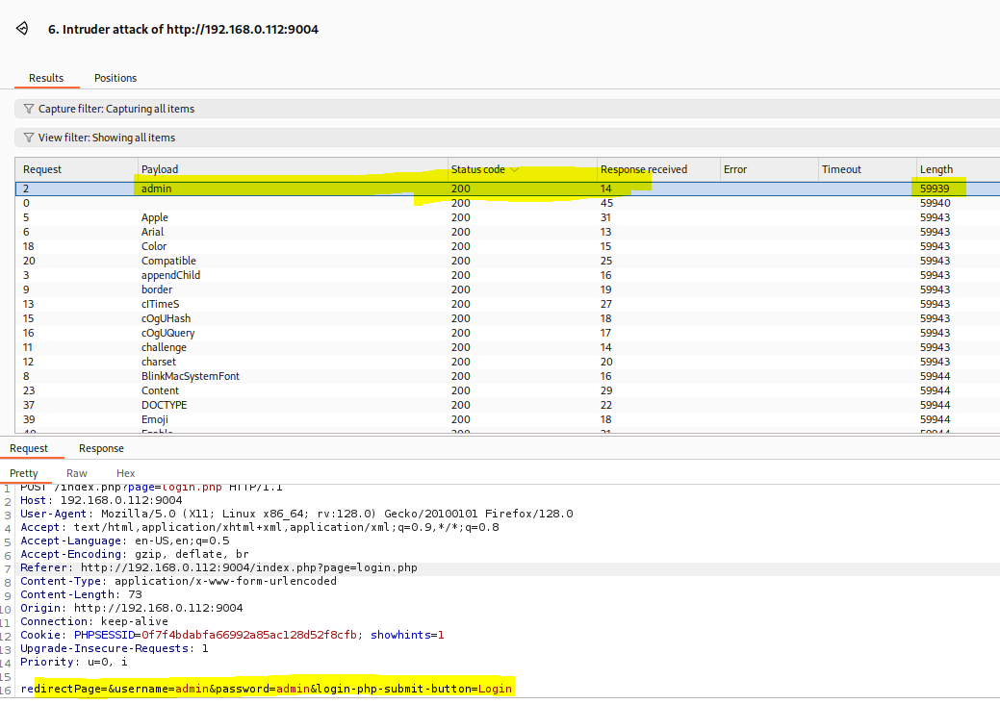

# Laboratorio 5. Vulnerabilidades Web
## Covadonga Leguina Roig
## PRÁCTICA 5.2. Ataques offline y online (4 puntos) 


### PRÁCTICA 5.2.1. Ataques prácticos (2 puntos)

#### PRÁCTICA 5.2.1.1 Ataque offline con John the Ripper (1 punto)

En esta práctica se generan contraseñas cifradas (hashes) usando distintos algoritmos (MD5, SHA1, SHA256, bcrypt, etc).

A continuación se muestra la debilidad de las contraseñas, las cuales no deberían NUNCA ser almacenadas en una base de datos.

Las herramientas necesarias en Kali Linux que usaremos son las siguientes:

| Herramienta                     | Uso                                        |
|--------------------------------|--------------------------------------------|
| `openssl`                      | Generar hashes comunes (MD5, SHA*)         |
| `mkpasswd` (de `whois`)        | Generar hashes bcrypt                      |
| `htpasswd` (de `apache2-utils`)| Crear hashes tipo Apache (MD5, SHA)       |
| `John the Ripper`              | Crackear los hashes                        |

<p style="text-align: justify; color: blue;">
<b>- openssl:</b> Es una herramienta para generar, verificar y manipular certificados y algoritmos de cifrado. <br>
<b>- mkpasswd:</b> Permite crear contraseñas cifradas <br>
<b>- htpasswd:</b> Se usa para crear archivos de autenticación en servidores<br>
<b>- John the Ripper:</b> es una de las herramientas más usadas para crackear contraseñas.


##### 1. Generar hashes
Hash con MD5 usando openssl
```bash
 echo -n "leguinaroig" | openssl dgst -md5
 ```
Hash con SHA1 / SHA256
```bash 
echo -n "leguinaroig" | openssl dgst -sha1
echo -n "leguinaroig" | openssl dgst -sha256
```
Hash con bcrypt usando mkpasswd
```bash
mkpasswd -m bcrypt
```
Hash tipo Apache (MD5 base64) con htpasswd
```
htpasswd -nbm cova leguinaroig
```


##### 2. Vulnerabilidad de passwords con John the Ripper
<p style="text-align: justify; color: blue;">
Partimos de los hashes obtenidos de la máquina <b>DVWA</b>
<br>

| user    | password                         |
|---------|----------------------------------|
| admin   | 5f4dcc3b5aa765d61d8327deb882cf99 |
| gordonb | e99a18c428cb38d5f260853678922e03 |
| 1337    | 8d3533d75ae2c3966d7e0d4fcc69216b |
| pablo   | 0d107d09f5bbe40cade3de5c71e9e9b7 |
| smithy  | 5f4dcc3b5aa765d61d8327deb882cf99 |


1. Prepara un archivo con los hashes
<p style="text-align: justify; color: blue;">
Guardo en un fichero los hashes obtenidos e identificamos que está generado en MD5.

 <br>


<p style="text-align: justify; color: blue;">
Usamos John the Ripper para crackear y ver todas las contraseñas ya que he guardado los hashes de todos los usuarios encontrados:


<p style="text-align: justify; color: blue;">
Como podemos comprobar en la captura, el proceso ha sido prácticamente instantáneo. (0:00:00:00).

| Usuario   | Contraseña    |
|----------|---------------|
| admin     | `password`   | 
| gordon    | `abc123`     | 
| 1337     | `charley`     | 
| pablo  | `letmein`       | 
| smithy  | `password`     | 

<p style="text-align: justify; color: blue;">
Voy a realizar el proceso con los distintos algoritmos usados con la contraseña <em>leguinaroig<em>, he añadido la contraseña al diccionario <em><b>rockyou</em></b> y todos han sido desencriptados casi instantáneamente.
<br>Para descifrar hashes en formato htpassword JohnTheRipper necesita que se lo especifiquemos como <em><b>md5crypt</b></em>





<p style="text-align: justify; color: blue;">
John The Ripper es más eficiente usando diccionarios pero también puede ser usado con fuerza bruta. He intentado hacerlo pero solo para el MD5 a los 20 minutos no había sacado la contraseña y he parado el proceso (no hay captura)


<p style="text-align: justify; color: red;">

| COMANDOS INTERESANTES JOHN THE RIPPER  |  Explicación  |
| ------------------------------------ |  -----| 
|john --help | Muestra opciones |
|John --incremental=all hashes.txt| Realiza un ataque de fuerza bruta|
| john --single hashes.txt| Realiza un ataque basado en nombres y datos comunes (heurística)|
|john wordlist=/usr/share/wordlists/rockyou.txt hashes.txt  | Indicamos un diccionario para sacar la contraseña |
| john --show hashes.txt | Mostramos las contraseñas ua descubiertas. John los almacena en una caché propia
|  john --format=raw-md5 my_hash_md5.txt | Especificamos el formato del hash
| john --format=md5crypt --wordlist=/usr/share/wordlists/rockyou.txt my_hash_htpasswd.txt | Especificamos el formato del hash y el diccionario a usar  |
|rm ~/.john/john.pot  | Borrar la caché de John The Ripper
 

---
---
---

#### PRÁCTICA 5.2.1.2 Ataque online con Burp Suite e Intruder (1 punto)

Realizar un ataque de fuerza bruta online contra un formulario de login, utilizando diccionarios personalizados generados con `Cewl`, y detectar credenciales válidas mediante análisis de la respuesta del servidor.

1. Diccionario desde marca.com
<p style="text-align: justify; color: blue;">
Uso la herramienta <b>Cewl</b> para generar un diccionario a partir del contenido de la página principal de https://www.marca.com. Indicamos con los flags -d y -m el nivel de profundidad y el tamaño mínimo de las palabras para agilizar un poco el proceso.


```
bash
   cewl https://www.marca.com  -d 1 -m 5 -w marca.txt
```

2. Diccionario desde bab.la/admin
<p style="text-align: justify; color: blue;">
Genero un segundo diccionario personalizado desde la URL https://es.bab.la/diccionario/ingles-espanol/admin, pero no incluye la palabra <b>admin</b> que es lo que pretendemos creando el diccionario desde la web indicada:


```
bash
   cewl https://es.bab.la/diccionario/ingles-espanol/admin -d 1 -m 5 -w babla.txt
```
<p style="text-align: justify; color: blue;">
Creo el diccionario descargando la web y creando el fichero con las palabras que contiene, eliminando las duplicadas y ordenándolas alfabeticamente.


3. Captura de petición de login con Burp Suite.

<p style="text-align: justify; color: blue;">
Verifico en Mutillidae II que existe el usuario <b>admin</b>, ya que nos da error "PASSWORD_INCORRECT", lo que indica que el usuario existe.


   1. Configura tu navegador para que todo el tráfico pase por **Burp Suite (Proxy)**.



   2. Dirígete al formulario de login de la aplicación objetivo.
   3. Introduce cualquier valor en el login (por ejemplo, `admin:1234`) y **captura la petición HTTP**.


   
   4. Envía la petición capturada a la pestaña **Intruder**.
   5. En la pestaña **Positions**, elimina todos los marcadores automáticos y selecciona **solo el campo de contraseña** como campo dinámico (payload).
      - El campo de usuario debe permanecer fijo (`admin`).
      - Usa la opción *Clear §* y luego selecciona manualmente solo el valor de la contraseña y presiona *Add §*.


4. Ejecución del ataque con diccionario personalizado 

   1. En la pestaña **Payloads**, selecciona el diccionario `marca.txt` o `babla.txt` como fuente.
   2. Ejecuta el ataque con el botón **Start attack**.
   3. Observa las respuestas del servidor para cada intento.

<p style="text-align: justify; color: blue;">
Configuro el Payload añadiendo los dos diccionarios que hemos creado, asegurándome de que está la contraseña correcta y ejecuto el ataque.


---

5. Detección de credencial válida

Durante el ataque, deberás identificar la respuesta que indique un login exitoso. Para ello, observa:

   - **Código de estado HTTP**: Por ejemplo, si todos los intentos fallidos devuelven `200 OK`, pero uno devuelve `302 Found`, es posible que el 302 indique una redirección posterior al login exitoso.
   - **Longitud de la respuesta**: Las respuestas exitosas pueden diferir en longitud respecto a las respuestas fallidas.
   - **Contenido de la respuesta**: Busca mensajes distintos como “Welcome”, “Dashboard”, etc.


<p style="text-align: justify; color: blue;">
En teoría el resultado correcto es <b>admin</b>, pero el ataque no me devuelve una respuesta concluyente. <br>
Ni cambia el Status Code ni la longitud de la respuesta.


<p style="text-align: justify; color: blue;">
He probado de nuevo esta vez con un <b>Battery RAM attack</b>, seleccionando los dos campos y forzando un diccionario donde sé que está la palabra <b>admin</b> que necesito tanto para el usuario como para la contraseña. <br>


<p style="text-align: justify; color: blue;">
De este modo encuentro un único resultado cuyo tamaño de respuesta es <b>diferente</b>, en este caso es el más corto y podemos deducir que es el resultado correcto, pero no me parece que sea conluyente.



<p style="text-align: justify; color: blue;">
Como estos resultado no me han parecido efectivos, realizo última prueba. He creado un nuevo usuario en la base de datos <b> cova:leguinaroig </b> Y realizado un ataque por fuerza bruta, en este caso por <b>Cluster Bomb attack </b>, seleccionando los dos campos a atacar e introduciendo como payload un diccionario donde he asegurado que estén ambas palabras


<p style="text-align: justify; color: blue;">
Lanzo el ataque y compruebo como encuentra el usuario y contraseña que tenemos en la base de datos. Obtengo una longitud de respuesta diferente y el Status Code también cambia porque nos reenvía a la pagina de login correcto.


<p style="text-align: justify; color: blue;">
Verifico que puedo loguearme con este ususario:


<p style="text-align: justify; color: blue;">
Este resultado sí que evidencia que el resultado ha sido efectivo y que por fuerza bruta a través de diccionario hemos podido encontrar el usuario y contraseña de acceso a la base de datos. <br>
<b>NOTA:</b> He dejado los intentos fallidos para que pueda servir de guía/manual.

---
---
---

### PRÁCTICA 5.2.2. Ataques teoría (1 punto)

Responde brevemente las siguientes preguntas. Justifica cuando se indique. Busque información complementaria del vocabulario o términos que desconozca.

1. ¿Cuál es la diferencia entre un ataque offline y un ataque online a credenciales?
<p style="text-align: justify; color: blue;">
El ataque offline descifra contraseñas a partir de hashes previamente obtenidos y que tenemos en nuestro equipo de forma local mientras que el ataque online se realiza a tiempo real sobre un sistema o página web lo que implica múltiples intentos de acceso.

2. ¿Qué ventaja ofrece el uso del diccionario rockyou en pruebas de fuerza bruta?
<p style="text-align: justify; color: blue;">
Este diccionario ha sido creado con credenciales filtradas de usuarios reales lo que lo convierte en muy efectivo a la hora de atacar contraseñas débiles y comunes. Esto agiliza mucho el proceso de búsqueda respecto a la fuerza bruta sin diccionario.

3. ¿Qué información nos proporciona hash-identifier y por qué es relevante antes de usar John the Ripper?
<p style="text-align: justify; color: blue;">
Nos indica el tipo algoritmo de cifrado utilizado en un hash esto es muy útil si se lo indicamos a John The Ripper mejorar la eficiencia del ataque y será más rápido y efectivo.


4. ¿Por qué un código de estado HTTP 302 Found puede indicar un inicio de sesión exitoso en un ataque de diccionario?
<p style="text-align: justify; color: blue;">
El código 302 indica una redirección a otra página, si el login es exitoso nos redirige a la página de inicio por ejemplo.

5. ¿Qué precauciones éticas y legales deben tenerse en cuenta al realizar este tipo de prácticas en entornos reales? 
<p style="text-align: justify; color: blue;">
En primer lugar debemos tener autorización para realizar estas pruebas a modo de auditoría de seguridad y evitar en todo caso el uso indebido de las credenciales que pudiéramos obtener, ciñendo su uso a la investigación o formación. Si hiciéramos uso de dichas credenciales podríamos caer en la comisión de delitos accediendo a sistemas de forma no autorizada lo que está regulado por la Ley de Protección de Datos con sus pertinentes consecuencias legales. Por ello estas prácticas deben realizarse en entornos autorizados y controlados.


6. Explora cómo cambiaría tu estrategia si las contraseñas estuvieran “salteadas” (salted). ¿Qué dificultades añade el uso de salt y cómo podrías adaptarte?
<p style="text-align: justify; color: blue;">
Añadir salt a la contraseña añade un valor extra de dificultad para poder descifrarlo de manera que el hash que se cree será siempre único para cada usuario y los diccionarios convencionales, como rockyou, no servirán ya que las palabras están modificadas. El descifrado se convierte en un proceso mucho más tedioso multiplicándose el tiempo de descifrado para cada contraseña. Para poder extraer la contraseña debemos en primer lugar extraer el salt, concatenarlo con la posible contraseña e ir probando todas las posibles combinaciones.

7. ¿Cómo impactaría el uso de GPUs o clusters de computación en la velocidad de un ataque offline con John the Ripper? Describe al menos dos formas de escalar tu ataque.
<p style="text-align: justify; color: blue;">
Acelerarían notablemente los ataques ya que son tecnologías diseñadas para realizar miles de operaciones en paralelo, perfecto para este tipo de cálculo repetitivo. Si distribuímos el ataque en diferentes GPUs podríamos multiplicar la eficacia del ataque de forma exponencial. También podríamos dividir el diccionario y realizar la tarea de forma distribuida con distintos procesos. <br>
- La versión Jumbo de John The Ripper permite el uso de GPU para acelerar los ataques.<br>
- A través de clusters de computación podríamos multiplicar la velocidad del ataque dividiendo la tarea entre cada nodo del clúster.

8. ¿Qué ventajas y desventajas tiene un ataque híbrido (combinando reglas de mangling con diccionarios) frente a uno puramente de diccionario o puramente de fuerza bruta? Proporciona ejemplos de reglas útiles.
<p style="text-align: justify; color: blue;">
Los ataques híbridos son más eficaces, no sólo prueba la palabra exacta sino también sus posibles variantes y es fácilmente personalizable (años de nacimiento, día de nacimiento,...). Por el contrario no garantiza que pruebe todos los patrones posibles; es más lento que un ataque con diccionario puro pero más rápido que uno de fuerza bruta. Para que sean realmente eficientes debemos crear una serie de reglas que optimicen los resultados:<br>
   - u: Convierte todo en mayúscula<br>
   - c: La primera letra en mayúscula<br>
   - Az"123": Añade 123 al final
   - Az"@": Añade @ al final
   - cAz"!": primera en mayúsculas y símbolo al final.
<br><br>
<b>Ejemplo de uso: </b> <br>
Para usarlas debemos incluirlas en el fichero de reglas de John The Ripper /usr/share/john/john.conf <br> <br>

```
[List.Rules:cova_rules]
Az"2024"
c
```
<p style="text-align: justify; color: blue;">
E indicarlas en el comando:<br>

``` 
john --wordlist=rockyou.txt --rules=cova_rules my_hash.txt
```

9. Imagina que el formulario de login de Mutillidae II aplicara un límite de tres intentos antes de bloquear la IP. ¿Cómo sortearías esa restricción para continuar tu ataque online?
<p style="text-align: justify; color: blue;">
Podríamos forzar a nuestro sistema para que cambie la IP cada dos intentos y así evitamos que se bloquee el ataque.

10. Describe cómo detectarías y diferenciarías en tus logs un ataque de diccionario con Burp Suite de un acceso legítimo de un usuario.
<p style="text-align: justify; color: blue;">
En los log del servicio web que tengamos, por ejemplo /var/log/apache2/access.log si estamos usando el servicio web de apache,  veríamos muchísimos intentos de inicio de sesión en muy poco tiempo lo que sería imposible hacerlo a mano, por tanto podríamos decir que estamos sufriendo un ataque por fuerza bruta o diccionario.

11. Más allá de capturar la contraseña, ¿qué información extra podrías inferir de la respuesta HTTP (cabeceras, tiempos de respuesta, tamaño de contenido) para enriquecer tu ataque?
<p style="text-align: justify; color: blue;">
Las cookies de sesión, son un dato clave para poder robar las sesiones. Los tiempos de respuesta, si son prolongados indican que se está ejecutando la petición, luego alguno de los datos puede ser correcto. Los códigos de estado HTTP también puede ser orientativos para determinar si el login ha sido válido o no. También podemos extraer información sobre las versiones de las tecnologías y/o servicios utilizados pudiendo averiguar qué vulnerabilidades asociadas tiene para así poder atacarlo.


### PRÁCTICA 5.2.3. Ataques offline y online Avanzado (1 punto)

Desarrolla una **guía avanzada de ataques de contraseñas online y offline**, enfocándote en las técnicas y herramientas más efectivas en contextos reales. El objetivo no es solo aplicar comandos, sino **razonar, justificar y documentar** qué haces y por qué.

El conjunto de herramientas es el siguiente:

| Tipo de ataque | Herramientas sugeridas |
|----------------|-------------------------|
| Offline        | `john`, `hashcat`, `hydra` (modo offline), `crunch` |
| Online         | `hydra`, `Burp Suite Intruder`, `ffuf`, `wfuzz`, `python requests` |
| Auxiliares     | `cewl`, `hashid`, `jwt-tool`, `rockyou.txt`, reglas de John, máscaras en Hashcat |

#### Teoría:
- ¿Qué herramienta usarías según el tipo de hash o endpoint? ¿Para qué sirve cada herramienta?
<p style="text-align: justify; color: blue;">
Si no conocemos el tipo de hash usaríamos <b> hasid </b>  para identificarlo.
Si conocemos el tipo de hash y es uno simple (MD4, SHA1, SHA256, SHA512,...) usaríamos <b> John The Ripper o hashcat </b>. La versatilidad de John es que podemos usar diccionarios personalizados. Hashcat por su parte es más potente ya que usa el procesador de la tarjeta gráfica o GPU, mucho más eficientes para el cálculo de este tipo de operaciones. Hashcat también es capaz de romper hashes encriptados o con salt fuerte (largo). 
Si el endpoint es Windows, mejor Hascat, si el Linux, mejor John.<br>
Para atacar endpoints de formularios web lo mejor son herramientas automatizables como <b>hydra, BrupSuite Intruder o Python requests </b>, que permiten realizar miles de intentos de login de forma automática. <br>
Si lo que necesitamos es encontrar rutas o parámetros en el equipo víctima usaremos <b> ffuf o wfuzz </b>, que realizan pruebas masivas de palabras en las URLs o en los parámetros de la máquina víctima.

- ¿Cuándo conviene un ataque online vs offline?
<p style="text-align: justify; color: blue;">
Realizaremos un ataque <b> offline</b> cuando tengamos hashes de contraseñas y queremos crackearlos. Se trata de ataques silenciosos ya que al realizar el descifrado en local no dejamos rastro en el tráfico de red. <br>
Si sólo conocemos el servicio accesible, por ejemplo que es un formulario web, haremos un ataque <b>online</b> aunque es mucho más "ruidoso" y fácil de detectar ya que cada intento de login en el sistema atacado quedará registrado en los logs del sistema y si este tiene algún sistema de monitorización de ataques, nos detectará fácilmente.

- ¿Cómo combinar herramientas y reglas para maximizar resultados?
<p style="text-align: justify; color: blue;">
Las herramientas para crear diccionarios como  crunch o cewl son muy útiles combinadas con John The Ripper o Hydra. Si tenemos más información de la víctima podríamos personalizar reglas para afinar más la búsqueda (año de nacimiento, id, dni...) en contraseñas con salt por ejemplo.


#### **Demostración práctica** (mínimo 2 ataques reales)

<p style="text-align: justify; color: blue; font-size: 18Px">
Demo 1. Hydra
<p style="text-align: justify; color: blue;">
Hydra es una herramienta para sacar contraseñas y/o usuarios de sistemas por fuerza bruta. En esta caso lo vamos a hacer de forma online. Aunque en el vídeo no lo he explicado, podríamos combinar hydra con <b>crunch o cewl</b> para la creación de diccionarios personalizados. En este caso por simplificar he usado el diccionario rockyou.


<video width="800" controls autoplay playsinline>
  <source src="capturas/tuto_hydra.mp4" type="video/mp4">
</video>

<p style="text-align: justify; color: blue;">
<b>NOTA:</b> No he podido insertar el video con audio. Puedes abrirlo desde el directorio capturas de este ejercicio (tuto_hydra.mp4)

<p style="text-align: justify; color: blue; font-size: 18Px">
Manual de uso de HYDRA
<p style="text-align: justify; color: blue;">
 <br>

|Comando  |	Significado|
|--------------|------------|
| hydra	| Llama a la herramienta| 
|-l admin	| indicamos que el usuario el fijo (en minúsculas) y especificamos cuál es "admin" |
|-P *.txt	| Indicamos el diccionario para que busque la contraseña (en mayúscula porque es lo que queremos buscar)| 
| IP	| IP de la máquina vícima | 
| http-get-form	| Método http para establecer el tipo de ataque |
| "ruta/de/ataque" | Indicamos la ruta a tacar con los parámetros indicados como ^USER^ y ^PASS^ para que hydra sustituya ahi los valores dados (fijo + diccionario|
| H=Cookie:PHPSSID=...; security=...| Indicamos la cookie de sesión para que se pueda autenticar y evitar falsos positivos|
| F Username and/or password incorrect.| Indicamos el mensaje en caso de error para que sea descartado por Hydra|
|-s 9001| Puerto a atacar|
|-L users.txt| PAra especificar un diccionario para los usuarios|
| -p 1234| Para establecer la contraseña fija|
|-t 4| hilos simultáneos para el ataque|
| -I | Ignora respuestas SSL inválidas|
|-F| Solo muestra intentos fallidos|
|-f | Oculta intentos fallidos|


---


<p style="text-align: justify; color: blue; font-size: 18Px">
Demo 2. WFUZZ

<p style="text-align: justify; color: blue;">
WFUZZ es una herramienta para realizar ataques a través de fuerza bruta a páginas web y descubrir directorios o rutas ocultas susceptibles de ser atacadas o que contengan información relevante. Igual que en el caso anterior podríamos combinarlo con cualquier herramienta de creación de diccionarios personalizados como <b>cewl</b> o <b>crunch</b>. En este caso vamos a usar un diccionario que incluye la herramienta, suficiente para realizar un ataque básico.

<video width="800" controls autoplay playsinline>
  <source src="capturas/tuto_wfuzz.mp4" type="video/mp4">
</video>

<p style="text-align: justify; color: blue;">
<b>NOTA:</b> No he podido insertar el video con audio. Puedes abrirlo desde el directorio capturas de este ejercicio (tuto_wfuzz.mp4)

<p style="text-align: justify; color: blue; font-size: 18Px">
Manual de uso de WFUZZ
<p style="text-align: justify; color: blue;">
wfuzz -c -v -t 50 -w /usr/share/wordlists/dirb/common.txt -u http://192.168.0.112:9004/FUZZ | grep 301
<br>

|Comando  |	Significado|
|--------------|------------|
| wfuzz	| Llama a la herramienta| 
|-c	| Colorea la salida |
|-v	| Modo verbose, muestra más información| 
|-t 50	| Número de hilos usados | 
| -w   /usr/share/wordlists/dirb/common.txt	| Indica el diccionario que vamos a utilizar en el ataque |
| -u http://192.168.0.112:9004/FUZZ |  URL objetivo del ataque, reemplazamos FUZZ por las palabras del diccionario |
| grep 301 | Filtramos respuestas válidas, redirecciones válidas |
| --hc | Oculta las respuestas con ciertos códigos (sustituto del grep) |
| --hh| Permite filtrar por la longitud de la respuesta |
|--hs| Oculta respuestas con un strig concreto|
|--hw| Oculta respuestas con un número de palabras concretas|
|-x | Establecemos el método http a usar |
| --cookie |Podemos enviar la cookie de sesion |
|-o|  Esportar el resultado a un fichero|
|--sc| Muestra sólo respuestas co nciertos códigos|
|--ss | Muestra sólo las respuestas con el string indicado|

#### **Base de datos de fuentes y referencias**

- Fuente: <br>

   [Youtube: El Pingüino de Mario.HYDRA](https://www.youtube.com/watch?v=rvme2kE8-jY)

   [Youtube: El Pingüino de Mario.WFUZZ](https://www.youtube.com/watch?v=AcvqZDbwOJE)

- Autor: El Pingüino de Mario
- <p style="text-align: justify; color: blue;">A través de estos tutoriales he aprendido el uso de Hydra y WFuzz para ataques online. He podido conocer mejor su uso así como los parámetros necesarios para realizar un ataque exitoso. Algunos comandos no han funcionado a la primera como sxe explica en el vídeo pero con ayuda de la IA he podido verificarlos y corregirlos hasta conseguir los resultados esperados.


